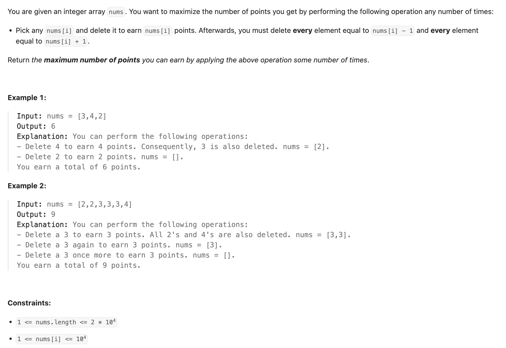
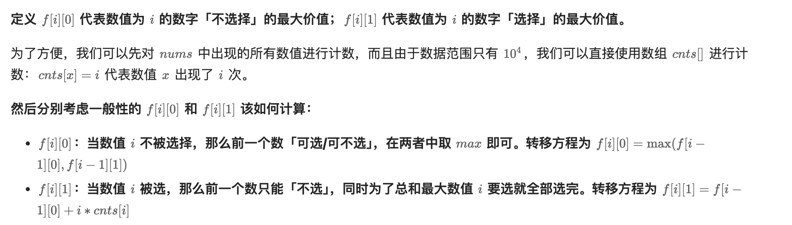

## 740. Delete and Earn

---

- 本题题意：
  - 一个“BUG”: array = [2, 2, 4, 5, 5, 7，8]
  - 如果**连续rob `5` 是允许的**
  - 但是rob 5, 就必须把 `5 - 1` and `5 + 1` 都must delete, 也就是这里must delete `4`
  - 所以本题可以 linear scan 回头看是否有 **current element - 1**

- 如果我们将数组排好序，从前往后处理，其实只需要考虑“当前数”与“前一个数”的「大小 & 选择」关系即可，这样处理完，显然每个数的「前一位/后一位」都会被考虑到。



- 注意这里的： **「选」 or 「不选」**:
  - “选” 数字 i 意味着你获得了 i * cnts[i] 的点数，并且因为你选择了 **i**，所以你**不能再选择 i-1**。
  - "不选" 数字 i：不获取 i 的点数，那么 **i-1**的点数 **可以获取也可以不获取**
    - 记住： 如果**不选当前的数字 i**, 那就是**继承前面 数字 i 的点数**，或者前面那个 数字i 也没被选中

- [具体更多解释](https://leetcode.cn/problems/delete-and-earn/solutions/758623/gong-shui-san-xie-zhuan-huan-wei-xu-lie-6c9t0/)
---

```py
class Solution:
    def deleteAndEarn(self, nums: List[int]) -> int:
        count = [0] * 10010  # since 1 <= nums[i] <= 10^4
        n = len(nums)
        max_num = 0
        for x in nums:
            count[x] += 1
            max_num = max(max_num, x)

        dp = [[0] * 2 for _ in range(max_num + 1)]
        for i in range(1, max_num + 1):  # i represent current num
            dp[i][1] = dp[i - 1][0] + i * count[i]
            dp[i][0] = max(dp[i - 1][1], dp[i - 1][0])

        return max(dp[max_num][1], dp[max_num][0])
```

