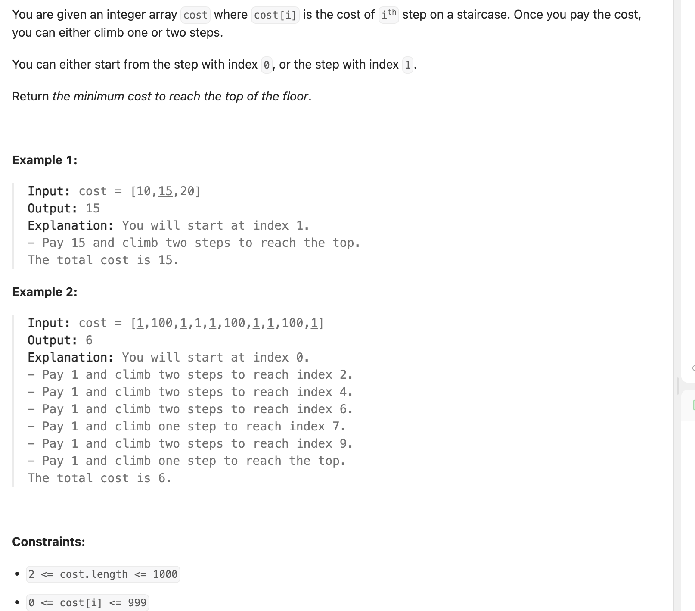
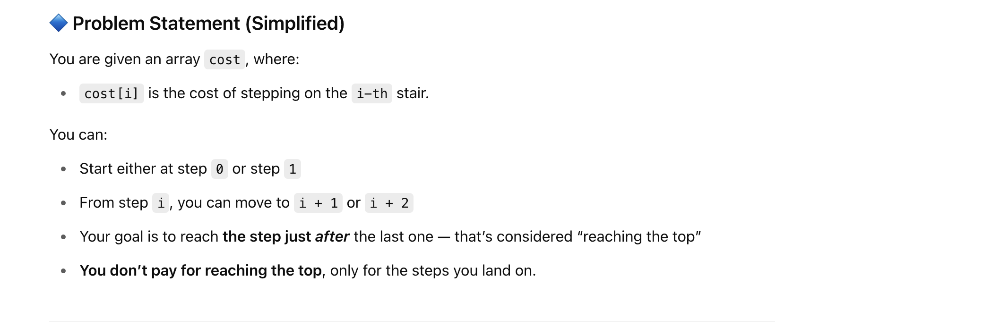
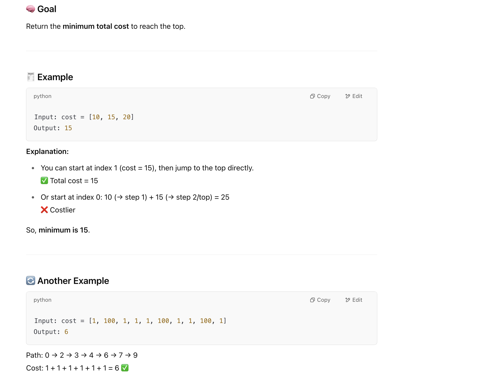

## 746. Min Cost Climbing Stairs

---





- 这里”支付的费用“是**起跳的位置**，**不是落下的位置**。
- 所以到达 **N**, 是不用支付的

- **破题点**：
  - You can **start at step 0 or step 1 for free**, as per the problem description.
  - So, the **cost to reach step 0 or step 1 is zero**.

---

- 注意： **without memorization**, general DFS => **TC = O(2^N)**, 因为两种选择   **SC = O(N)**

---

### memorization

- TC = 状态个数 * 单个状态所需要的计算时间 = O(N) * O(1) = O(N)
- SC = O(N)


```py
class Solution:
    def minCostClimbingStairs(self, cost: List[int]) -> int:
        n = len(cost)
        @cache
        def dfs(i):
            if i <= 1:
                return 0
            return min(dfs(i - 1) + cost[i - 1], dfs(i - 2) + cost[i - 2])
        return dfs(n)
```

- TC

---

### tabulation

- 注意： 为什么设置 **(n + 1)**? 因为看cost的index范围，如果设置成 n, 那么当 **for i in range(2, n)**， 就直接停下来了，因为 n - 1 就是 2 

```py
class Solution:
    def minCostClimbingStairs(self, cost: List[int]) -> int:
        n = len(cost)
        dp = [0] * (n + 1)
        for i in range(2, n + 1):
            dp[i] = min(dp[i - 1] + cost[i - 1], dp[i - 2] + cost[i - 2])
        return dp[n]
```

- TC = O(N)
- SC = O(N)

---

### Optimized Space

```py
class Solution:
    def minCostClimbingStairs(self, cost: List[int]) -> int:
        n = len(cost)
        f0 = f1 = 0
        for i in range(2, n + 1):
            new_f = min(f1 + cost[i - 1], f0 + cost[i - 2])
            f0 = f1
            f1 = new_f
        return new_f
```

- TC = O(N)
- SC = O(1)

