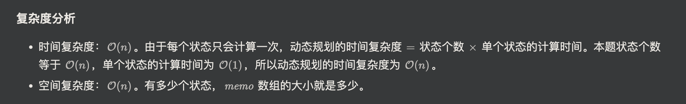

## 70. Climbing Stairs


- [中文解释](https://leetcode.cn/problems/climbing-stairs/solutions/2560716/jiao-ni-yi-bu-bu-si-kao-dong-tai-gui-hua-7zm1/)


- 注意： **f[0] = 1**, 因为在 0 的时候，保持原地不动 也是一种方式
-       **f[1] = 1**
-       由于  **f[2] = 2**, 
-       either
        -       option 1:  step 1 + step 1 = 2
        -       option 2:  step 2 = 2

---

### memorization

```py
class Solution:
    def climbStairs(self, n: int) -> int:
        @cache
        def dfs(i):
            if i <= 1:
                return 1
            return dfs(i - 1) + dfs(i - 2)
        return dfs(n)
```


---

### tabulation

```py
class Solution:
    def climbStairs(self, n: int) -> int:
        dp = [0] * (n + 1)
        dp[0] = 1
        dp[1] = 1
        for i in range(2, n + 1):
            dp[i] = dp[i - 1] + dp[i - 2]
        return dp[n]
```

---

### Ooptimized Space

```py
class Solution:
    def climbStairs(self, n: int) -> int:
        f0 = f1 = 1
        for _ in range(2, n + 1):
            new_f = f1 + f0
            f0 = f1
            f1 = new_f
        return f1
```