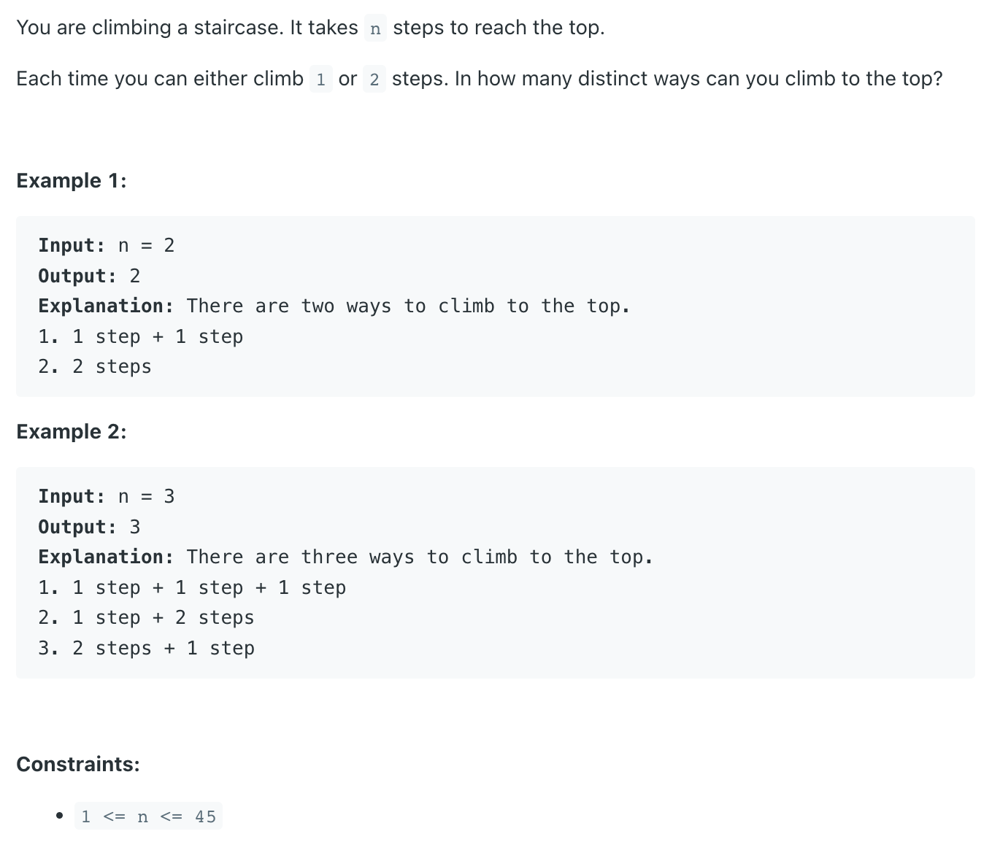
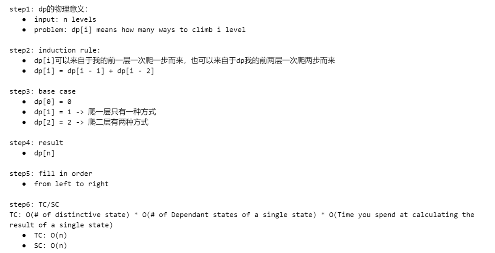

## 70. Climbing Stairs

---
- Linear Scan 回头看问题


---

```java
public class _70_ClimbingStairs {
    public int climbStairs(int n) {
        if (n < 1) {
            return 0;
        }
        if (n == 1 || n == 2) {
            return n;
        }
        int[] dp = new int[n + 1];
        dp[1] = 1;
        dp[2] = 2;
        for (int i = 3; i <= n; i++) {
            dp[i] = dp[i - 1] + dp[i - 2];
        }
        return dp[n];
    }
}
```
---

#### Python

```py
class Solution:
    def climbStairs(self, n: int) -> int:
        dp = [0] * (n + 1)
        dp[0] = 1
        dp[1] = 1
        for i in range(2, n + 1):
            dp[i] = dp[i - 1] + dp[i - 2]
        
        return dp[n]
        
```