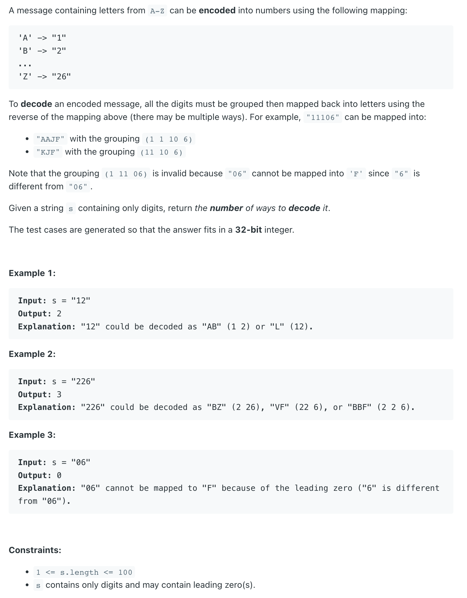
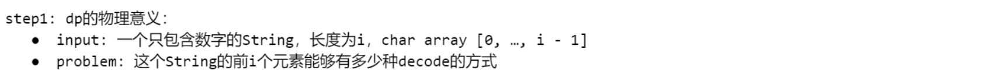
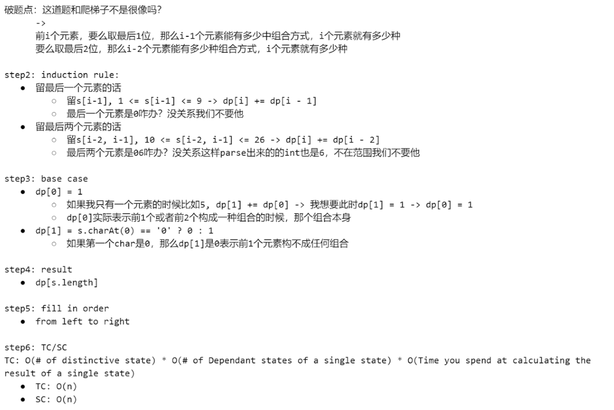
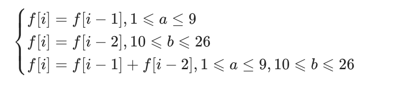

## 91. Decode Ways

---


---
- [c9 - Part1 43:00]()

- [中文解释](https://leetcode.cn/problems/decode-ways/solution/gong-shui-san-xie-gen-ju-shu-ju-fan-wei-ug3dd/)


---

```java
class _91_DecodeWays {
    public int numDecodings(String s) {
        if (s == null || s.length() == 0) {
            return 0;
        }
        int n = s.length();
        int[] dp = new int[n + 1];
        dp[0] = 1;
        dp[1] = s.charAt(0) == '0' ? 0 : 1;
        for (int i = 2; i <= n; i++) {
            int one = Integer.parseInt(s.substring(i - 1, i)) ;
            int two = Integer.parseInt(s.substring(i - 2, i)) ;
            if (one >= 1 && one <= 9) {
                dp[i] += dp[i - 1];
            }
            if (two >= 10 && two <= 26) {
                dp[i] += dp[i - 2];
            }
        }
        return dp[n];
    }

    public static void main(String[] args) {
        _91_DecodeWays decodeWays = new _91_DecodeWays();
        int res = decodeWays.numDecodings("226");
        System.out.println(res); // 3
    }
}
```

