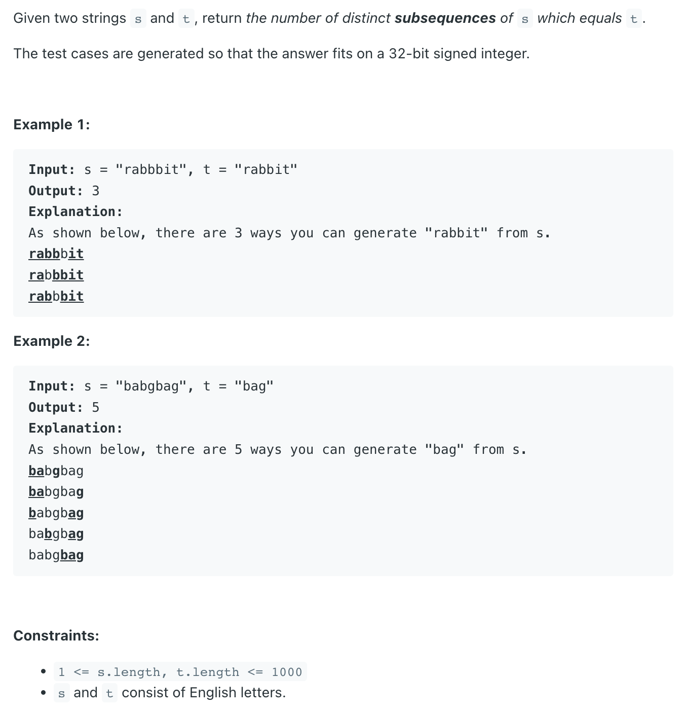
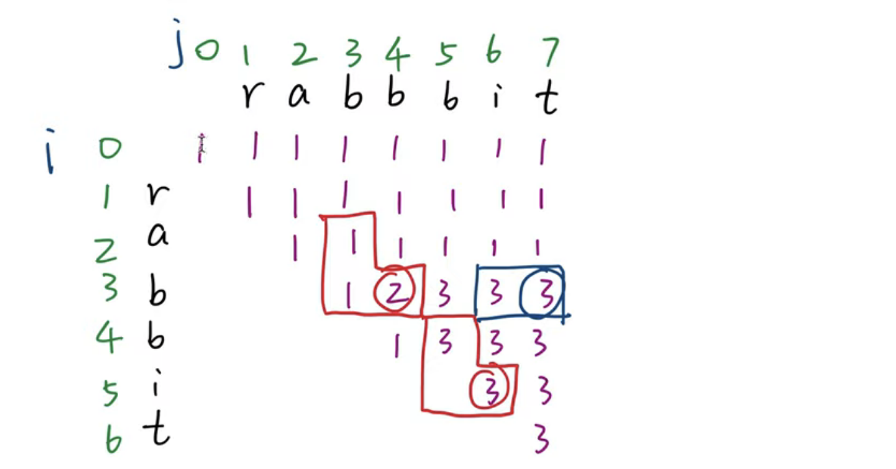

## 115. Distinct Subsequences


- [中文教程](https://www.youtube.com/watch?v=iYSRiP7-dCs)
---

- initialization:




- 假如 `s` 里的任何 `char` 你都不用来匹配 `t` 的字符， 因为`index-0` 的时候，`t` 的字符是空，那都不用来匹配空，则只有一种可能性：就是 `1`
  所以`coloumn 0` 全部初始化为 `1`

```ruby
        s:  j
            0   1   2   3   4   5   6   7   
t:              r   a   b   b   b   i   t
i   0       1   1   1   1   1   1   1   1
    1   r   0   1   1   1   1   1   1   1
    2   a   0   0   1   1   1   1   1   1
    3   b   0   0   0   1   2   3   3   3
    4   b   0   0   0   0   1   3   3   3
    5   i   0   0   0   0   0   0   3   3
    6   t   0   0   0   0   0   0   0   3       
```  
---

```java
class _115_DistinctSubsequences {
    public int numDistinct(String s, String t) {
        int m = s.length(), n = t.length();

        int[][] dp = new int[n + 1][m + 1];
        // initialize the dp value when t is an empty string,
        // number of subsequence of an empty string should be 1
        for (int i = 0; i <= m; i++) {
            dp[0][i] = 1;
        }

        for (int j = 1; j <= n; j++) {
            dp[j][0] = 0;
        }

        for (int i = 1; i <= n; i++) {
            for (int j = 1; j <= m; j++) {
                if (s.charAt(j - 1) == t.charAt(i - 1)) {
                    dp[i][j] = dp[i - 1][j - 1] + dp[i][j - 1];
                } else {
                    dp[i][j] = dp[i][j - 1];
                }
            }
        }
        return dp[n][m];
    }
}
```