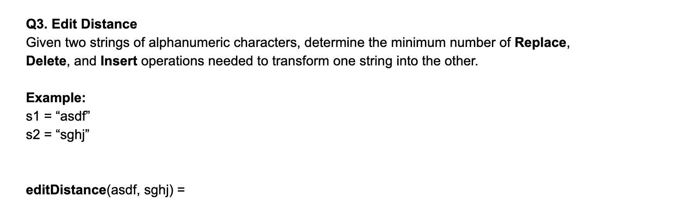
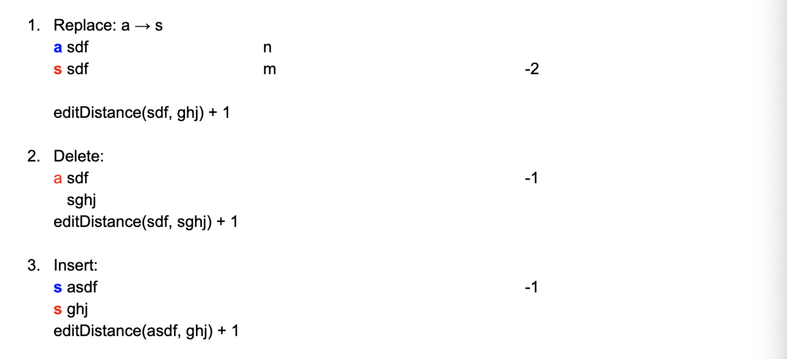

# 72. Edit Distance

```ruby
Given two words word1 and word2, 
find the minimum number of operations required to convert word1 to word2.

You have the following 3 operations permitted on a word:

Insert a character
Delete a character
Replace a character

Example 1:

Input: word1 = "horse", word2 = "ros"
Output: 3
Explanation: 
horse -> rorse (replace 'h' with 'r')
rorse -> rose (remove 'r')
rose -> ros (remove 'e')

Example 2:

Input: word1 = "intention", word2 = "execution"
Output: 5
Explanation: 
intention -> inention (remove 't')
inention -> enention (replace 'i' with 'e')
enention -> exention (replace 'n' with 'x')
exention -> exection (replace 'n' with 'c')
exection -> execution (insert 'u')
```
---


## Analysis

- we grow the string from the left hand side to the right hand side ===>
- **M[i][j] represents the minimum number of actions to transform the first letters of S1**
- **to the first j letters of S2**





```java
case0: do nothing 


case1: replace
s1 = a -> s
s2 = s
M[1][1] => M[0][0] + 1

M[i][j] => M[i - 1][j - 1] + 1


case2: delete
s1 = a -> ""    0
s2 = s          1
M[1][1] => M[0][1] + 1

M[i][j] => M[i - 1][j] + 1


case3: insert
s1 = a -> as    
s2 = s          
M[1][1] => M[1][0] + 1

M[i][j] => M[1][j - 1] + 1

Final Rule =>

M[i][j] = Math.min(M[i - 1][j - 1], M[i - 1][j], M[1][j - 1]) + 1


How to fill in the 2D M[i][j] matrix?


s2     |    s   g   h   j
size   | 0  1   2   3   4
--------------------------
s1   0 | 0  1   2   3   4
a    1 | 1  1   2   3   4
s    2 | 2  1   2   3   4
d    3 | 3  2   2   3   4
f    4 | 4  3   3   3   4 -> return
```


```java
class Solution {
    public int minDistance(String word1, String word2) {
        int[][] dp = new int[word1.length() + 1][word2.length() + 1];
        for(int i = 0; i <= word1.length(); i++){
            for(int j = 0; j <= word2.length(); j++){
                if(i == 0){
                    dp[i][j] = j;
                }else if(j == 0){
                    dp[i][j] = i;
                }else if(word1.charAt(i - 1) == word2.charAt(j - 1)){
                    dp[i][j] = dp[i - 1][j - 1];
                }else{
                    int temp = Math.min(dp[i - 1][j] + 1, dp[i][j - 1] + 1);
                    dp[i][j] = Math.min(dp[i - 1][j - 1] + 1, temp);
                }
            }
        }
        return dp[word1.length()][word2.length()];
    }
}

```


---


## 本题DFS 解法

```java
class Solution {
    public int minDistance(String word1, String word2) {
        if(word1.isEmpty()){
            return word2.length();
        }
        if(word2.isEmpty()){
            return word1.length();
        }
        
        if(word1.charAt(0) == word2.charAt(0)){
            int nothing = minDistance(word1.substring(1), word2.substring(1));
            return nothing;
        }
        
        int replace = 1 + minDistance(word1.substring(1), word2.substring(1));
        int insert = 1 + minDistance(word1, word2.substring(1));
        int delete = 1 + minDistance(word1.substring(1), word2);
        return Math.min(delete,  Math.min(replace, insert));
    }
}
```