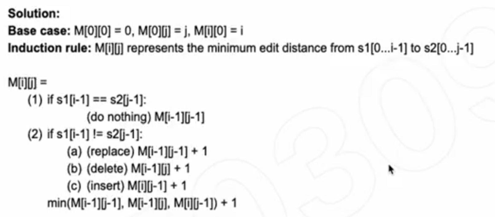

## 72. Edit Distance


---


## Analysis


- we grow the string from the left hand side to the right hand side ===>
- **M[i][j] represents the minimum number of actions to transform the first letters of S1**
- **to the first j letters of S2**


```java
case0: do nothing 


case1: replace
s1 = a -> s
s2 = s
M[1][1] => M[0][0] + 1

M[i][j] => M[i - 1][j - 1] + 1


case2: delete
s1 = a -> ""    0
s2 = s          1
M[1][1] => M[0][1] + 1

M[i][j] => M[i - 1][j] + 1


case3: insert
s1 = a -> as    
s2 = s          
M[1][1] => M[1][0] + 1

M[i][j] => M[i][j - 1] + 1

Final Rule =>

M[i][j] = Math.min(M[i - 1][j - 1], M[i - 1][j], M[1][j - 1]) + 1


How to fill in the 2D M[i][j] matrix?


s2     |    s   g   h   j
size   | 0  1   2   3   4
--------------------------
s1   0 | 0  1   2   3   4
a    1 | 1  1   2   3   4
s    2 | 2  1   2   3   4
d    3 | 3  2   2   3   4
f    4 | 4  3   3   3   4 -> return
```




- T = O(m * n)
- Space = O(m * n)


```java
class Solution {
    public int minDistance(String word1, String word2) {
        int m = word1.length();
        int n = word2.length();
        int[][] dp = new int[m + 1][n + 1];
        for (int i = 0; i <= m; i++) {
            for (int j = 0; j <= n; j++) {
                if (i == 0) {
                    dp[i][j] = j;
                } else if (j == 0) {
                    dp[i][j] = i;
                } else if (word1.charAt(i - 1) == word2.charAt(j - 1)) {
                    dp[i][j] = dp[i - 1][j - 1];
                } else {
                    int tmp = Math.min(dp[i - 1][j], dp[i - 1][j - 1]);
                    dp[i][j] = Math.min(tmp, dp[i][j - 1]) + 1;
                }
            }
        }
        return dp[m][n];
    }
}
```


---


## 本题DFS 解法


- There are at most `m + n` levels in the recursion tree, and there are at most 3 branches
  in each node. Thus
  - Time = O(3^(m + n))

```java
class Solution {
    public int minDistance(String word1, String word2) {
        //Base case
        if(word1.isEmpty()){
            return word2.length();
        }
        if(word2.isEmpty()){
            return word1.length();
        }
        
        //(a) check what the distance is if the character[0] are
        //identical and we do nonthing first
        if(word1.charAt(0) == word2.charAt(0)){
            int nothing = minDistance(word1.substring(1), word2.substring(1));
            return nothing;
        }
        
        int replace = 1 + minDistance(word1.substring(1), word2.substring(1));
        int insert = 1 + minDistance(word1, word2.substring(1));
        int delete = 1 + minDistance(word1.substring(1), word2);
        return Math.min(delete,  Math.min(replace, insert));
    }
}
```