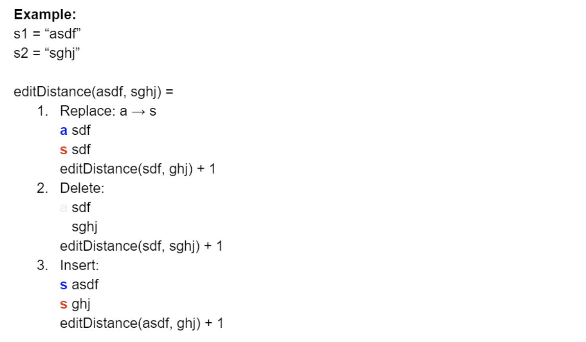
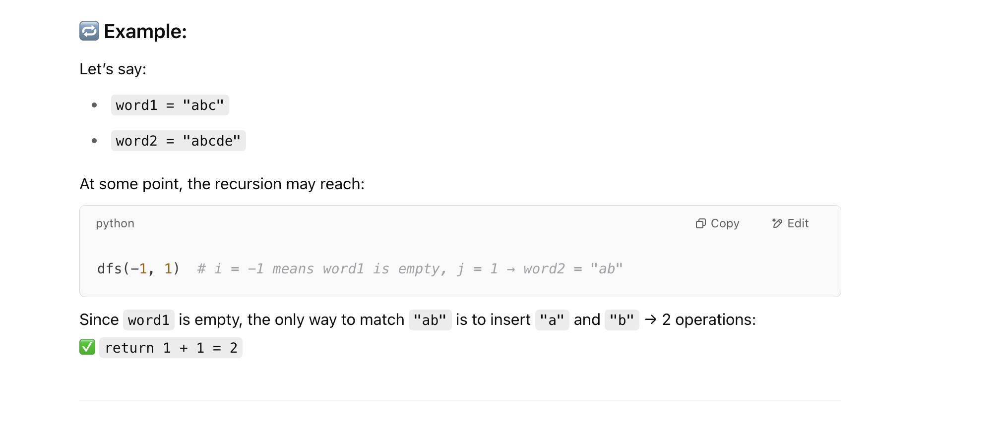

## 72. Edit Distance


---
### 本题DFS 解法 TLE



- There are at most `m + n` levels in the recursion tree, and there are at most 3 branches
  in each node. Thus
  - Time = **O(3^(m + n))**


---

### Meorization DFS

```py
class Solution:
    def minDistance(self, word1: str, word2: str) -> int:
        m, n = len(word1), len(word2)

        @cache
        def dfs(i, j):
            if i < 0:
                return j + 1
            if j < 0:
                return i + 1
            if word1[i] == word2[j]:
                return dfs(i - 1, j - 1)
            return min(dfs(i - 1, j), dfs(i, j - 1), dfs(i - 1, j - 1)) + 1

        return dfs(m - 1, n - 1)
```


- why we have to: 

```py
        if i < 0:
            return j + 1
```




---
## Tabulation 

```java
class tabulation {
    public int minDistance(String word1, String word2) {
        int m = word1.length(), n = word2.length();
        int[][] dp = new int[m + 1][n + 1];

        // --- Base Cases ---
        // 1. If word2 is empty (j=0), we need 'i' deletions to make word1 empty.
        for (int i = 0; i <= m; i++) {
            dp[i][0] = i;
        }
        // 2. If word1 is empty (i=0), we need 'j' insertions to create word2.
        for (int j = 0; j <= n; j++) {
            dp[0][j] = j;
        }

        // Iterate forwards through prefixes of word1 (length i)
        for (int i = 1; i <= m; i++) {
            // Iterate forwards through prefixes of word2 (length j)
            for (int j = 1; j <= n; j++) {
                // Compare the LAST characters of the current prefixes
                // (character at index i-1 in word1 and j-1 in word2)
                if (word1.charAt(i - 1) == word2.charAt(j - 1)) {
                    dp[i][j] = dp[i - 1][j - 1];
                } else {
                    // Cost if we inserted word2[j-1] into word1
                    int insert = dp[i][j - 1] + 1;

                    // Cost if we deleted word1[i-1] from word1
                    int delete = dp[i - 1][j] + 1;

                    // Cost if we replaced word1[i-1] with word2[j-1]
                    int replace = dp[i - 1][j - 1] + 1;

                    dp[i][j] = Math.min(Math.min(insert, delete), replace);
                }
            }
        }
        return dp[m][n];
    }
}
```


- T = O(m * n)
- Space = O(m * n)
