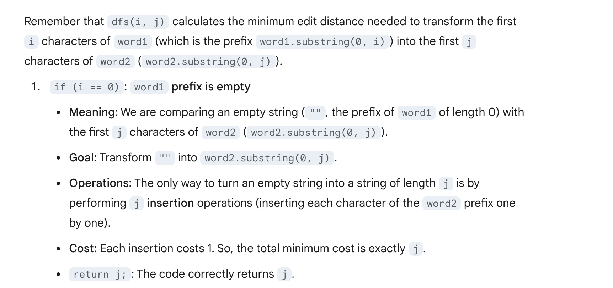

## 72. Edit Distance


---
### 本题DFS 解法


- There are at most `m + n` levels in the recursion tree, and there are at most 3 branches
  in each node. Thus
  - Time = O(3^(m + n))

```java
class EditDistance_dfs {
    public int minDistance(String word1, String word2) {
        // base case
        if (word1.isEmpty()) return word2.length();
        if (word2.isEmpty()) return word1.length();

        // a. Check what the distance is if the charaxters[0] are identical and we do nothing first
        if (word1.charAt(0) == word2.charAt(0)) {
            int nothing = minDistance(word1.substring(1), word2.substring(1));
            return nothing;
        }

        // b. chech what the distance is if we do a Replace first?
        int replace = 1 + minDistance(word1.substring(1), word2.substring(1));

        // c. check what the distance is if we do a Delete first?
        int delete = 1 + minDistance(word1.substring(1), word2);

        // d. chech what the distance is if we do a Insert first?
        int insert = 1 + minDistance(word1, word2.substring(1));

        return Math.min(delete, Math.min(replace, insert));
    }
}
```
---



---

### Meorization DFS

```java
class memo {
    private Integer[][] dp;
    private String word1;
    private String word2;
    public int minDistance(String word1, String word2) {
        this.word1 = word1;
        this.word2 = word2;

        // dp[i][j] will store the min distance between word1[0...i-1] and word2[0...j-1]
        // Initialize with null to indicate not computed
        dp = new Integer[word1.length() + 1][word2.length() + 1];

        // Start the DFS from the end (using full lengths as initial i, j)
        return dfs(word1.length(), word2.length());
    }

    // i = length of word1 prefix considered, j = length of word2 prefix considered
    private int dfs(int i, int j) {
        // Base Case 1: If word1 prefix is empty (length i=0),
        // we need 'j' insertions to make it word2's prefix.
        if (i == 0) {
            return j; // Cost is j operations
        }
        // Base Case 2: If word2 prefix is empty (length j=0),
        // we need 'i' deletions from word1's prefix.
        if (j == 0) {
            return i; // Cost is i operations
        }

        if (dp[i][j] != null) {
            return dp[i][j];
        }

        // Compare the characters at the end of the current prefixes (indices i-1, j-1)
        if (word1.charAt(i - 1) == word2.charAt(j - 1)) {
            // Last characters match. No operation needed for this character.
            // Cost is the same as the cost for prefixes ending at i-1, j-1.
            return dp[i][j] = dfs(i - 1, j - 1);
        } else {
            // Last characters differ. We need one operation. Find the minimum cost:
            // 1. Insert: Transform word1[0..i-1] to word2[0..j-2], then insert word2[j-1].
            //    Cost = 1 + dfs(i, j - 1)
            int insert = 1 + dfs(i, j - 1);

            // 2. Delete: Transform word1[0..i-2] to word2[0..j-1], then delete word1[i-1].
            //    Cost = 1 + dfs(i - 1, j)
            int delete = 1 + dfs(i - 1, j);

            // 3. Replace: Transform word1[0..i-2] to word2[0..j-2], then replace word1[i-1] with word2[j-1].
            //    Cost = 1 + dfs(i - 1, j - 1)
            int replace = 1 + dfs(i - 1, j - 1);

            dp[i][j] = Math.min(insert, Math.min(delete, replace));
            return dp[i][j];
        }
    }
}
```

---
## Top-Down DP

```java

```


- T = O(m * n)
- Space = O(m * n)
