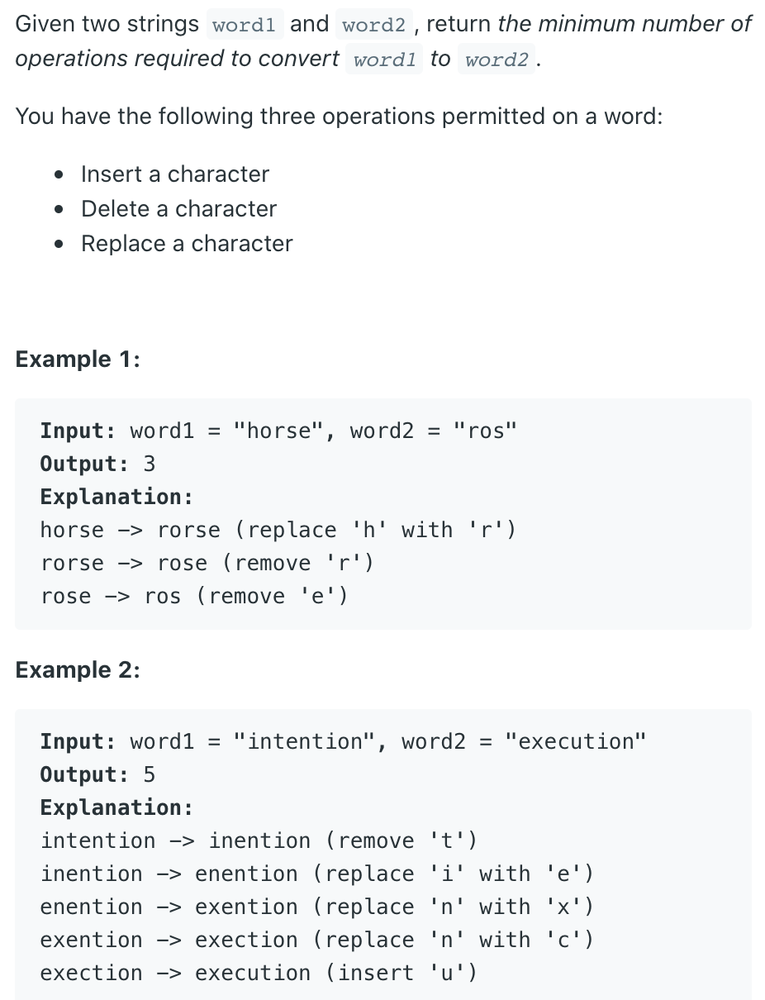

## 72. Edit Distance


---
### 本题DFS 解法 TLE


- There are at most `m + n` levels in the recursion tree, and there are at most 3 branches
  in each node. Thus
  - Time = O(3^(m + n))

```java
class dfs_with_TLE {
    private String word1, word2;
    public int minDistance(String word1, String word2) {
        this.word1 = word1;
        this.word2 = word2;
        return dfs(0, 0);
    }

    private int dfs(int i, int j) {
        // Base cases: if one string is finished,
        // the cost is to insert/delete the rest of the other string
        if (i == word1.length()) {
            return word2.length() - j;  // insert remaining chars of word2
        }
        if (j == word2.length()) {
            return word1.length() - i;  // delete remaining chars of word1
        }

        // If the current characters match
        if (word1.charAt(i) == word2.charAt(j)) {
            // No operation needed for these matching characters.
            // The minimum distance is the distance of the remaining substrings.
            int nothing = dfs(i + 1, j + 1);
            return nothing;
        } else {
            // 1. Insert: Insert word2[j] into word1. This means we now need to match
            //    word1[i...end] with the rest of word2[j+1...end]. Cost is 1 + distance of remaining.
            int insert = 1 + dfs(i, j + 1);

            // 2. Delete: Delete word1[i]. This means we now need to match
            //    word1[i+1...end] with word2[j...end]. Cost is 1 + distance of remaining.
            int delete = 1 + dfs(i + 1, j);

            // 3. Replace: Replace word1[i] with word2[j]. This means we now need to match
            //    word1[i+1...end] with word2[j+1...end]. Cost is 1 + distance of remaining.
            int replace = 1 + dfs(i + 1, j + 1);

            return Math.min(insert, Math.min(delete, replace));
        }
    }
}
```
---


---

### Meorization DFS

```java
class memo {
    private Integer[][] dp;
    private String word1;
    private String word2;
    public int minDistance(String word1, String word2) {
        this.word1 = word1;
        this.word2 = word2;

        // dp[i][j] will store the min distance between word1[0...i-1] and word2[0...j-1]
        // Initialize with null to indicate not computed
        dp = new Integer[word1.length() + 1][word2.length() + 1];

        // Start the DFS from the end (using full lengths as initial i, j)
        return dfs(word1.length(), word2.length());
    }

    // i = length of word1 prefix considered, j = length of word2 prefix considered
    private int dfs(int i, int j) {
        // Base Case 1: If word1 prefix is empty (length i=0),
        // we need 'j' insertions to make it word2's prefix.
        if (i == 0) {
            return j; // Cost is j operations
        }
        // Base Case 2: If word2 prefix is empty (length j=0),
        // we need 'i' deletions from word1's prefix.
        if (j == 0) {
            return i; // Cost is i operations
        }

        if (dp[i][j] != null) {
            return dp[i][j];
        }

        // Compare the characters at the end of the current prefixes (indices i-1, j-1)
        if (word1.charAt(i - 1) == word2.charAt(j - 1)) {
            // Last characters match. No operation needed for this character.
            // Cost is the same as the cost for prefixes ending at i-1, j-1.
            return dp[i][j] = dfs(i - 1, j - 1);
        } else {
            // Last characters differ. We need one operation. Find the minimum cost:
            // 1. Insert: Transform word1[0..i-1] to word2[0..j-2], then insert word2[j-1].
            //    Cost = 1 + dfs(i, j - 1)
            int insert = 1 + dfs(i, j - 1);

            // 2. Delete: Transform word1[0..i-2] to word2[0..j-1], then delete word1[i-1].
            //    Cost = 1 + dfs(i - 1, j)
            int delete = 1 + dfs(i - 1, j);

            // 3. Replace: Transform word1[0..i-2] to word2[0..j-2], then replace word1[i-1] with word2[j-1].
            //    Cost = 1 + dfs(i - 1, j - 1)
            int replace = 1 + dfs(i - 1, j - 1);

            dp[i][j] = Math.min(insert, Math.min(delete, replace));
            return dp[i][j];
        }
    }
}
```

---
## Tabulation 

```java
class tabulation {
    public int minDistance(String word1, String word2) {
        int m = word1.length(), n = word2.length();
        int[][] dp = new int[m + 1][n + 1];

        // --- Base Cases ---
        // 1. If word2 is empty (j=0), we need 'i' deletions to make word1 empty.
        for (int i = 0; i <= m; i++) {
            dp[i][0] = i;
        }
        // 2. If word1 is empty (i=0), we need 'j' insertions to create word2.
        for (int j = 0; j <= n; j++) {
            dp[0][j] = j;
        }

        // Iterate forwards through prefixes of word1 (length i)
        for (int i = 1; i <= m; i++) {
            // Iterate forwards through prefixes of word2 (length j)
            for (int j = 1; j <= n; j++) {
                // Compare the LAST characters of the current prefixes
                // (character at index i-1 in word1 and j-1 in word2)
                if (word1.charAt(i - 1) == word2.charAt(j - 1)) {
                    dp[i][j] = dp[i - 1][j - 1];
                } else {
                    // Cost if we inserted word2[j-1] into word1
                    int insert = dp[i][j - 1] + 1;

                    // Cost if we deleted word1[i-1] from word1
                    int delete = dp[i - 1][j] + 1;

                    // Cost if we replaced word1[i-1] with word2[j-1]
                    int replace = dp[i - 1][j - 1] + 1;

                    dp[i][j] = Math.min(Math.min(insert, delete), replace);
                }
            }
        }
        return dp[m][n];
    }
}
```


- T = O(m * n)
- Space = O(m * n)
