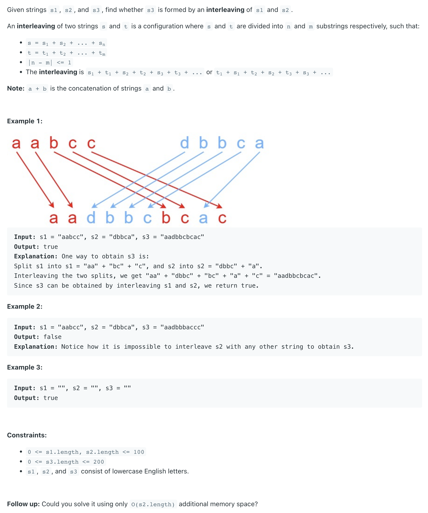
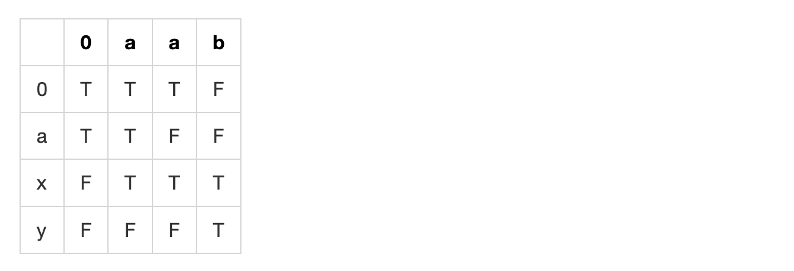

## 97. Interleaving String

---

- m = len(s1), n = len(s3)

- m = 3, n = 4
- i = m - 1 = 2                       # i start from the last index of s1
- j = n - 1 = 3                       # j start from the last index of s2
    
- len(s3) = m + n = 7
- **k =  len(s3) - 1** = 6                # k start from the last index of s3
- **k = i + j + 1** = 6
- **i + j + 1 is the last index of len(s3)**


- Note: **the ending of s3** is either **from the last index of S1** or **from the last index of s2**
---
### memorization

```py
class Solution:
    def isInterleave(self, s1: str, s2: str, s3: str) -> bool:
        m, n = len(s1), len(s2)
        if n + m != len(s3):
            return False

        @cache
        def dfs(i, j):
            if i < 0 and j < 0:
                return True

            if i >= 0 and s1[i] == s3[i + j + 1] and dfs(i - 1, j):
                return True
            if j >= 0 and s2[j] == s3[i + j + 1] and dfs(i, j - 1):
                return True

        return dfs(m - 1, n - 1)
```

---
- [DP Explain:](https://www.youtube.com/watch?v=ih2OZ9-M3OM)


- 1.  `a a b`
- 2.  `a x y`
- 3.  `a a x a b y`



---

```java
class _97_InterleavingString {
    public boolean isInterleave(String s1, String s2, String s3) {
        int len1 = s1.length(), len2 = s2.length(), len3 = s3.length();
        if (len1 + len2 != len3) {
            return false;
        }

        /*
        dp[i][j] -> true if s1[0..i-1] and s2[0..j-1] interleaves s3[0..i+j-1]
        */
        boolean[][] dp = new boolean[len1 + 1][len2 + 1];

        /*
        EMPTY s1,s2 can surely interleave to form EMPTY s3
        */
        dp[0][0] = true;

        for (int i = 1; i <= len1; i++) {
            if (s1.charAt(i - 1) == s3.charAt(i - 1)) {
                dp[i][0] = dp[i - 1][0];
            }
        }
        for (int i = 1; i <= len2; i++) {
            if (s2.charAt(i - 1) == s3.charAt(i - 1)) {
                dp[0][i] = dp[0][i - 1];
            }
        }

        for (int i = 1; i <= len1; i++) {
            for (int j = 1; j <= len2; j++) {
                char c1 = s1.charAt(i - 1), c2 = s2.charAt(j - 1), c3 = s3.charAt(i + j - 1);

                //case 1, special case, up and left has the same character.
                if (c1 == c3 && c2 == c3) {
                    dp[i][j] = dp[i - 1][j] || dp[i][j - 1];
                } else if (c1 == c3) {
                    //case2, normal case, only from left
                    dp[i][j] = dp[i - 1][j];
                } else if (c2 == c3) {
                    //case3, normal case, only from up
                    dp[i][j] = dp[i][j - 1];
                } else {
                    // case4, c1 != c3 && c2 != c3
                    dp[i][j] = false;
                }
            }
        }
        return dp[len1][len2];
    }
}
```