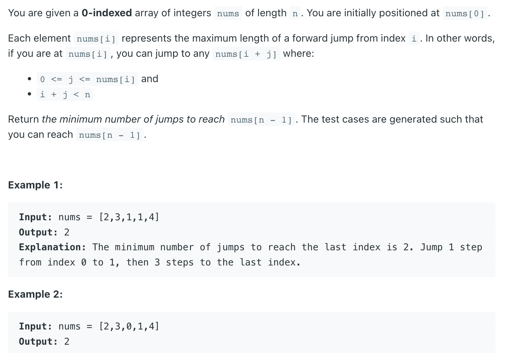

## 45. Jump Game II | Array Hopper II


---

### Memorization

```py
class Solution:
    def jump(self, nums: List[int]) -> int:
        dp = [-1] * len(nums)
        return self.dfs(nums, dp, 0)

    def dfs(self, nums: List[int], dp: List[int], index: int) -> int:
        if index == len(nums) - 1:
            dp[index] = 0
            return dp[index]

        if dp[index] != -1:
            return dp[index]

        min_jumps = float("inf")
        i = index + 1
        while i <= (index + nums[index]) and i < len(nums):
            min_jumps = min(min_jumps, self.dfs(nums, dp, i) + 1)
            i += 1
        dp[index] = min_jumps
        return dp[index]
```
---

### Tabulation

```py
class tabulation {
    public int jump(int[] nums) {
        int[] dp = new int[nums.length];
        dp[nums.length - 1] = 0;

        for (int index = nums.length - 2; index >= 0; index--) {
            int min = 99999;
            for (int i = index + 1; (i <= index + nums[index]) && i < nums.length; i++) {
                min = Math.min(min, dp[i] + 1);
            }
            dp[index] = min;
        }
        return dp[0];
    }
}
```