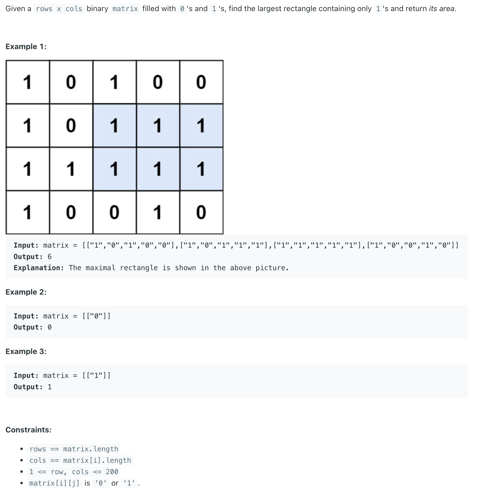

## 85. Maximal Rectangle || Largest Rectangle Of 1s




---
## Anaylysis

- 可以参考前面那些 DP 题


```java
public class _85_MaximalRectangle {
    public int maximalRectangle(char[][] matrix) {
        int row = matrix.length;
        int col = matrix[0].length;
        int[][] right = checkRightToLeft(matrix, row, col); // right-to-left direction
        int[][] down = checkDownToUp(matrix, row, col); // down-to-up direction
        return maxRecArea(right, down, row, col); // Calculate max rectangle area
    }

    private int[][] checkRightToLeft(char[][] matrix, int row, int col) {
        int[][] right = new int[row][col];
        for (int i = row - 1; i >= 0; i--) {  // Iterate rows from bottom to top
            for (int j = col - 1; j >= 0; j--) { // Iterate columns from right to left
                if (matrix[i][j] == '1') {
                    if (j == col - 1) {  // If at the last column, there's only one '1'
                        right[i][j] = 1;
                    } else {
                        // Add one more to the count from the right neighbor
                        right[i][j] = right[i][j + 1] + 1;
                    }
                } else {
                    right[i][j] = 0;  // If it's not '1', no consecutive 1's
                }
            }
        }
        return right;
    }

    private int[][] checkDownToUp(char[][] matrix, int row, int col) {
        int[][] down = new int[row][col];
        for (int i = row - 1; i >= 0; i--) {  // Iterate rows from bottom to top
            for (int j = col - 1; j >= 0; j--) { // Iterate columns from right to left
                if (matrix[i][j] == '1') {
                    if (i == row - 1) {  // If at the last row, there's only one '1'
                        down[i][j] = 1;
                    } else {
                        // Add one more to the count from the downward neighbor
                        down[i][j] = down[i + 1][j] + 1;
                    }
                } else {
                    down[i][j] = 0;  // If it's not '1', no consecutive 1's
                }
            }
        }
        return down;
    }

    private int maxRecArea(int[][] right, int[][] down, int row, int col) {
        int max = 0;
        for (int i = 0; i < row; i++) {
            for (int j = 0; j < col; j++) {
                int cur = right[i][j];  // Start with the maximum width from right[i][j]
                for (int len = 1; len <= down[i][j]; len++) {  // Go downwards, increasing the height
                    cur = Math.min(cur, right[i + len - 1][j]);  // Find the minimum width for this height
                    max = Math.max(max, cur * len);  // Calculate the area and update max
                }
            }
        }
        return max;
    }
}
```

