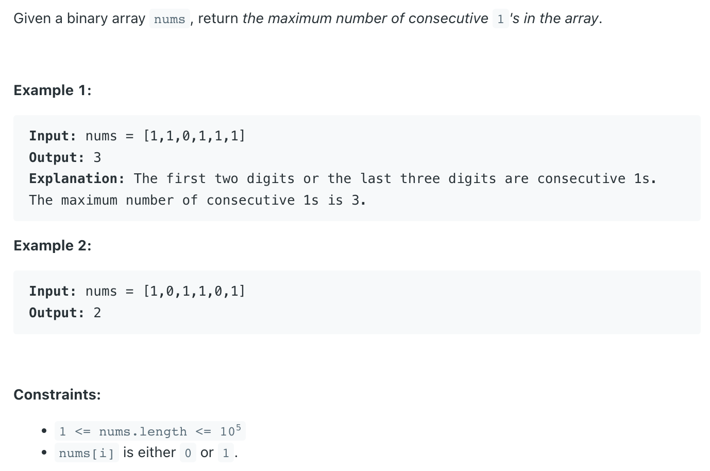
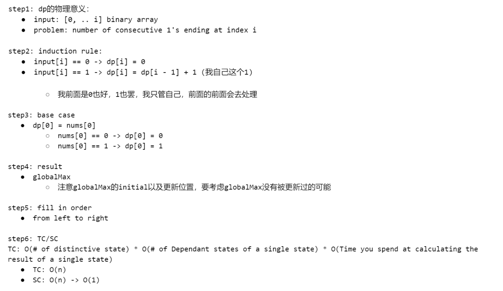

## 485. Max Consecutive Ones

---

---

```java
public class _485_MaxConsecutiveOnes {
    public int findMaxConsecutiveOnes(int[] nums) {
        if (nums == null || nums.length == 0) {
            return 0;
        }

        int[] dp = new int[nums.length];
        dp[0] = nums[0] == 0 ? 0 : 1;
        int globalMax = dp[0];
        for (int i = 1; i < nums.length; i++) {
            if (nums[i] == 1) {
                dp[i] = dp[i - 1] + 1;
            } else {
                dp[i] = 0;
            }
            globalMax = Math.max(globalMax, dp[i]);
        }
        return globalMax;
    }

    public static void main(String[] args) {
        int[] nums = {1, 1, 0, 1, 1, 1};
        _485_MaxConsecutiveOnes maxConsecutiveOnes = new _485_MaxConsecutiveOnes();
        int max = maxConsecutiveOnes.findMaxConsecutiveOnes(nums);
        System.out.println(max); // 3
    }
}
```

