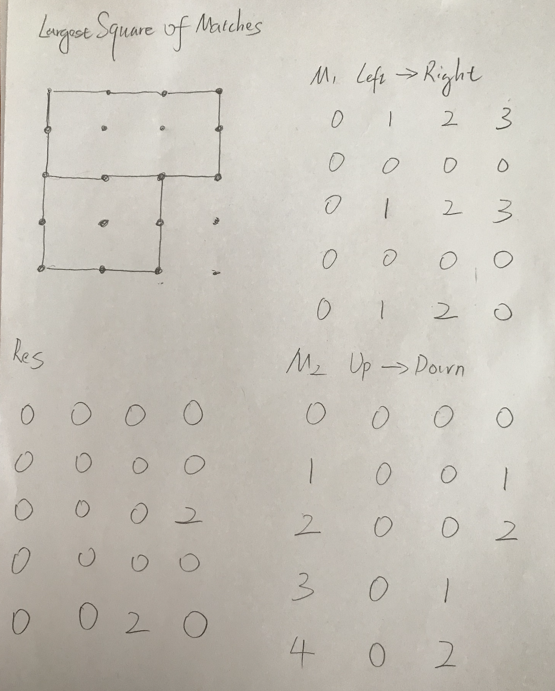

# Largest Square Of Matches

```ruby
Determine the largest square surrounded by a bunch of matches (each match is either horizontal or vertical), 
return the length of the largest square.

The input is a matrix of points. Each point has one of the following values:

0 - there is no match to its right or bottom.
1 - there is a match to its right.
2 - there is a match to its bottom.
3 - there is a match to its right, and a match to its bottom.


Assumptions
The given matrix is guaranteed to be of size M * N, where M, N >= 0

Examples

{{3, 1, 1, 3, 0, 1, 1, 0},

 {2, 0, 0, 2, 0, 0, 0, 0},

 {3, 1, 3, 0, 0, 0, 0, 0},

 {2, 0, 2, 0, 0, 0, 0, 0},

 {1, 1, 0, 0, 0, 0, 0, 0}}

This matrix represents the following bunch of matches:
```


## Analysis:



- 如图所示， M1 代表 horizontal from left -> right, when j == 0, 第一项全部init to be 0
  - linear scan 回头看， M1[i][j] = M1[i][j - 1] + 1;
  - if matrix[i][j - 1] == 0, represent 从左至右已经都会是0， 除非 在右边出现一个 matrix[i][j] == 3的 情况才有可能改变
  - if matrix[i][j - 1] == 2, represent 从左至右已经都会是0，并且2 represent 向下扩张 
    除非 在右边出现一个 matrix[i][j] == 3的 情况才有可能改变


- 如图所示， M2 代表 vertical from top -> bottom, when i == 0, 第一项全部init to be 0
  - linear scan 回头看， M2[i][j] = M1[i - 1][j] + 1;
  - if matrix[i - 1][j] == 0, represent 从上至下已经都会是0， 除非 在右边出现一个 matrix[i][j] == 3的 情况才有可能改变
  - if matrix[i - 1][j] == 1, represent 从左至右已经都会是0，并且1 represent 向右扩张 
    除非 在右边出现一个 matrix[i][j] == 3的 情况才有可能改变


```java
public class Solution {
  public int largestSquareOfMatches(int[][] matrix) {
    // Write your solution here
    int row = matrix.length;
    int col = matrix[0].length;
    if(row == 0 || col == 0){
      return 0;
    }
    int[][] hor = new int[row][col]; //horizontal.  from left to right
    int[][] ver = new int[row][col]; //vertical.  from top to bottom
    int maxLength = 0;
    int squarelen = 0;
    //horizontal
    for(int i = 0; i < row; i++){
      for(int j = 0; j < col; j++){
        if(j == 0 || matrix[i][j - 1] == 0 || matrix[i][j - 1] == 2){
          hor[i][j] = 0;
        }else{
          hor[i][j] = hor[i][j - 1] + 1;
        }
      }
    }
    //vertical
    for(int i = 0; i < row; i++){
      for(int j = 0; j < col; j++){
        if(i == 0 || matrix[i - 1][j] == 0 || matrix[i - 1][j] == 1){
          ver[i][j] = 0;
        }else{
          ver[i][j] = ver[i - 1][j] + 1;
        }
      }
    }
    //merge horizontal and vertical
    for(int i = 0; i < row; i++){
      for(int j = 0; j < col; j++){
        squarelen = Math.min(hor[i][j], ver[i][j]);
        if(ver[i][j - squarelen] >= squarelen && hor[i - squarelen][j] >= squarelen){
          maxLength = Math.max(maxLength, squarelen);
        }
      }
    }
    return maxLength;
  }
}
```