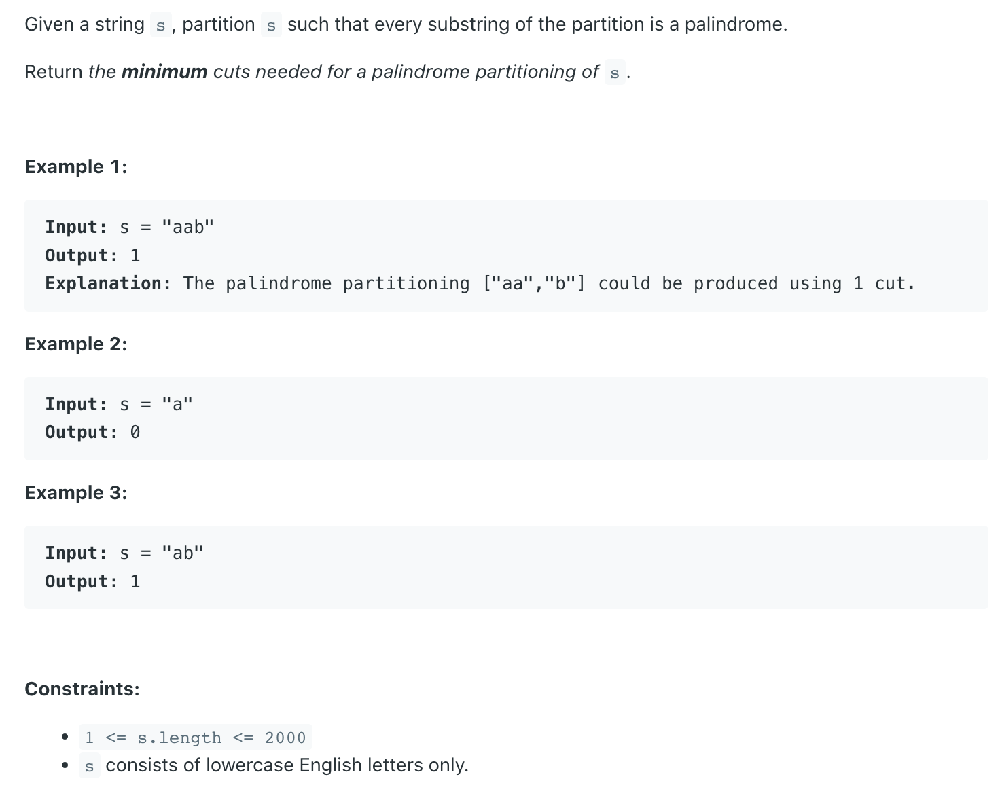

## 132. Palindrome Partitioning II | Minimum Cuts For Palindromes

---

```ruby
Given a string, a partitioning of the string is a palindrome partitioning 
if every substring of the partition is a palindrome. 
Determine the fewest cuts needed for a palindrome partitioning of a given string.

Assumptions

The given string is not null
Examples

“a | babbbab | bab | aba” is a palindrome partitioning of “ababbbabbababa”.

The minimum number of cuts needed is 3.
```

- [LO mid2 51:50]()

---
### Analysis:


Assumption:
1. if there is **only one** character in this string, it is a palindrome and **doesn't need to cut**
2. if this string is **empty**, it **doesn't need to cut**, return 0


Approach:

- "minimum cuts" -> from all the possible ways
- cut a string into every smaller substring, I can search history dictionay
- Linear Scan search on previous data
	- `dp[i]` = min cuts for `substring[0, i]`
	- induction rule:
		- `dp[i]` =
			- case 1: if `substring[0, i]` is palindrome, `dp[i] = 0`
			- case 2: `min(dp[j - 1]) + 1`   `for j: from 1 to i` ,   **&&** `substring[i, j]` is palindrome 
	- base case: `dp[0] = 0`, we don't need to cut, 
	- this dp[] array record all palindrome substring's possible ways
	   - return `dp[n - 1]`


- `j` - 右小段的第一个位置
- 左大段 `[0, j - 1] -> dp[j - 1]`


---
Additional data structures:

- need to convert this string to char Array

- Time = `O(n^3)`,      
  - two for loop n^2 * isPalindrome() while loop,   =>  n^2 * n = n^3

---


```java
class _132_PalindromePartitioning_II {
    public int minCut(String s) {
        if (s == null || s.length() == 0) return 0;

        int n = s.length();
        char[] arr = s.toCharArray();
        int[] dp = new int[n]; // 这里的dp[] 对应的是每一个char
        dp[0] = 0; // we don't need to cut
        for (int i = 1; i < n; i++) {
            // case 1:
            if (isPalindrome(arr, 0, i)) {
                continue;
            }

            // case 2:
            dp[i] = i; // worst case, we need `i` cut for (i + 1) size array
            for (int j = 1; j <= i; j++) {
                if (isPalindrome(arr, j, i)) {
                    dp[i] = Math.min(dp[i], dp[j - 1] + 1);
                }
            }
        }
        return dp[n - 1];
    }

    private boolean isPalindrome(char[] arr, int left, int right) {
        while (left <= right) {
            if (arr[left] != arr[right]) {
                return false;
            }
            left++;
            right--;
        }
        return true;
    }
}
```
---


- s = `a a b c b`


```ruby

dp  [0   0            ]
    [a   a   b   c   b]
             i 

dp  [0   0   2        ]
    [a   a   b   c   b]
             i 


dp  [0   0   2        ]
    [a   a   b   c   b]
             i 
         j 

dp  [0   0   1        ]
    [a   a   b   c   b]
             i 
             j 


dp  [0   0   1        ]
    [a   a   b   c   b]
                 i 

dp  [0   0   1   3    ]
    [a   a   b   c   b]
                 i 

dp  [0   0   1   3    ]
    [a   a   b   c   b]
                 i 
         j  

dp  [0   0   1   3    ]
    [a   a   b   c   b]
                 i 
             j 

dp  [0   0   1   2    ]
    [a   a   b   c   b]
                 i 
                 j


dp  [0   0   1   2   4]
    [a   a   b   c   b]
                     i 

dp  [0   0   1   2   4]
    [a   a   b   c   b]
                     i 
         j  


dp  [0   0   1   2   4]
    [a   a   b   c   b]
                     i 
             j  


dp  [0   0   1   2   1]
    [a   a   b   c   b]
                     i 
             j

dp  [0   0   1   2   1]
    [a   a   b   c   b]
                     i 
                 j

dp  [0   0   1   2   1]
    [a   a   b   c   b]
                     i 
                     j
```

---

- [watching this AMAZING video by Tushar Roy](https://www.youtube.com/watch?v=lDYIvtBVmgo&t=176s)
- [leetCode discussion](https://leetcode.com/problems/palindrome-partitioning-ii/discuss/42199/My-DP-Solution-(-explanation-and-code))

---


### Brute Force

- [结合前面的leetcode 讨论](https://leetcode.com/problems/palindrome-partitioning-ii/discuss/590653/From-Brute-Force-to-Top-down-DP)


- We might try all the substring combinations of the given string.
  To achive this, we might start processing from the `beginning` of the string 
  and **keep adding one character at a time**.
- If we **get a palindrome**, we take it as **one cut** and recursively process the remaining.


```java
class palindromePartitioning_II_bf {
    public int minCut(String s) {
        return minCutFrom(s, 0, s.length() - 1);
    }

    private int minCutFrom(String s, int left, int right) {
        if (left == right || isPalindrome(s, left, right)) {
            return 0;
        }
        int minCut = s.length() - 1;
        for (int i = left; i <= right; i++) {
            if (isPalindrome(s, left, i)) {
                minCut = Math.min(minCut, 1 + minCutFrom(s, i + 1, right));
            }
        }
        return minCut;
    }

    private boolean isPalindrome(String s, int l, int r) {
        while (l <= r) {
            if (s.charAt(l) != s.charAt(r)) {
                return false;
            }
            l++;
            r--;
        }
        return true;
    }

    public static void main(String[] args) {
        palindromePartitioning_II_bf palindromePartitioning_ii_bf = new palindromePartitioning_II_bf();
        int cuts = palindromePartitioning_ii_bf.minCut("ababacde");
        System.out.println(cuts); // 3
    }
}
```
---

### Top-down DP

- We might memoize both functions minCut() and isPalindrome().
  Two indexes are changing in both functions; therefore, we might build a two-dimensional array for each.


```java
class palindromePartitioning_topDownDp {
    private Integer dp[][];
    private Boolean dpIsPalindrome[][];
    
    public int minCut(String s) {
        int n = s.length();
        dp = new Integer[n][n];
        dpIsPalindrome = new Boolean[n][n];
        return minCutFrom(s, 0, n - 1);
    }

    private int minCutFrom(String s, int start, int end) {
        if (start == end || isPalindrome(s, start, end)) {
            return 0;
        }
        if (dp[start][end] != null) {
            return dp[start][end];
        }
        
        int minCut = s.length() - 1;
        for (int i = start; i <= end; i++) {
            if (isPalindrome(s, start, i)) {
                minCut = Math.min(minCut, 1 + minCutFrom(s, i + 1, end));
            }
        }
        return minCut;
    }

    private boolean isPalindrome(String s, int start, int end) {
        if (start >= end) {
            return true;
        }

        if (dpIsPalindrome[start][end] != null) {
            return dpIsPalindrome[start][end];
        }

        return dpIsPalindrome[start][end] =
                (s.charAt(start) == s.charAt(end)) && isPalindrome(s, start + 1, end - 1); 
    }
}
```