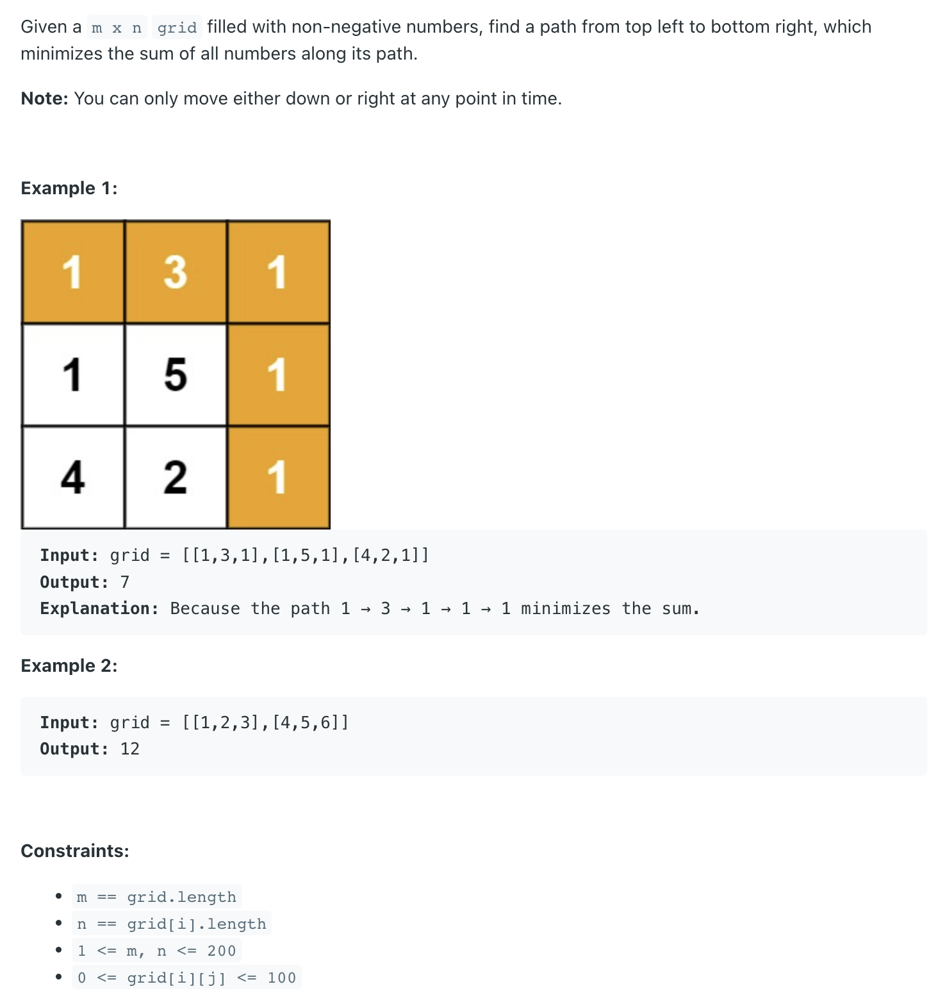

## 64. Minimum Path Sum

---

- [中文解释](https://leetcode.cn/problems/minimum-path-sum/solutions/3045828/jiao-ni-yi-bu-bu-si-kao-dpcong-ji-yi-hua-zfb2/)

---

### memorization

```py
class Solution:
    def minPathSum(self, grid: List[List[int]]) -> int:
        m, n = len(grid), len(grid[0])

        @cache
        def dfs(i, j):
            if i < 0 or j < 0:
                return inf

            if i == 0 and j == 0:
                return grid[i][j]

            return min(dfs(i - 1, j), dfs(i, j - 1)) + grid[i][j]

        return dfs(m - 1, n - 1)
```

- **without memorization**:  Two Options, either **right** or **down**, O(2^(m + n))

- memo 的 TC 分析：**O(m * n)**, 因为每一种状态只计算一次
- SC: **O(m * n)**, 保存多状态就需要多少空间


---

### 1:1 翻译成递推

```py
class Solution:
    def minPathSum(self, grid: List[List[int]]) -> int:
        m, n = len(grid), len(grid[0])
        f = [[inf] * (n + 1) for _ in range(m + 1)]
        for i, row in enumerate(grid):
            for j, x in enumerate(row):
                if i == j == 0:
                    f[1][1] = x
                else:
                    f[i + 1][j + 1] = min(f[i + 1][j], f[i][j + 1]) + x
        return f[m][n]
```


---
```java
class _64_MinimumPathSum {
    public int minPathSum(int[][] grid) {
        int m = grid.length, n = grid[0].length;
        int[][] dp = new int[m][n];
        dp[0][0] = grid[0][0];

        for (int i = 1; i < m; i++) {
            dp[i][0] = dp[i - 1][0] + grid[i][0];
        }

        for (int j = 1; j < n; j++) {
            dp[0][j] = dp[0][j - 1] + grid[0][j];
        }

        for (int i = 1; i < m; i++) {
            for (int j = 1; j < n; j++) {
                dp[i][j] = Math.min(dp[i - 1][j], dp[i][j - 1]) + grid[i][j];
            }
        }
        return dp[m - 1][n - 1];
    }
}
```