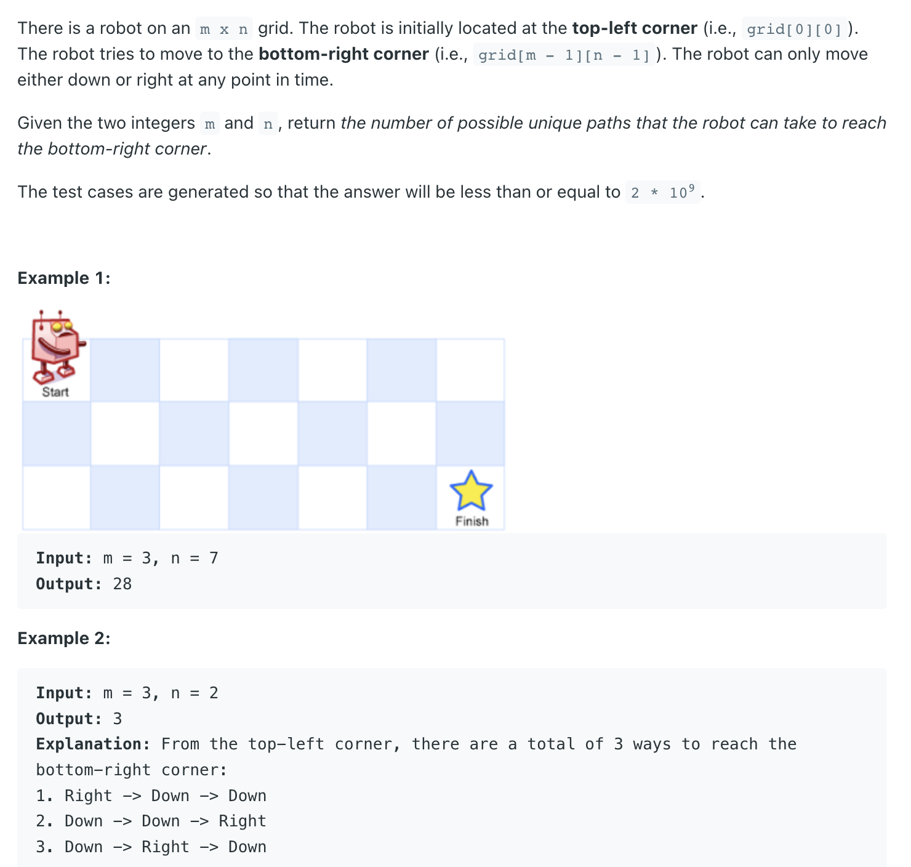
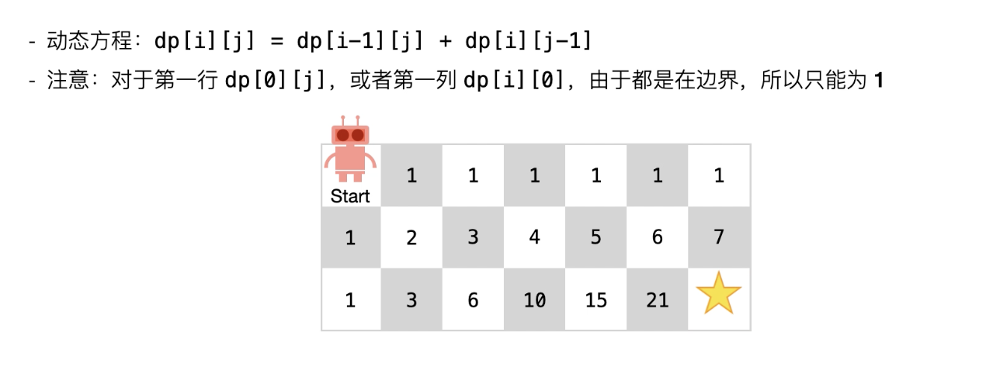
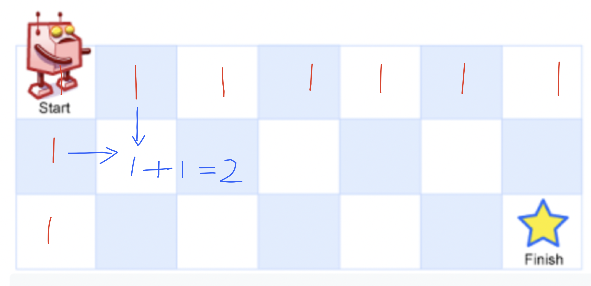

## 62. Unique Paths






- time: O(m * n)
- space: O(m * n)


```java
class Solution {
    public int uniquePaths(int m, int n) {
        int[][] dp = new int[m][n];
        
        for (int i = 0; i < m; i++) {
            dp[i][0] = 1;
        }
        
        for (int j = 0; j < n; j++) {
            dp[0][j] = 1;
        }
        
        for (int i = 1; i < m; i++) {
            for (int j = 1; j < n; j++) {
                dp[i][j] = dp[i][j - 1] + dp[i - 1][j];
            }
        }
        
        return dp[m - 1][n - 1];
    }
}
```
---

#### Python

```py
class Solution:
    def uniquePaths(self, m: int, n: int) -> int:
        dp = [[0 for _ in range(n)] for _ in range(m)]

        for i in range(m):
            dp[i][0] = 1

        for i in range(n):
            dp[0][i] = 1

        for i in range(1, m):
            for j in range(1, n):
                dp[i][j] = dp[i - 1][j] + dp[i][j - 1]
        
        return dp[m - 1][n - 1]
```