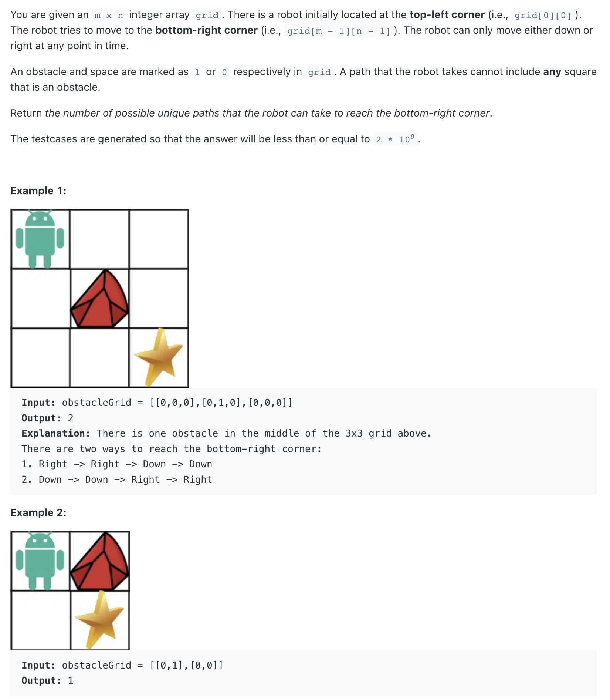
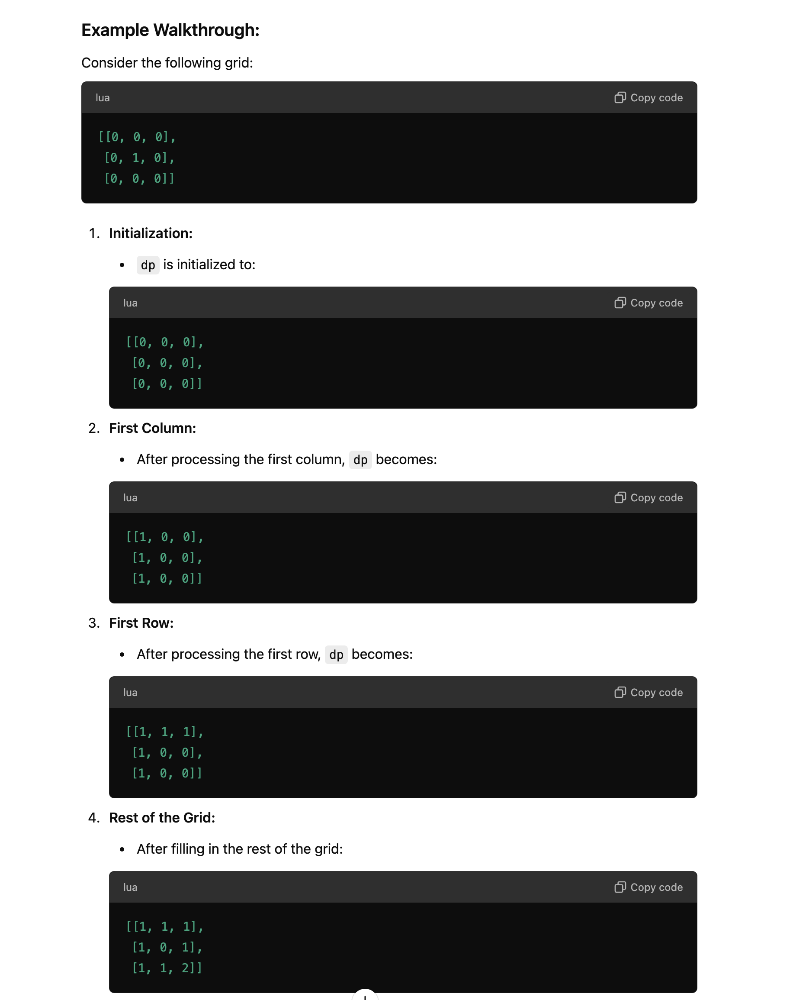

## 63. Unique Paths II



---

```java
class _63_UniquePaths_II {
    public int uniquePathsWithObstacles(int[][] obstacleGrid) {
        int m = obstacleGrid.length, n = obstacleGrid[0].length;
        int[][] dp = new int[m][n];

        for (int i = 0; i < m; i++) {
            if (obstacleGrid[i][0] == 0) { // '0' represent space
                dp[i][0] = 1;
            } else {
                //on the first column, if there is an obstacle, the rest are blocked.
                //no need to continue.
                break;
            }
        }
        for (int j = 0; j < n; j++) { // '0' represent space
            if (obstacleGrid[0][j] == 0) {
                dp[0][j] = 1;
            } else {
                //First row, once obstacle found, the rest are blocked.
                break;
            }
        }

        for (int row = 1; row < m; row++) {
            for (int col = 1; col < n; col++) {
                if (obstacleGrid[row][col] == 0) { // '0' represent space
                    dp[row][col] = dp[row - 1][col] + dp[row][col - 1];
                }
            }
        }
        return dp[m - 1][n - 1];
    }
}
```
---

#### Python

```py
class Solution:
    def uniquePathsWithObstacles(self, obstacleGrid: List[List[int]]) -> int:
        m, n = len(obstacleGrid), len(obstacleGrid[0]);
        dp = [[0 for _ in range(n)] for _ in range(m)]
        
        for i in range(m):
            if obstacleGrid[i][0] != 1:
                dp[i][0] = 1
            else:
                break
        
        for j in range(n):
            if obstacleGrid[0][j] != 1:
                dp[0][j] = 1
            else:
                break
        
        for i in range(1, m):
            for j in range(1, n):
                if obstacleGrid[i][j] != 1:
                    dp[i][j] = dp[i - 1][j] + dp[i][j - 1]
        
        return dp[m - 1][n - 1]
```