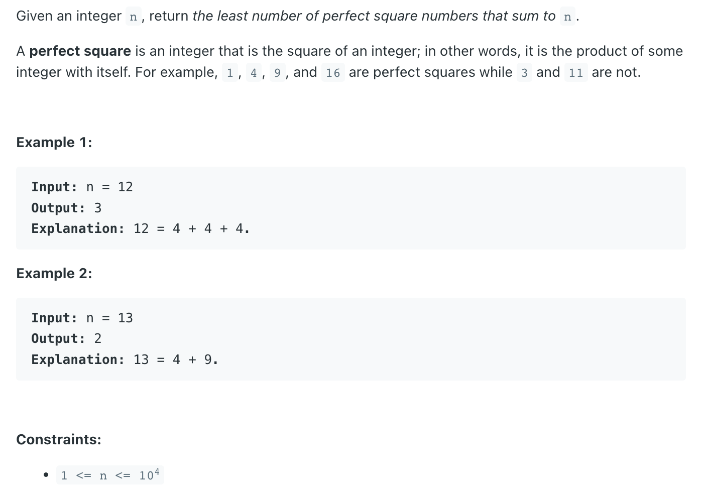

## 279. Perfect Squares

---


---

```ruby
    12
    1, 4, 9
    1 + minSquares(12 - 1)
    4 + minSquares(12 - 4) = 4 + 1 + minSquares(8 - 1)
                           = 4 + 4 + minSquares(8 - 4)
``` 


---
```java
public class _279_PerfectSquares {
    public int numSquares(int n) {
        if (n == 0) {
            return 0;
        }
        int[] dp = new int[n + 1];
        dp[0] = 0;
        for (int i = 1; i <= n; i++) {
            dp[i] = i;
            for (int j = 1; j * j <= i; j++) {
                dp[i] = Math.min(dp[i], dp[i - j * j] + 1);
            }
        }
        return dp[n];
    }

    public static void main(String[] args) {
        _279_PerfectSquares perfectSquares = new _279_PerfectSquares();
        int res = perfectSquares.numSquares(5);
        System.out.println(res); // 2
    }
}
```