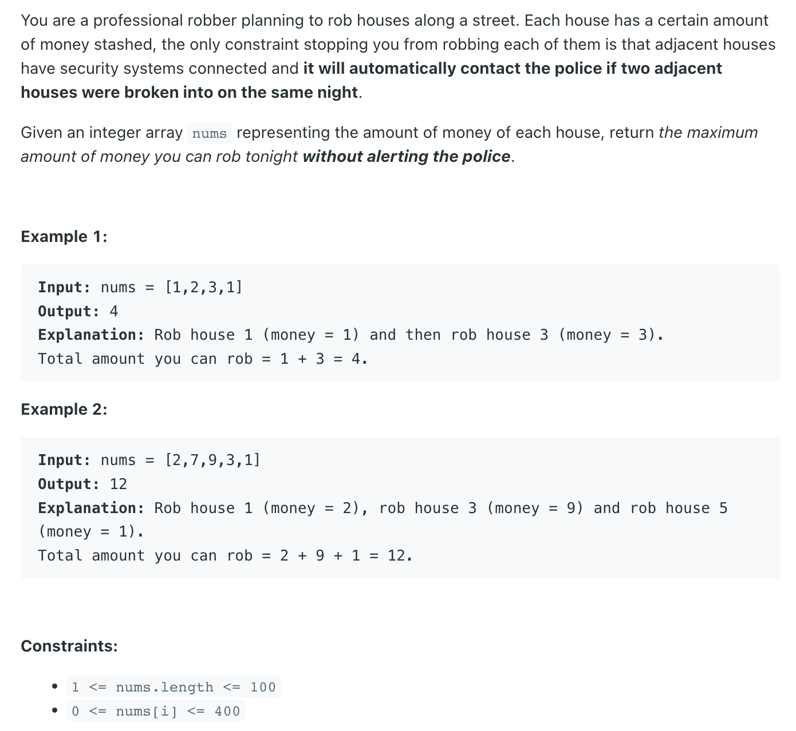
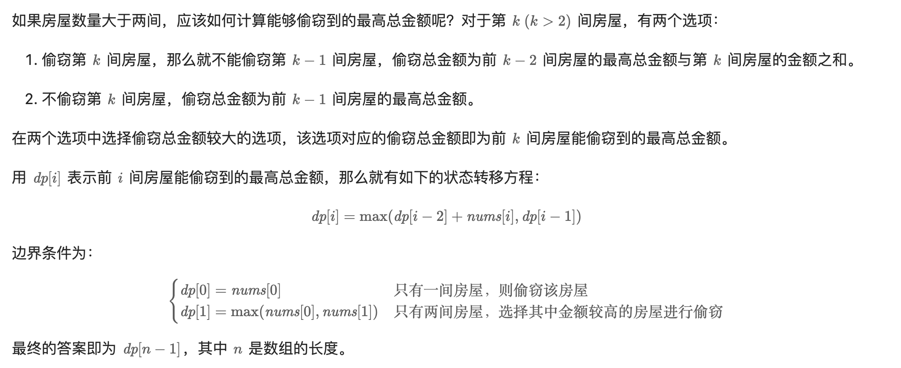

## 198. House Robber


- [中文解释](https://leetcode.cn/problems/house-robber/solutions/263856/da-jia-jie-she-by-leetcode-solution/)
---

- First, consider the simplest cases. If there is **only one** house, stealing from it will yield the highest total amount. 
  If there are **two houses**, since they are **adjacent** and **cannot be robbed at the same time**, you can only rob one of them. 
  In this case, **choosing the house with the higher amount will maximize** the total money stolen.


---

```java
class _198_HouseRobber {
    public int rob(int[] nums) {
        if (nums == null || nums.length == 0) {
            return 0;
        }
        int[] dp = new int[nums.length];
        dp[0] = nums[0];
        dp[1] = Math.max(nums[0], nums[1]);
        for (int i = 2; i < nums.length; i++) {
            dp[i] = Math.max(dp[i - 1], dp[i - 2] + nums[i]);
        }
        return dp[nums.length - 1];
    }
}

```
---

### Recursion with TLE

```java
class Solution {
    public int rob(int[] nums) {
        int n = nums.length;
        return f(n - 1, nums);
    }

    private int f(int idx, int[] nums) {
        if (idx == 0) {
            return nums[0];
        }
        if (idx < 0) {
            return 0;
        }
        int pick = nums[idx] + f(idx - 2, nums);
        int notPick = f(idx - 1, nums);
        return Math.max(pick, notPick);
    }
}
```

- TC: **O(2^N)** , where N is the number of elements in A. At each index, we have two choices of either robbing or not robbing the current 
  house. Thus this leads to time complexity of 222...n times ≈ O(2^N)
- SC: **O(N)** , It is recursive stack space.
---

### Memoization/Top-down DP: [accepted]

```py
class Solution:
    def rob(self, nums: List[int]) -> int:
        dp = [-1] * len(nums)
        return self.f(nums, dp, 0)

    def f(self, nums: List[int], dp: List[int], index: int) -> int:
        if index == len(nums) - 1:
            return nums[index]

        if index >= len(nums):
            return 0

        if dp[index] != -1:
            return dp[index]

        pick = nums[index] + self.f(nums, dp, index + 2)
        notPick = self.f(nums, dp, index + 1)
        dp[index] = max(pick, notPick)
        return dp[index]
```

- TC: **O(N)**
- SC: **O(N)+O(N)**, one is recursive stack space and anothe O(N) is for dp array.
---

### Tabulation/Buttom Up DP:

```py
class Solution:
    def rob(self, nums: List[int]) -> int:
        if len(nums) < 2:
            return nums[0]

        dp = [0] * len(nums)
        dp[0] = nums[0]
        dp[1] = max(nums[0], nums[1])
        for i in range(2, len(nums)):
            notPick = dp[i - 1]
            pick = dp[i - 2] + nums[i]
            dp[i] = max(pick, notPick)
        return dp[len(nums) - 1]
```

TC: O(N)
SC: O(N), for dp array.
