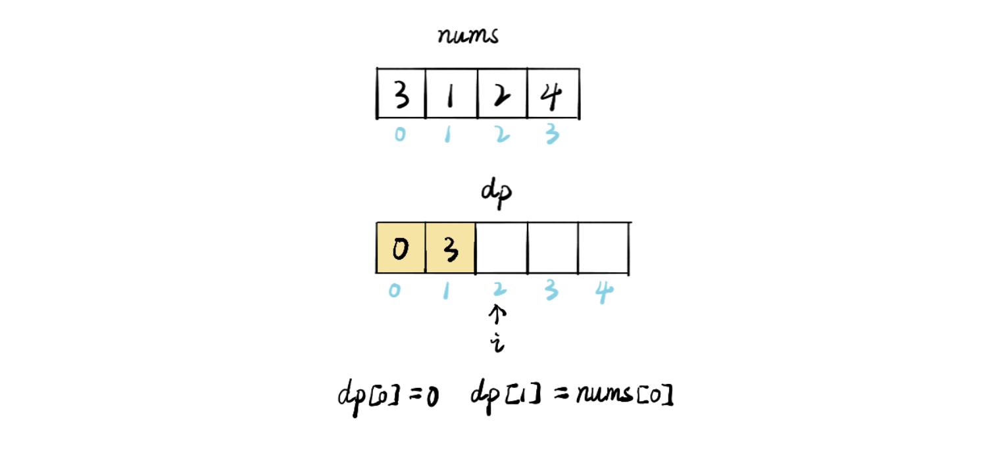
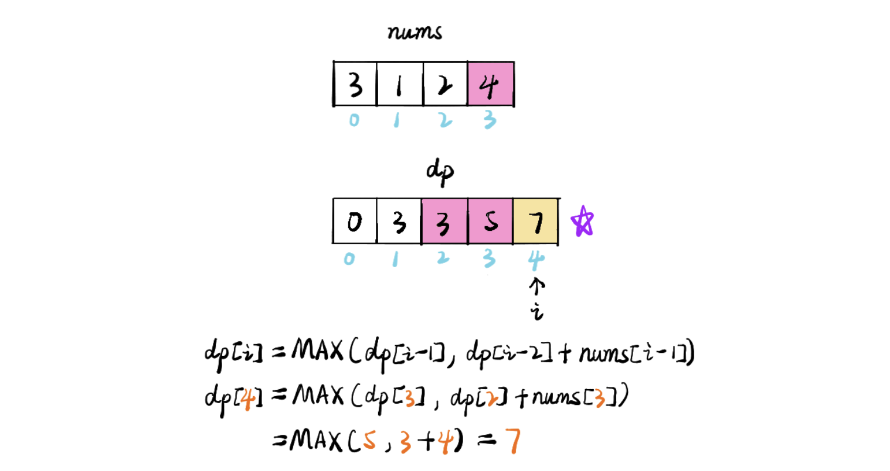

## 198. House Robber

---




---

```java
class _198_HouseRobber {
    public int rob(int[] nums) {
        if (nums == null || nums.length == 0) {
            return 0;
        }
        int[] dp = new int[nums.length + 1];
        dp[0] = 0;
        dp[1] = nums[0];
        for (int i = 2; i <= nums.length; i++) {
            dp[i] = Math.max(dp[i - 1], dp[i - 2] + nums[i - 1]);
        }
        return dp[nums.length];
    }

    public static void main(String[] args) {
        _198_HouseRobber houseRobber = new _198_HouseRobber();
        int[] nums = {3, 1, 2, 4};
        System.out.println(houseRobber.rob(nums)); // 7
    }
}

```