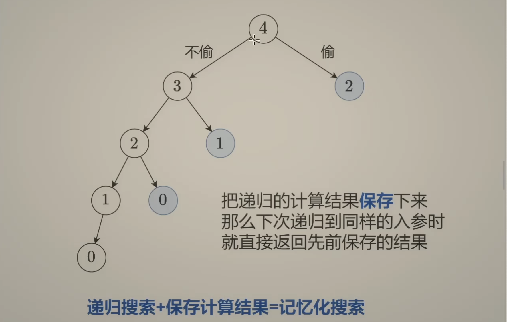
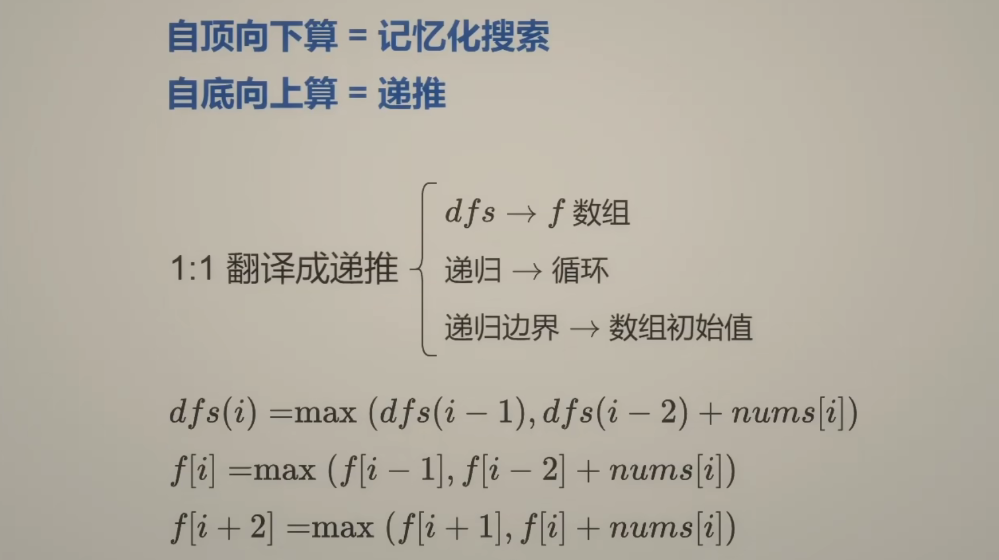
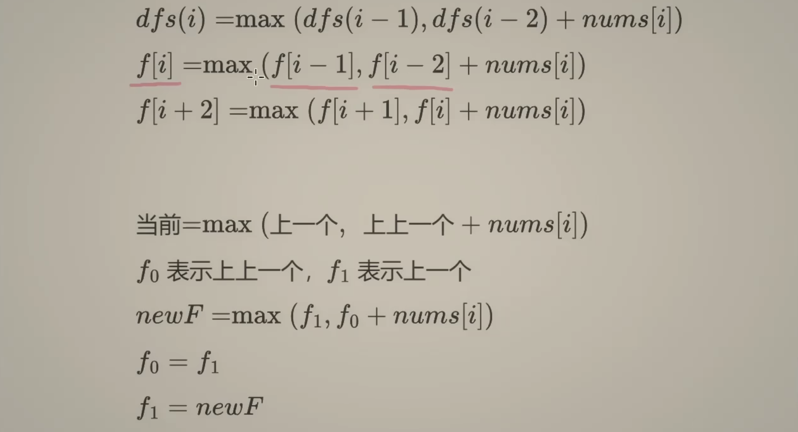

## 198. House Robber


- First, consider the simplest cases. If there is **only one** house, stealing from it will yield the highest total amount. 
  If there are **two houses**, since they are **adjacent** and **cannot be robbed at the same time**, you can only rob one of them. 
  In this case, **choosing the house with the higher amount will maximize** the total money stolen.


---


---

### Recursion with TLE

```java
class Solution {
    public int rob(int[] nums) {
        int n = nums.length;
        return f(n - 1, nums);
    }

    private int f(int idx, int[] nums) {
        if (idx == 0) {
            return nums[0];
        }
        if (idx < 0) {
            return 0;
        }
        int pick = nums[idx] + f(idx - 2, nums);
        int notPick = f(idx - 1, nums);
        return Math.max(pick, notPick);
    }
}
```

- TC: **O(2^N)** , where N is the number of elements in A. At each index, we have **two choices of either robbing or not robbing** the current 
  house. Thus this leads to time complexity of 222...n times ≈ O(2^N)
- SC: **O(N)** , It is recursive stack space.
---


---


- LC 198 代码：

```py
class Solution:
    def rob(self, nums: List[int]) -> int:
        n = len(nums)

        @cache
        def dfs(index):
            if index < 0:
                return 0
            res = max(dfs(index - 1), nums[index] + dfs(index - 2))
            return res
        return dfs(n - 1)
```


- 为什么选择记忆化搜索，因为我们可以发现有[很多subproblem 是重复计算的](https://www.bilibili.com/video/BV1Xj411K7oF?t=192.6)：


---

### 复杂度如何计算？

- TC = **状态个数 * 单个状态所需要的计算时间** = **O(N) * O(1)** = O(N)
- SC = **O(N)**
---




- 0 and 1 merge to => 2, 2 and 1 merge to => 3, 3 and 2 merge to => 4
- 既然我们已经知道从哪些点归到哪些点, 那么可以去掉递归中的递:



- 注意：由于 i - 2 可能最终导致 i 为负数，所以我们让 **i + 2** 来计算:
  - **f[i] = max(f[i - 1], f[i - 2] + nums[i])**, let **i + 2**  
  - **f[i + 2] = max(f[i + 1], f[i] + nums[i])**

- 于是代码变成：


```py
class Solution:
    def rob(self, nums: List[int]) -> int:
        n = len(nums)
        f = [0] * (n + 2)
        for index, num in enumerate(nums):
            f[index + 2] = max(f[index + 1], f[index] + num)
        return f[n + 1]
```

- 但是这个代码的: SC = **O(N)**, 如何改成 => O(1) ?



- 于是代码变成:

```py
class Solution:
    def rob(self, nums: List[int]) -> int:
        n = len(nums)
        f0 = f1 = 0
        for index, num in enumerate(nums):
            new_f = max(f1, f0 + num)
            f0 = f1
            f1 = new_f
        return f1
```
