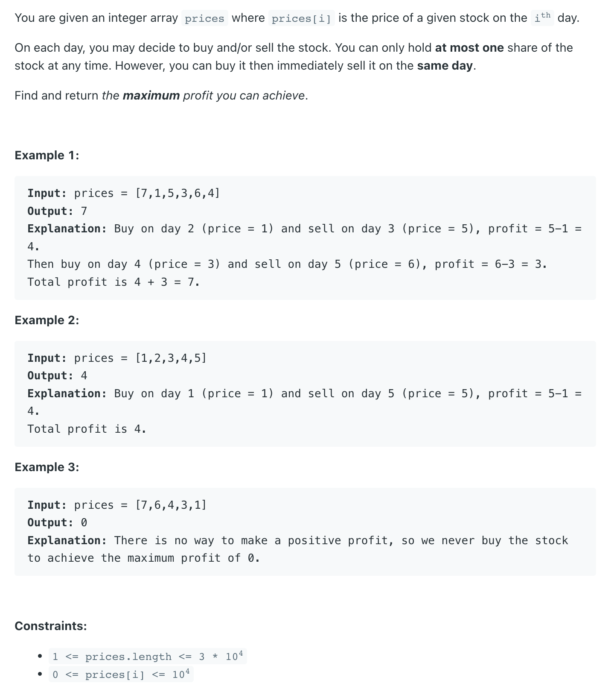

## 122. Best Time to Buy and Sell Stock II

---

### Memoization

```py
class Solution:
    def maxProfit(self, prices: List[int]) -> int:
        n = len(prices)
        dp = [[-1 for _ in range(2)] for _ in range(len(prices))]
        return self.dfs(prices, 1, dp, 0)

    def dfs(self, prices, is_buy, dp, index) -> int:
        if index >= len(prices):
            return 0
        if dp[index][is_buy] != -1:
            return dp[index][is_buy]

        if is_buy:
            buy = -prices[index] + self.dfs(prices, 0, dp, index + 1)
            skip = self.dfs(prices, 1, dp, index + 1)
            dp[index][is_buy] = max(buy, skip)
            return dp[index][is_buy]
        else:
            sell = prices[index] + self.dfs(prices, 1, dp, index + 1)
            hold = self.dfs(prices, 0, dp, index + 1)
            dp[index][is_buy] = max(sell, hold)
            return dp[index][is_buy]
```

---
### bottom-up DP

- for each day
  - either 1. hold a share
  - or     2. not hold a share 

---
```py
class Solution:
    def maxProfit(self, prices: List[int]) -> int:
        n = len(prices)
        # Handle the case of an empty price list
        if n == 0:
            return 0

        # dp[i][0]: max cash at the end of day i, not holding stock
        # dp[i][1]: max cash at the end of day i, holding stock
        dp = [[0] * 2 for _ in range(n + 1)]

        # dp[0][0]: Before considering any prices, not holding -> cash is 0.
        dp[0][0] = 0
        # dp[0][1]: Before considering any prices, holding -> This state is impossible.
        dp[0][1] = -float('inf')

        # dp[i] will store the results after considering the first 'i' prices (prices[0]...prices[i-1])
        for i in range(1, n + 1):
            # Case 1: not holding stock today
            # Either we did nothing today (carry dp[i-1][0]) or sold stock today (dp[i-1][1] + price)
            dp[i][0] = max(dp[i - 1][0], dp[i - 1][1] + prices[i - 1])
            # Case 2: holding stock today
            # Either we did nothing today (carry dp[i-1][1]) or bought stock today (dp[i-1][0] - price)
            dp[i][1] = max(dp[i - 1][0] - prices[i - 1], dp[i - 1][1])

        # Final result: maximum profit at the end of day n with no stock in hand
        return dp[n][0]
```