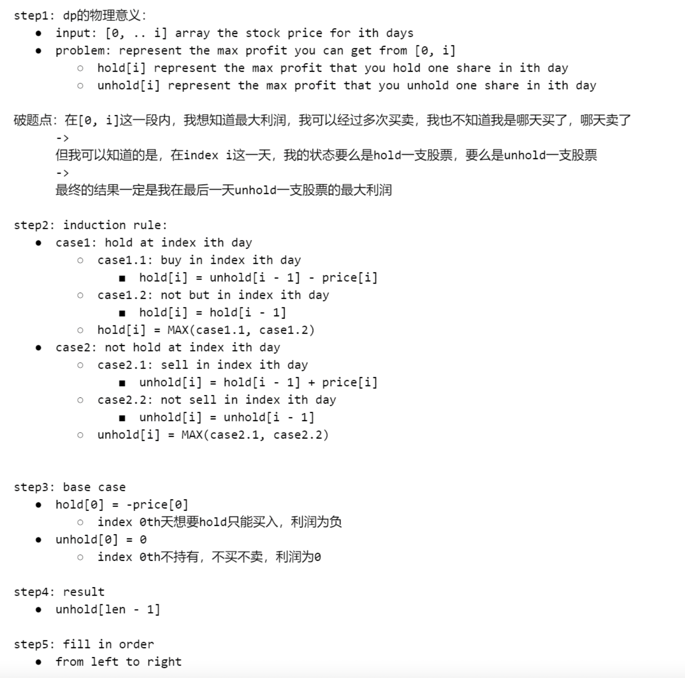

## 122. Best Time to Buy and Sell Stock II

---

### Memoization

```py
class Solution:
    def maxProfit(self, prices: List[int]) -> int:
        n = len(prices)
        dp = [[-1 for _ in range(2)] for _ in range(len(prices))]
        return self.dfs(prices, 1, dp, 0)

    def dfs(self, prices, is_buy, dp, index) -> int:
        if index >= len(prices):
            return 0
        if dp[index][is_buy] != -1:
            return dp[index][is_buy]

        if is_buy:
            buy = -prices[index] + self.dfs(prices, 0, dp, index + 1)
            skip = self.dfs(prices, 1, dp, index + 1)
            dp[index][is_buy] = max(buy, skip)
            return dp[index][is_buy]
        else:
            sell = prices[index] + self.dfs(prices, 1, dp, index + 1)
            hold = self.dfs(prices, 0, dp, index + 1)
            dp[index][is_buy] = max(sell, hold)
            return dp[index][is_buy]
```
---
### bottom-up DP

```py
class Solution:
    def maxProfit(self, prices: List[int]) -> int:
        n = len(prices)
        dp = [ [0 for _ in range(2)] for _ in range(len(prices) + 1)]
        for index in range(n - 1, -1, -1):
            for is_buy in range(2):
                if is_buy:
                    buy = -prices[index] + dp[index + 1][0]
                    skip = 0 + dp[index + 1][1]
                    dp[index][is_buy] = max(buy, skip)
                else:
                    sell = prices[index] + dp[index + 1][1]
                    hold = 0 + dp[index + 1][0]
                    dp[index][is_buy] = max(sell, hold)
        
        return dp[0][1]
```

---
### DP

- for each day
  - either 1. hold a share
  - or     2. not hold a share 



---
```java
class bestTimeToBuyAndSellStock_II_dp {
    public int maxProfit(int[] prices) {
        if (prices == null || prices.length == 0) return 0;

        int[] hold = new int[prices.length];
        int[] unhold = new int[prices.length];
        hold[0] = -prices[0];
        unhold[0] = 0;
        
        for (int i = 1; i < prices.length; i++) {
            hold[i] = Math.max(hold[i - 1], unhold[i - 1] - prices[i]);
            unhold[i] = Math.max(unhold[i - 1], hold[i - 1] + prices[i]);
        }
        return unhold[prices.length - 1];
    }
}
```