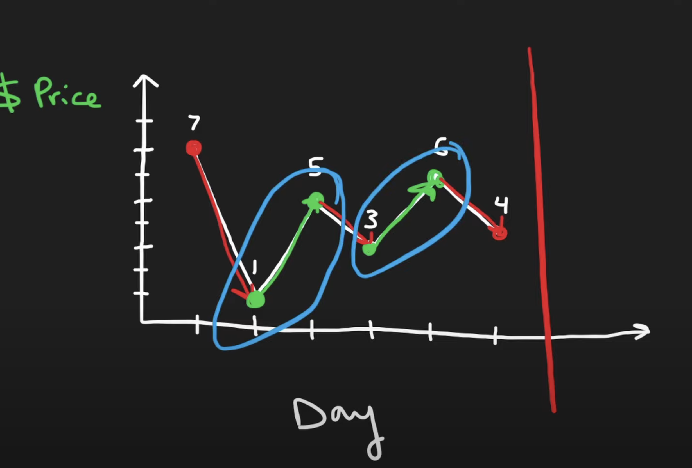
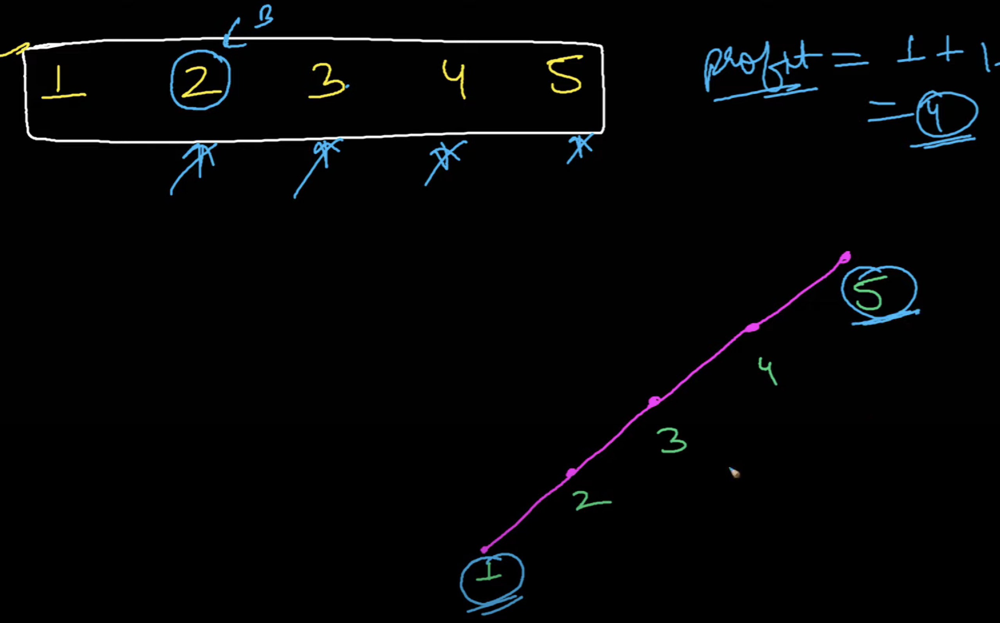

## 122. Best Time to Buy and Sell Stock II

---



- we just need to `add` every **increase of the stock price**
- 可以看到只要每一次是递增就加到profit里，如果是decrease的，就不需要操作



- 如果从`1`到`5` 是递增的，则可以把每一段间距加起来

---
```java
class bestTimeToBuyAndSellStock {
    public int maxProfit(int[] prices) {
        int profit = 0;
        for (int i = 1; i < prices.length; i++) {
            if (prices[i] > prices[i - 1]) {
                profit += prices[i] - prices[i - 1];
            }
        }
        return profit;
    }
}
```
---


## DP
