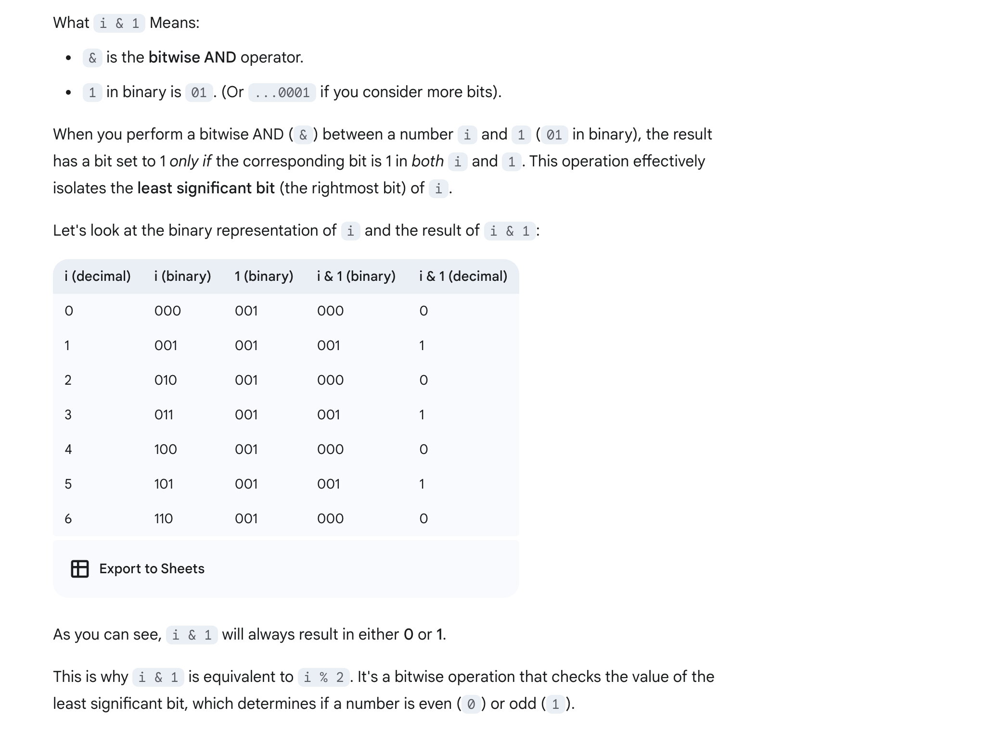

## 123. Best Time to Buy and Sell Stock III

---
### Memoization

```py
class Solution:
    def maxProfit(self, prices: List[int]) -> int:
        n = len(prices)
        # Initialize a 3D DP array with -1
        dp = [[[-1 for _ in range(3)] for _ in range(2)] for _ in range(n)]
        return self.dfs(prices, 1, 2, dp, 0)

    def dfs(self, prices, is_buy, transactions_left, dp, index) -> int:
        if index >= len(prices) or transactions_left == 0:
            return 0
        # if transactions_left == 0:
        #     return 0
        if dp[index][is_buy][transactions_left] != -1:
            return dp[index][is_buy][transactions_left]

        if is_buy:
            buy = -prices[index] + self.dfs(prices, 0, transactions_left, dp, index + 1)
            skip = self.dfs(prices, 1, transactions_left, dp, index + 1)
            dp[index][is_buy][transactions_left] = max(buy, skip)
        else:
            sell = prices[index] + self.dfs(prices, 1, transactions_left - 1, dp, index + 1)
            hold = self.dfs(prices, 0, transactions_left, dp, index + 1)
            dp[index][is_buy][transactions_left] = max(sell, hold)

        return dp[index][is_buy][transactions_left]
```
---

### Tabulation

- **Only 2 transaction**


- for every day, `4` cases:
  - 1. has the first share **buy1**
  - 2. sell the first share **sell1**
  - 3. has the second share **buy2**
  - 4. sell the second share **sell2**
  - `buy1 = max(buy1, -prices[i])`
  - `sell1 = max(sell1, buy1 + prices[i])`
  - `buy2 = max(buy2, sell1 - prices[i])`
  - `sell2 = max(sell2, buy2 + prices[i])`
---

```java
class bestTimeToBuyAndSellStock_III_dp {
    public int maxProfit(int[] prices) {
        int n = prices.length;
        if (n == 0) return 0;

        int buy1 = -prices[0];
        int sell1 = 0;
        int buy2 = -prices[0]; // 这里也必须是 -prices[0]
        int sell2 = 0;

        for (int i = 1; i < n; i++) {
            buy1 = Math.max(buy1, -prices[i]);
            sell1 = Math.max(sell1, buy1 + prices[i]);
            buy2 = Math.max(buy2, sell1 - prices[i]);
            sell2 = Math.max(sell2, buy2 + prices[i]);
        }

        return Math.max(sell1, sell2); // 这里为什么选择其中一个，因为题目最多要求at most 2 transactions
                                       // 也就是说，一次也可以
    }
}
```
---

```ruby
class Solution:
    def maxProfit(self, prices: List[int]) -> int:
        n = len(prices)

        # dp[i][k][holding_status]
        # i: Day index (0 to n-1)
        # k: Number of transactions completed (1 or 2 represent meaningful values)
        # holding_status: 0 (not holding stock), 1 (holding stock)
        dp = [[[0] * 2 for _ in range(3)] for _ in range(n)]

        # 第 3 维规定了必须持股，因此是 -prices[0]
        dp[0][1][1] = -prices[0]  # Represents buying on day 0, ending day 0 holding.
        dp[0][1][0] = 0  # Day 0, 1 transaction completed, not holding stock.

        # Day 0, 2 transactions completed, holding stock
        dp[0][2][1] = -float('inf')  # Day 0, 2 transactions completed, not holding stock. (Impossible state)
        dp[0][2][0] = -float('inf')  # This state should also typically be -infinity initially

        for i in range(1, n):
            # 转移顺序先持股，再卖出
            # --- Transitions for k = 1 completed transaction ---
            # Max of:
            # 1. Held from day i-1 (dp[i-1][1][1]), staying at 1 completed.
            # 2. Bought today (-prices[i]), coming from a state where you were not holding
            dp[i][1][1] = max(dp[i - 1][1][1], - prices[i])
            # Max of:
            # 1. Was not holding day i-1 (dp[i-1][1][0]), staying at 1 completed.
            # 2. Sold today (+ prices[i]), from holding state (dp[i-1][1][1]). Selling completes a transaction, moving to 2 completed.
            dp[i][1][0] = max(dp[i - 1][1][0], dp[i - 1][1][1] + prices[i])

            # --- Transitions for k = 2 completed transactions ---
            # Max of:
            # 1. Held from day i-1 (dp[i-1][2][1]), staying at 2 completed.
            # 2. Bought today (-prices[i]), coming from not holding state with 1 completed (dp[i-1][1][0]).
            dp[i][2][1] = max(dp[i - 1][2][1], dp[i - 1][1][0] - prices[i])
            # Max of:
            # 1. Was not holding day i-1 (dp[i-1][2][0]), staying at 2 completed.
            # 2. Sold today (+ prices[i]), from holding state with 2 completed (dp[i-1][2][1]).
            dp[i][2][0] = max(dp[i - 1][2][0], dp[i - 1][2][1] + prices[i])

        # The final answer is the maximum cash at the end of the last day (index n-1),
        # when not holding stock, with either 1 completed transaction (dp[n-1][1][0]) or 2 completed transactions (dp[n-1][2][0]).
        # This covers the cases where the maximum profit is achieved after completing 1 or 2 transactions.
        return max(dp[n - 1][1][0], dp[n - 1][2][0])
```
---

### Rolling Array to save SC

```py
class Solution:
    def maxProfit(self, prices: List[int]) -> int:
        n = len(prices)

        dp = [[[0] * 2 for _ in range(3)] for _ in range(n)]

        # 第 3 维规定了必须持股，因此是 -prices[0]
        dp[0][1][1] = -prices[0]  # Represents buying on day 0, ending day 0 holding.
        dp[0][1][0] = 0  # Day 0, 1 transaction completed, not holding stock.

        # Day 0, 2 transactions completed, holding stock
        dp[0][2][1] = -float('inf')  # Day 0, 2 transactions completed, not holding stock. (Impossible state)
        dp[0][2][0] = -float('inf')  # This state should also typically be -infinity initially

        for i in range(1, n):
            dp[i & 1][1][1] = max(dp[(i - 1) & 1][1][1], - prices[i])
            dp[i & 1][1][0] = max(dp[(i - 1) & 1][1][0], dp[(i - 1) & 1][1][1] + prices[i])

            dp[i & 1][2][1] = max(dp[(i - 1) & 1][2][1], dp[(i - 1) & 1][1][0] - prices[i])
            dp[i & 1][2][0] = max(dp[(i - 1) & 1][2][0], dp[(i - 1) & 1][2][1] + prices[i])
        return max(dp[(n - 1) & 1][1][0], dp[(n - 1) & 1][2][0])
```

---

### remove one dimension **day**

```py
class Solution:
    def maxProfit(self, prices: List[int]) -> int:
        n = len(prices)

        dp = [[0] * 2 for _ in range(3)]

        dp[1][1] = -prices[0]
        dp[1][0] = 0

        dp[2][1] = -float('inf')
        dp[2][0] = -float('inf')

        for i in range(1, n):
            dp[1][1] = max(dp[1][1], - prices[i])
            dp[1][0] = max(dp[1][0], dp[1][1] + prices[i])

            dp[2][1] = max(dp[2][1], dp[1][0] - prices[i])
            dp[2][0] = max(dp[2][0], dp[2][1] + prices[i])
        return max(dp[1][0], dp[2][0])
```