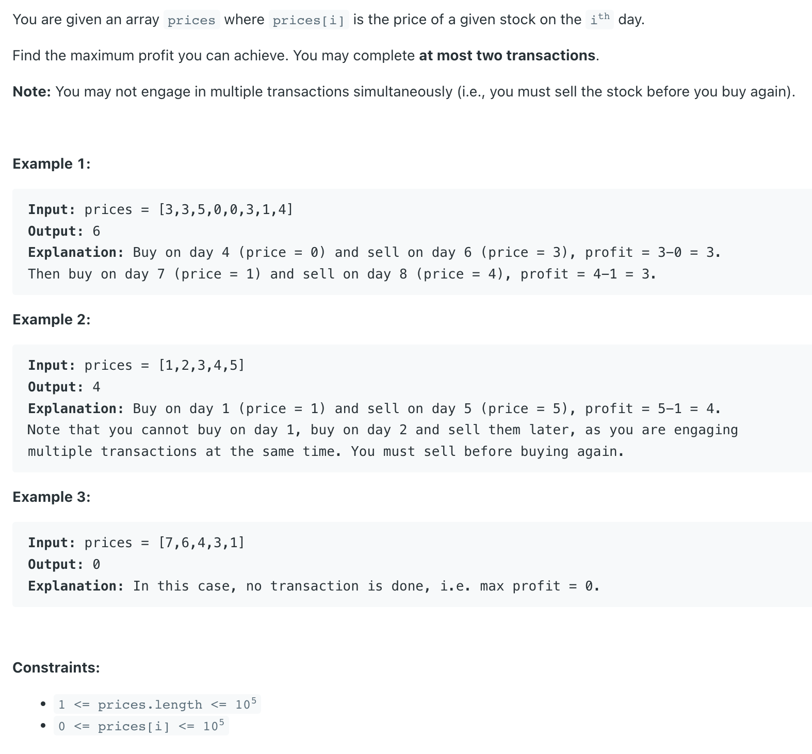
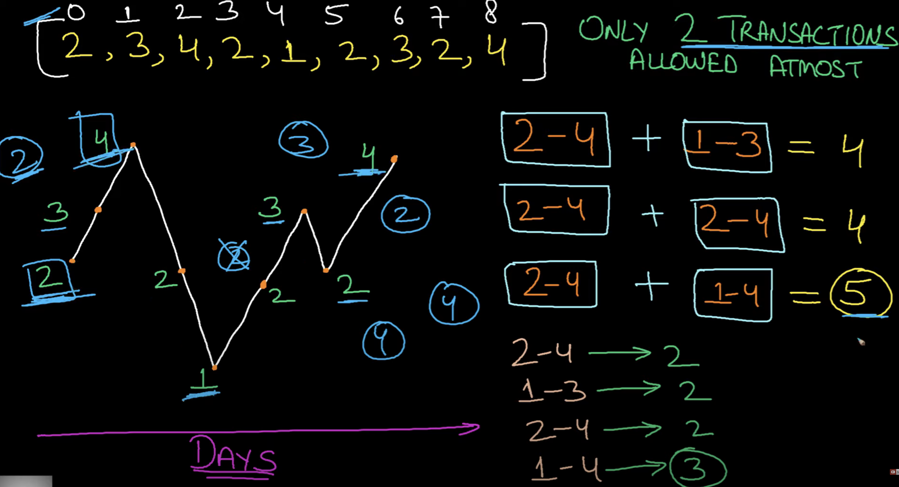
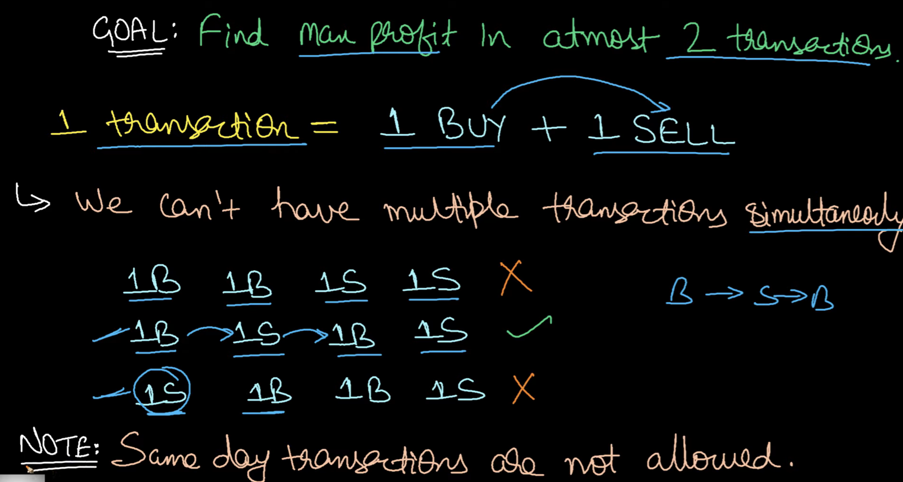

## 123. Best Time to Buy and Sell Stock III


- [youtube1](https://www.youtube.com/watch?v=37s1_xBiqH0&t=166s)
- [youtube2 CHN](https://www.youtube.com/watch?v=USEFjOtuyA4&t=706s)
---


- **Only 2 transaction**



- for every day, `4` cases:
  - 1. has the first share **buy1**
  - 2. sell the first share **sell1**
  - 3. has the second share **buy2**
  - 4. sell the second share **sell2**
  - `buy1 = max(buy1,  -prices[i])`
  - `sell1 = max(sell1,  buy1 + prices[i])`
  - `buy2 = max(buy2,  sell-prices[i])`
  - `buy1 = max(buy1,  -prices[i])`
---

```java
class bestTimeToBuyAndSellStock_III_dp {
    public int maxProfit(int[] prices) {
        int n = prices.length;
        if (n == 0) return 0;

        int buy1 = -prices[0];
        int sell1 = 0;
        int buy2 = -prices[0]; // 这里也必须是 -prices[0]
        int sell2 = 0;

        for (int i = 1; i < n; i++) {
            buy1 = Math.max(buy1, -prices[i]);
            sell1 = Math.max(sell1, buy1 + prices[i]);
            buy2 = Math.max(buy2, sell1 - prices[i]);
            sell2 = Math.max(sell2, buy2 + prices[i]);
        }

        return Math.max(sell1, sell2); // 这里为什么选择其中一个，因为题目最多要求at most 2 transactions
                                       // 也就是说，一次也可以
    }
}
```
