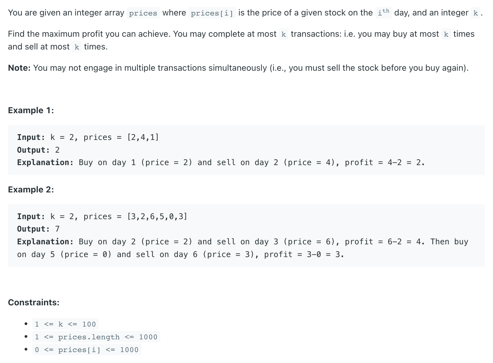

## 188. Best Time to Buy and Sell Stock IV


---

### Top-Down Memoization DFS (solve it by meself 🎉)

```py
class Solution:
    def maxProfit(self, k: int, prices: List[int]) -> int:
        n = len(prices)
        dp = [ [[-1 for _ in range(k + 1) ]for _ in range(2)] for _ in range(len(prices))]
        return self.dfs(prices, 1, k, dp, 0)
    
    def dfs(self, prices, is_buy, transactions_left, dp, index):
        if index >= len(prices):
            return 0
        if transactions_left == 0:
            return 0
        if dp[index][is_buy][transactions_left] != -1:
            return dp[index][is_buy][transactions_left]
        
        if is_buy:
            buy = -prices[index] + self.dfs(prices, 0, transactions_left, dp, index + 1)
            skip = 0 + self.dfs(prices, 1, transactions_left, dp, index + 1)
            dp[index][is_buy][transactions_left] = max(buy, skip)
        else:
            sell = prices[index] + self.dfs(prices, 1, transactions_left - 1, dp, index + 1)
            hold = 0 + self.dfs(prices, 0, transactions_left, dp, index + 1)
            dp[index][is_buy][transactions_left] = max(sell, hold)
        
        return dp[index][is_buy][transactions_left]
```


---

### Tabulation

```py
class Solution:
    def maxProfit(self, k: int, prices: List[int]) -> int:
        n = len(prices)
        # Edge case optimization: If k is large enough, this problem reduces to Leetcode 122
        # if k >= n // 2:
        #     return sum(max(prices[i + 1] - prices[i], 0) for i in range(n - 1))

        dp = [[[0 for _ in range(k + 1)] for _ in range(2)] for _ in range(n + 1)]
        for index in range(n - 1, -1, -1):
            for is_buy in range(2):
                for t_l in range(1, k + 1):
                    if is_buy:
                        dp[index][is_buy][t_l] = max(-prices[index] + dp[index + 1][0][t_l], dp[index + 1][1][t_l])
                    else:
                        dp[index][is_buy][t_l] = max(prices[index] + dp[index + 1][1][t_l - 1], dp[index + 1][0][t_l])

        return dp[0][1][k]
```