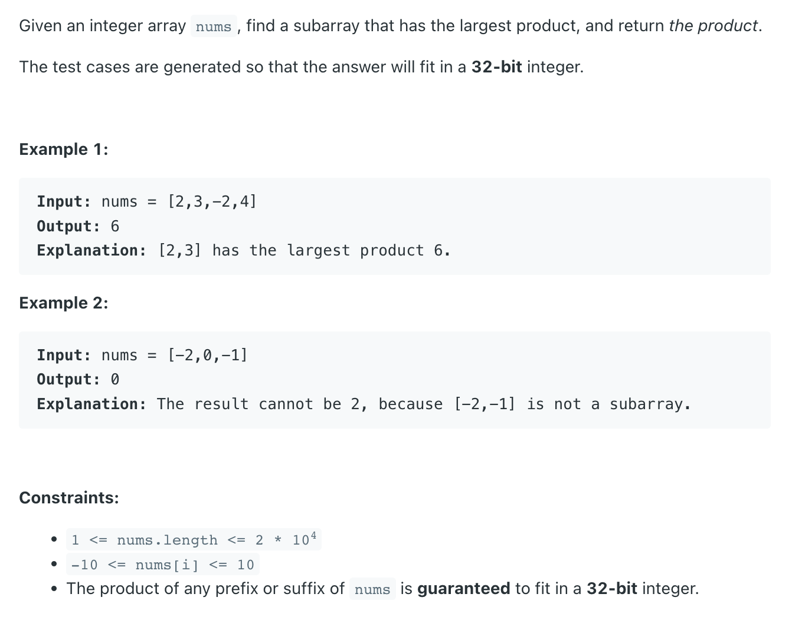
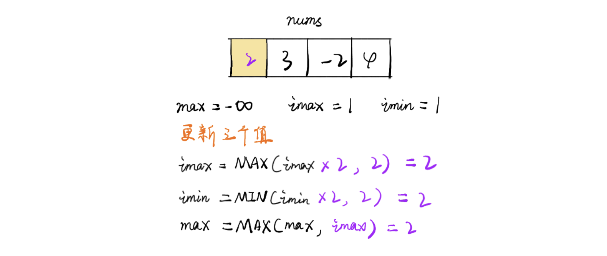
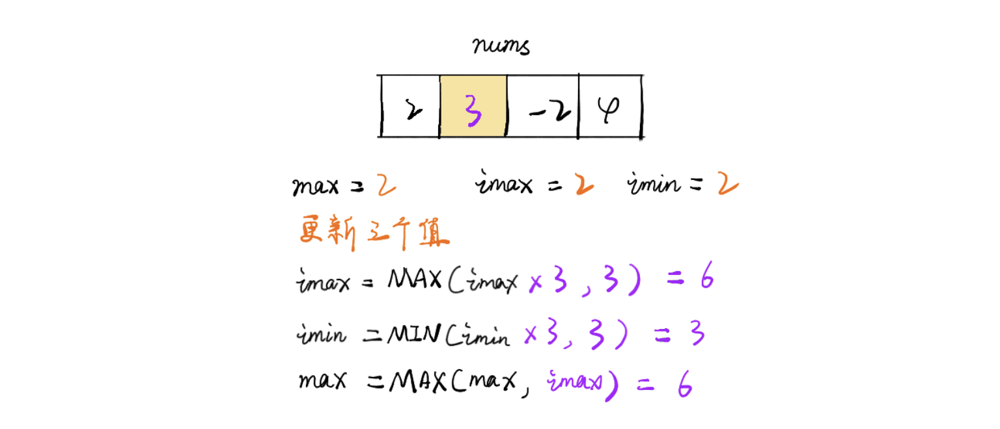
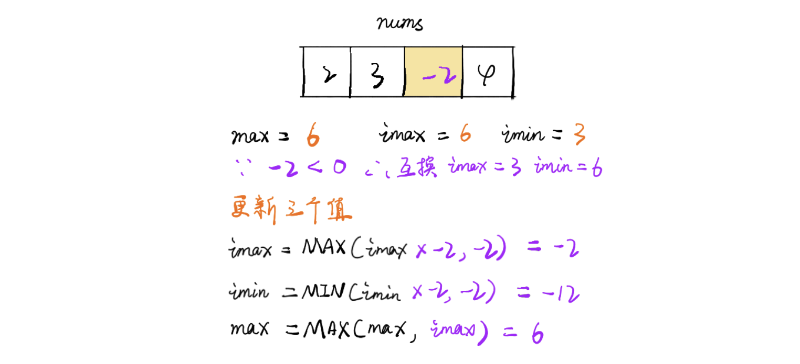
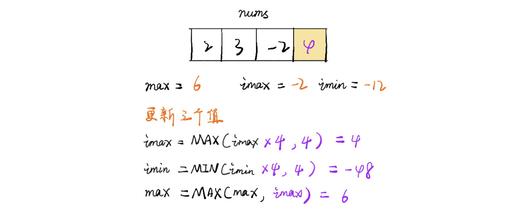
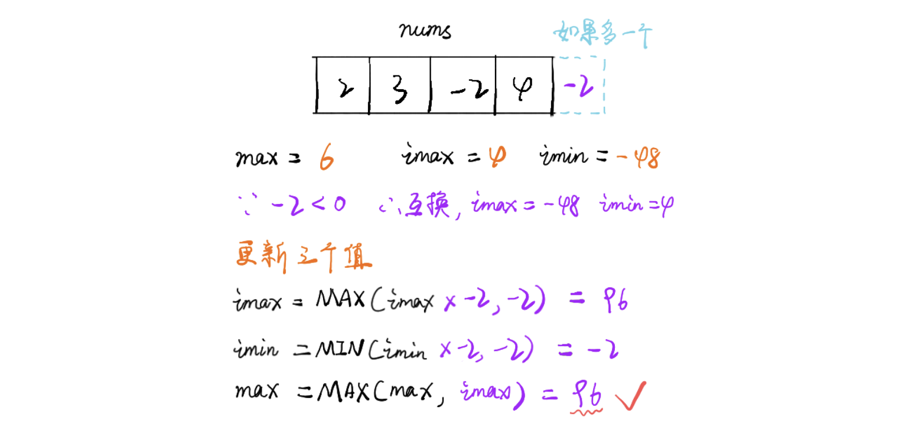

## 152. Maximum Product Subarray

---
- [中文教程 ｜ 博大精深!](https://leetcode.cn/problems/maximum-product-subarray/solution/hua-jie-suan-fa-152-cheng-ji-zui-da-zi-xu-lie-by-g/)
---











---

```ruby
max = 1, min = 1
res = MIN_VALUE
            [2   -2   3    2   -3    5]
+Product:    2   -2   3    6   72   360
-Product:    2   -4  -12  -24  -18  -90 
```
---


