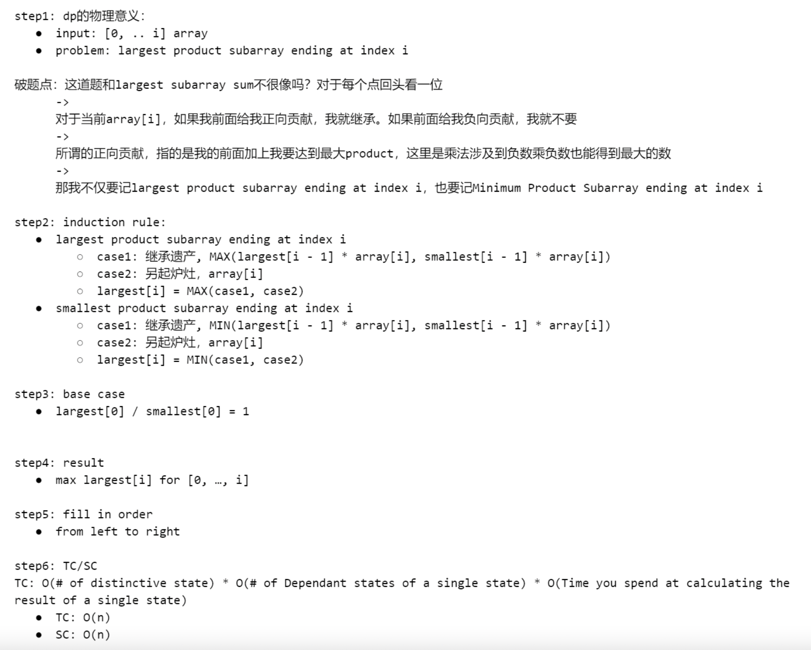

## 152. Maximum Product Subarray

---


```java
public class maxProductSubarray {
    public int maxProduct(int[] nums) {
        int n = nums.length;
        int[] largest = new int[n];
        int[] smallest = new int[n];
        largest[0] = nums[0];
        smallest[0] = nums[0];
        int max = largest[0];

        for (int i = 1; i < n; i++) {
            int tmpLargest = Math.max(nums[i] * largest[i - 1], nums[i] * smallest[i - 1]);
            largest[i] = Math.max(tmpLargest, nums[i]);

            int tmpSmallest = Math.min(nums[i] * largest[i - 1], nums[i] * smallest[i - 1]);
            smallest[i] = Math.min(tmpSmallest, nums[i]);

            max = Math.max(max, largest[i]);
        }
        return max;
    }
}
```
---

### Memorization 


```py
class Solution:
    def maxProduct(self, nums: List[int]) -> int:
        dp = {}
        return self.dfs(nums, dp, nums[0], 1)

    def dfs(self, nums: List[int], dp: List[int], curProduct: int, index: int) -> int:
        key = (index, curProduct)
        if key in dp:
            return dp[key]

        # Base Case: If index is out of bounds.
        # 'curProduct' at this point is the product of a contiguous subarray ending at nums[len(nums)-1].
        # This is one of the fully formed products to be considered.
        if index == len(nums):
            return curProduct

        # Option 1: Extend the current product.
        # The subarray ending at nums[index-1] (with product 'curProduct') is extended by nums[index].
        # The new product is curProduct * nums[index].
        # We recursively call _dfs for the next index with this new product.
        extend = self.dfs(nums, dp, curProduct * nums[index], index + 1)

        # Option 2: Start a new product (new subarray) beginning with nums[index].
        # The product of this new subarray is initially nums[index].
        # We recursively call _dfs for the next index with this new product.
        restart = self.dfs(nums, dp, nums[index], index + 1)

        # Option 3: Stop here. Consider 'curProduct' itself as a candidate maximum.
        # 'curProduct' is the product of the subarray that ended at nums[index-1].
        stop = curProduct

        res = max(extend, restart, stop)
        dp[key] = res
        return dp[key]
```