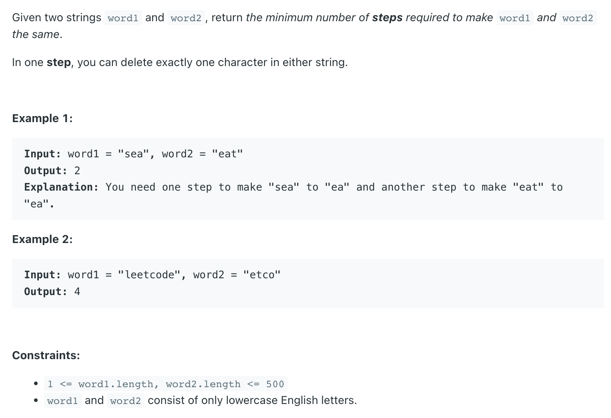

## 583. Delete Operation for Two Strings


- refer to: `lc 72`,`lc 161`

---
```java
class _583_DeleteOperationForTwoStrings {
    public int minDistance(String word1, String word2) {
        int m = word1.length(), n = word2.length();
        int[][] dp = new int[m + 1][n + 1];

        for (int i = 0; i <= m; i++) {
            dp[i][0] = i;
        }
        for (int i = 0; i <= n; i++) {
            dp[0][i] = i;
        }

        for (int i = 1; i <= m; i++) {
            for (int j = 1; j <= n; j++) {
                if (word1.charAt(i - 1) == word2.charAt(j - 1)) {
                    dp[i][j] = dp[i - 1][j - 1];
                } else {
                    dp[i][j] = Math.min(dp[i - 1][j - 1] + 2,
                            Math.min(dp[i - 1][j] + 1, dp[i][j - 1] + 1));
                }
            }
        }
        return dp[m][n];
    }
}
```