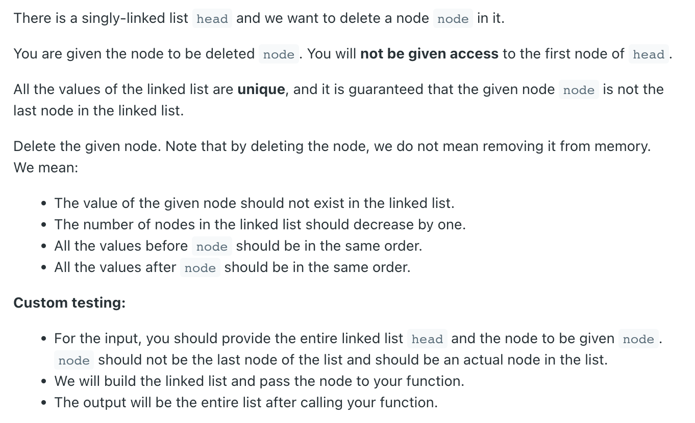
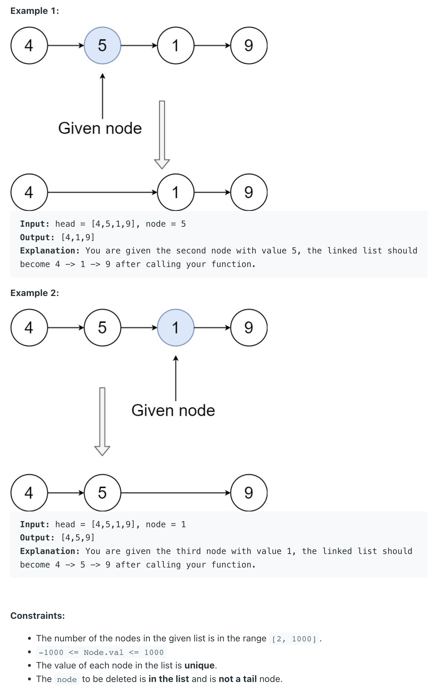

## 237. Delete Node in a Linked List



```java
/**
remove: 1

    [4] -> [5] -> [1] -> [9]
 

    [4] -> [1] -> [1] -> [9]


    [4] -> [1] -> [9] 

                 [1] = null
*/ 


/**
 * Definition for singly-linked list.
 * public class ListNode {
 *     int val;
 *     ListNode next;
 *     ListNode(int x) { val = x; }
 * }
 */
class Solution {
    public void deleteNode(ListNode node) {
        if (node == null) {
            return;
        }
        ListNode oldNext = node.next;
        node.val = node.next.val;
        node.next = node.next.next;
        oldNext = null;
    }
}
```