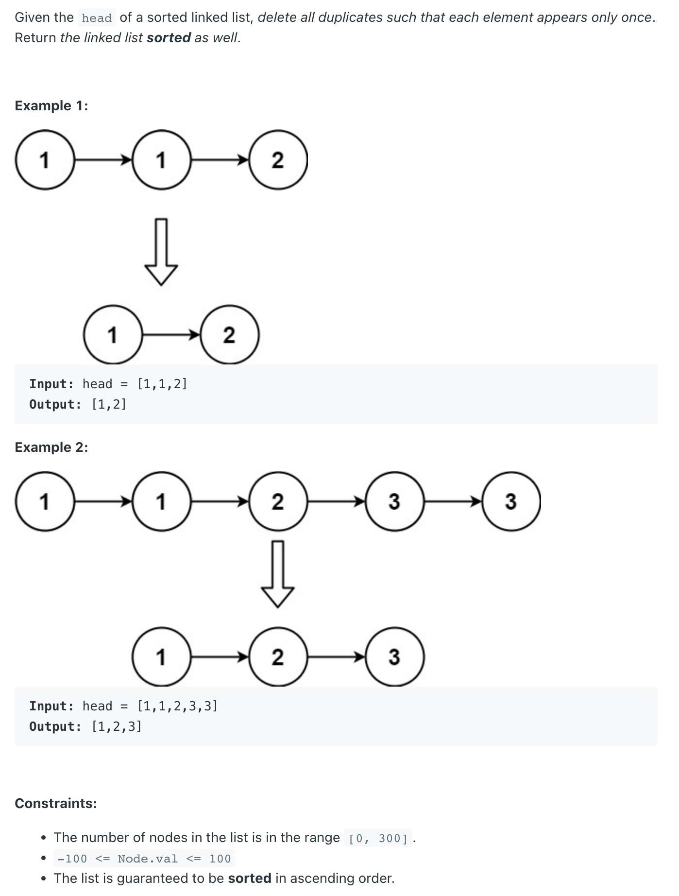

## 83. Remove Duplicates from Sorted List


- [youtube video](https://www.youtube.com/watch?v=p10f-VpO4nE)

```ruby
    head
    [1] -> [1] -> [2] -> [3] -> [3]
    cur    cur.next


    head
    [1] -> [1] -> [2] -> [3] -> [3]
    cur
    |              ↑  
     ——————————————        ## cur = cur.next.next


## but what if:

    head
    [1] -> [1] -> [1] -> [3] -> [3] -> null
    cur           cur.next
    |             ↑  
    ——————————————      ## so we need to still check if: cur.val == cur.next.val
                        ## cur.next = cur.next.next


    head
    [1]                  [3] -> [3] -> null
    cur           
    |                     ↑  
    ——————————————————————  


    head
    [1]                  [3]           null
                         cur           
    |                    ↑ |            ↑
    —————————————————————  —————————————
```
---

```java
class _83_RemoveDuplicatesFromSortedList {
    public ListNode deleteDuplicates(ListNode head) {
        if (head == null || head.next == null) return head;

        ListNode cur = head;
        while (cur != null) {
            while (cur.next != null && cur.val == cur.next.val) {
                cur.next = cur.next.next;
            }
            cur = cur.next;
        }
        return head;
    }
}
```