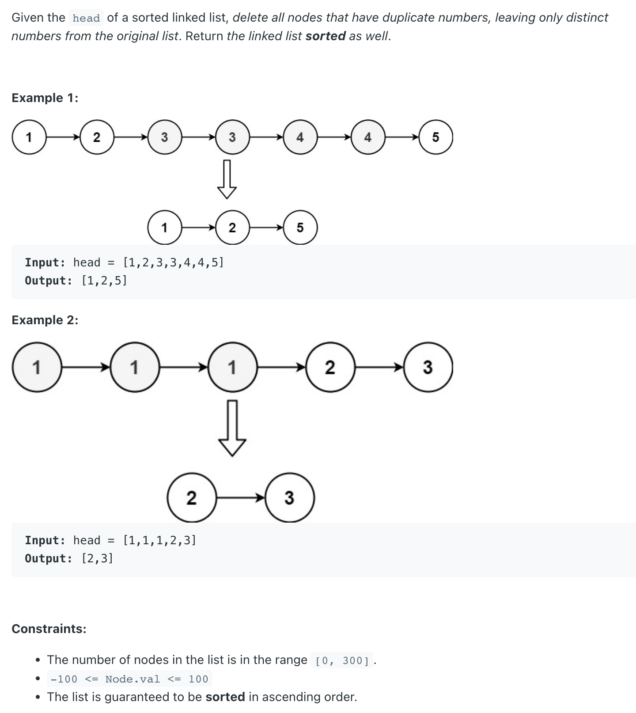

## 82. Remove Duplicates from Sorted List II


- [YoutTube video](https://www.youtube.com/watch?v=R6-PnHODewY)

```ruby
## if (head.val == head.next.val) ?

    [dummy] -> [1] -> [2] -> [3] -> [3] -> [4] -> [4] -> [5]
     prev      head


    [dummy] -> [1] -> [2] -> [3] -> [3] -> [4] -> [4] -> [5]
     prev      head                     # head.val != head.next.val


    [dummy] -> [1] -> [2] -> [3] -> [3] -> [4] -> [4] -> [5]
               prev   head  


    [dummy] -> [1] -> [2] -> [3] -> [3] -> [4] -> [4] -> [5]
                      prev   head       # head.val == head.next.val


    [dummy] -> [1] -> [2] -> [3] -> [3] -> [4] -> [4] -> [5]
                      prev          head      


    [dummy] -> [1] -> [2]    [3] -> [3] -> [4] -> [4] -> [5]
                      prev          head 
                       |                    ↑
                       ——————————————————————


    [dummy] -> [1] -> [2]    [3] -> [3] -> [4] -> [4] -> [5]
                      prev                 head 
                       |                    ↑
                       ——————————————————————


    [dummy] -> [1] -> [2]    [3] -> [3] -> [4] -> [4] -> [5]
                      prev                        head 
                       |                    ↑
                       ——————————————————————


    [dummy] -> [1] -> [2]    [3] -> [3] -> [4] -> [4] -> [5]
                      prev                               head 
                       |                                  ↑
                       ————————————————————————————————————
```
---

```java
class _82_RemoveDuplicatesFromSortedList_II {
    public ListNode deleteDuplicates(ListNode head) {
        if (head == null || head.next == null) {
            return head;
        }
        ListNode dummy = new ListNode(9527);
        dummy.next = head;
        ListNode prev = dummy;
        while (head != null) {
            if (head.next != null && head.val == head.next.val) {
                while (head.next != null && head.val == head.next.val) {
                    head = head.next;
                }
                prev.next = head.next;
            } else {
                prev = prev.next;
            }
            head = head.next;
        }
        return dummy.next;
    }

    public static void main(String[] args) {
        ListNode head = new ListNode(1);
        head.next = new ListNode(2);
        head.next.next = new ListNode(3);
        head.next.next.next = new ListNode(3);
        head.next.next.next.next = new ListNode(4);
        head.next.next.next.next.next = new ListNode(4);
        head.next.next.next.next.next.next = new ListNode(5);
        _82_RemoveDuplicatesFromSortedList_II removeDuplicatesFromSortedList_ii = new _82_RemoveDuplicatesFromSortedList_II();
        ListNode res = removeDuplicatesFromSortedList_ii.deleteDuplicates(head);
        while (res != null) {
            System.out.print(res.val + " ");
            res = res.next;
        } // [1] -> [2] -> [5]
    }
}
```