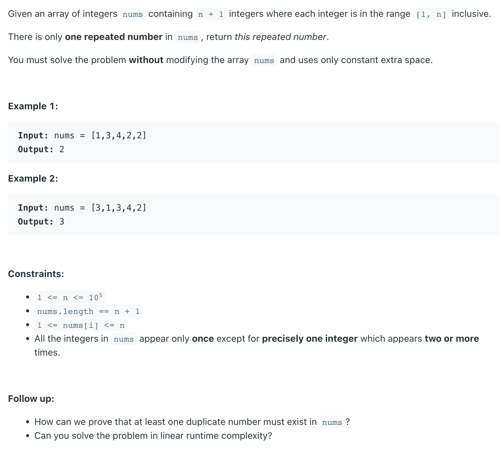

## 287. Find the Duplicate Number



- [neetcode](https://www.youtube.com/watch?v=wjYnzkAhcNk&t=906s&ab_channel=NeetCode)
- [中文解释](https://www.youtube.com/watch?v=6UaLpPavqoM&ab_channel=%E8%B4%BE%E8%80%83%E5%8D%9A)

---

- `1 ~ N`, index `0 ~ N`, 必定有一个 `repeated number`
- 可以先参考 `LC 142`

- [全部链表Cycle 中文解释](https://leetcode.cn/problems/find-the-duplicate-number/solutions/58841/287xun-zhao-zhong-fu-shu-by-kirsche/)


---
```java
class _287_FindTheDuplicateNumber {
    public int findDuplicate(int[] nums) {
        int slow = 0, fast = 0;
        while (true) {
            slow = nums[slow];
            fast = nums[nums[fast]];
            if (slow == fast) {
                break;
            }
        }

        int tortoise = 0;
        while (true) {
            slow = nums[slow];
            tortoise = nums[tortoise];
            if (slow == tortoise) {
                break;
            }
        }
        return slow;
    }
}
```
