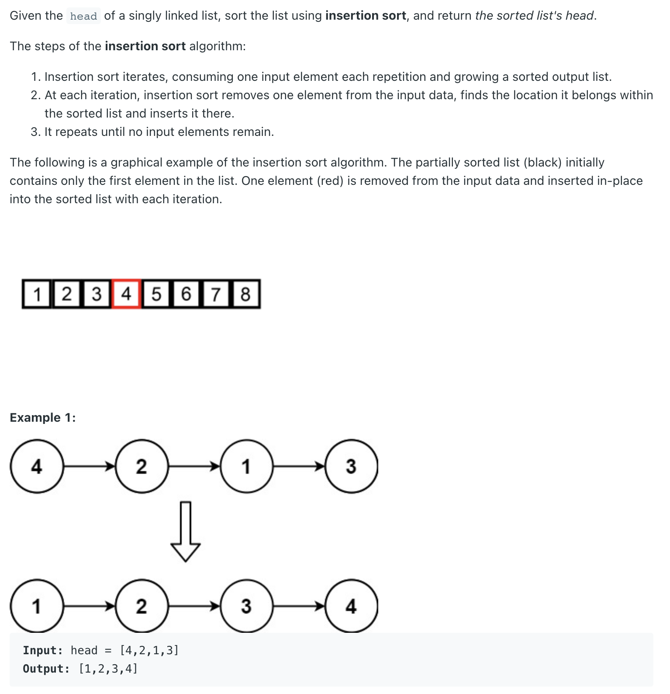

## 147. Insertion Sort List


---
```ruby
              head
    dummy ->  [4] -> [2] -> [1] -> [3]
              prev   cur


                __________
               ↓         |
              head       |
    dummy ->  [4]    [2]--  [1] -> [3]
     tmp      prev   cur     ↑
               |             |
               |             |
               ——————————————


    dummy     head
      tmp ->  [2] -> [4] -> [1] -> [3]
              cur    prev


    dummy     head
      tmp ->  [2] -> [4] -> [1] -> [3]
                     prev   cur


               ______________
               ↓             |
    dummy     head           |
      tmp ->  [2] -> [4]    [1]    [3]
                     prev   cur     ↑
                       |            |
                       |            |
                       ——————————————

    dummy     head
      tmp ->  [1] -> [2] -> [4] -> [3]
              cur          prev     


    dummy     head
      tmp ->  [1] -> [2] -> [4] -> [3]
                            prev   cur    # cur.val > tmp.next.val


    dummy     head
              [1] -> [2] -> [4] -> [3]
              tmp           prev   cur    # cur.val > tmp.next.val


    dummy     head
              [1] -> [2] -> [4] -> [3]
                     tmp    prev   cur   


                            _________
                            |       |
    dummy     head          ↓       |
              [1] -> [2]    [4]    [3]     null
                     tmp           cur      ↑
                            prev            |  
                             |              |
                             |              |  
                             ————————————————


    dummy     head          
              [1] -> [2] -> [3] -> [4]     null
                     tmp    cur    prev     ↑
                                    |       |  
                                    |       |
                                    |       |  
                                    —————————
```
---

```java
class _147_InsertionSortList {
    public ListNode insertionSortList(ListNode head) {
        if (head == null) {
            return head;
        }
        ListNode dummy = new ListNode(9527);
        dummy.next = head;
        ListNode prev = head;
        ListNode cur = head.next;

        while (cur != null) {
            if (cur.val >= prev.val) {
                prev = cur;
                cur = cur.next;
                continue;
            }
            ListNode tmp = dummy;
            while (cur.val > tmp.next.val) {
                tmp = tmp.next;
            }
            prev.next = cur.next;
            cur.next = tmp.next;
            tmp.next = cur;
            cur = prev.next;
        }
        return dummy.next;
    }
}
```