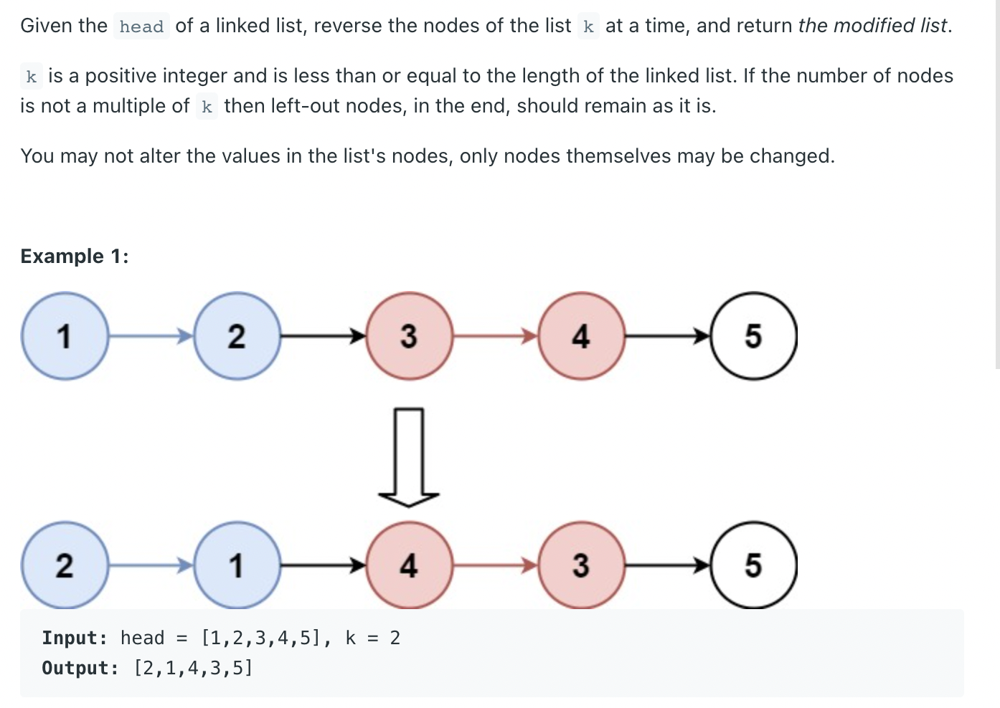
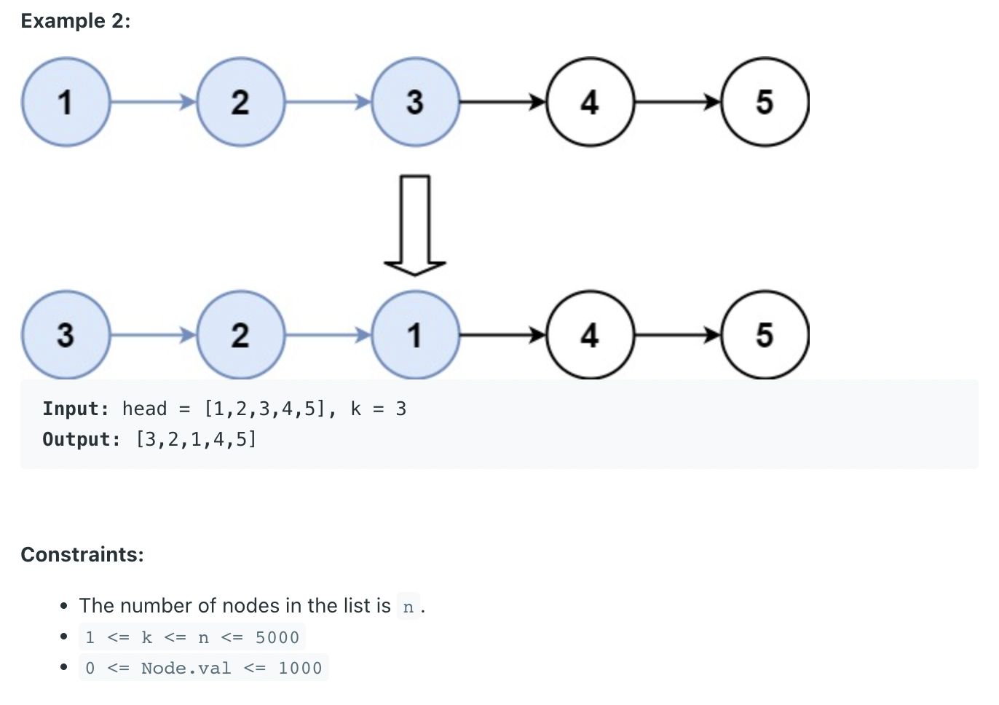
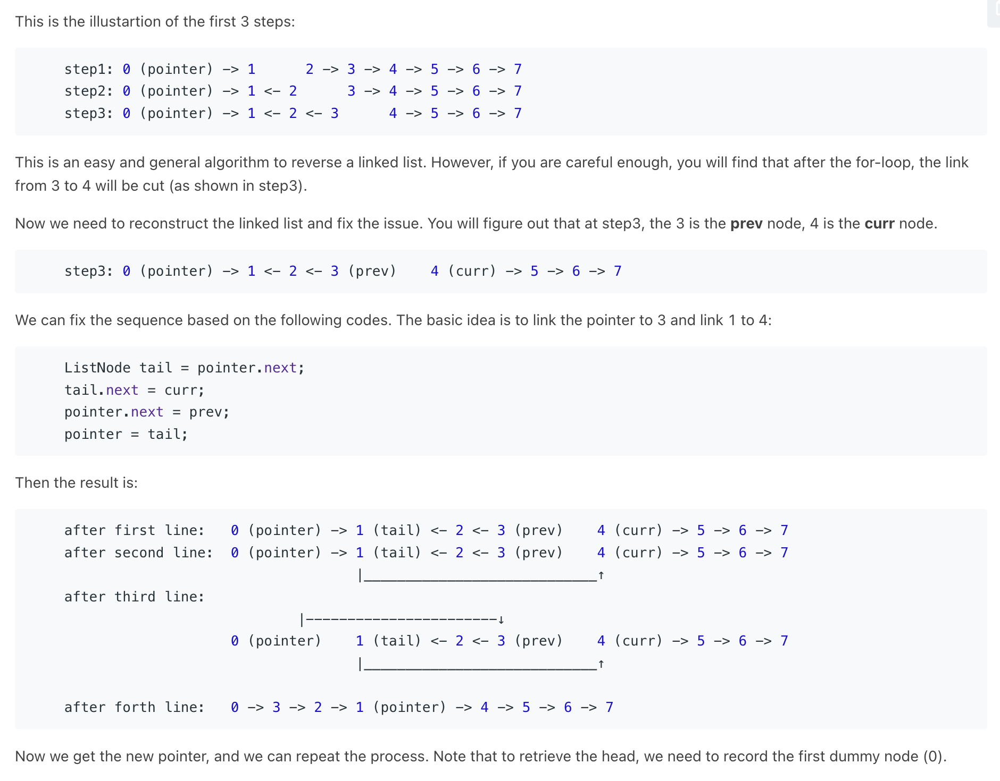

## 25. Reverse Nodes in k-Group



- [Java O(n) solution with super detailed explanation & illustration](https://leetcode.com/problems/reverse-nodes-in-k-group/discuss/183356/Java-O(n)-solution-with-super-detailed-explanation-and-illustration)
---



- 注意本题，最后一轮loop, `for (int i = 0; i < k && node != null; i++)`
  - 比如最后还剩下 `7 -> 8`, `node = node.next;`, 最后node 一定变成 null, 因为不够3个node, 所以 `break` 跳出loop

---
```java
/*

step3: 0 (pointer) -> 1 <- 2 <- 3 (prev)    4 (curr) -> 5 -> 6 -> 7

	ListNode tail = pointer.next;
	tail.next = curr;
	pointer.next = prev;
	pointer = tail;
	    `
after first line:   0 (pointer) -> 1 (tail) <- 2 <- 3 (prev)    4 (curr) -> 5 -> 6 -> 7
after second line:  0 (pointer) -> 1 (tail) <- 2 <- 3 (prev)    4 (curr) -> 5 -> 6 -> 7
                                   |____________________________↑
after third line:
                            |-----------------------↓
                    0 (pointer)    1 (tail) <- 2 <- 3 (prev)    4 (curr) -> 5 -> 6 -> 7
                                   |____________________________↑

after forth line:	0 -> 3 -> 2 -> 1 (pointer) -> 4 -> 5 -> 6 -> 7

 */
class _25_ReverseNodesInKGroup {
    public static ListNode reverseKGroup(ListNode head, int k) {
        ListNode dummy = new ListNode(0);
        dummy.next = head;
        ListNode pointer = dummy;

        while (pointer != null) {
            ListNode node = pointer;
            for (int i = 0; i < k && node != null; i++) {
                node = node.next;
            }
            if (node == null) break;

            ListNode prev = null, cur = pointer.next, next = null;
            for (int i = 0; i < k; i++) {
                next = cur.next;
                cur.next = prev;
                prev = cur;
                cur = next;
            }
            ListNode tail = pointer.next;
            tail.next = cur;
            pointer.next = prev;
            pointer = tail;
        }
        return dummy.next;
    }

    public static void main(String[] args) {
        ListNode L1 = new ListNode(1);
        ListNode L2 = new ListNode(2);
        ListNode L3 = new ListNode(3);
        ListNode L4 = new ListNode(4);
        ListNode L5 = new ListNode(5);
        L1.next = L2;
        L2.next = L3;
        L3.next = L4;
        L4.next = L5;
        ListNode iterator = L1;
        while (iterator != null) {
            System.out.print(iterator.val + "  "); // 1  2  3  4  5 
            iterator = iterator.next;
        }

        System.out.println();
        System.out.println("After Reversed:");
        ListNode reverse = reverseKGroup(L1, 2);
        while (reverse != null) {
            System.out.print(reverse.val + "  "); // 2  1  4  3  5  
            reverse = reverse.next;
        }
    }
}
```