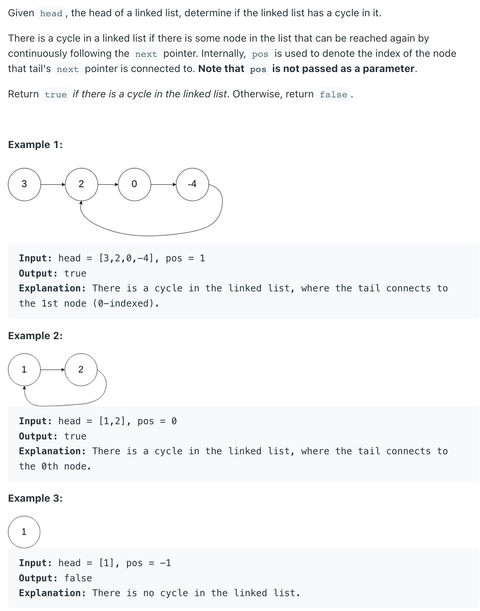

## 141. Linked List Cycle


---

## Analysis:

- 这道题使用快慢指针，但要注意的是，跳出loop 条件为 && => ` while(fast.next != null && fast.next.next != null)`

- 但慢指针 等于 快指针的时候 => return true, or => false

```java
/**
 * Definition for singly-linked list.
 * class ListNode {
 *     int val;
 *     ListNode next;
 *     ListNode(int x) {
 *         val = x;
 *         next = null;
 *     }
 * }
 */
public class Solution {
    public boolean hasCycle(ListNode head) {
        if(head == null){
            return false;
        }
        ListNode fast = head;
        ListNode slow = head;
        while(fast.next != null && fast.next.next != null){
            slow = slow.next;
            fast = fast.next.next;
            if(slow == fast){
                return true;
            }
        }
        return false;
    }
}
```