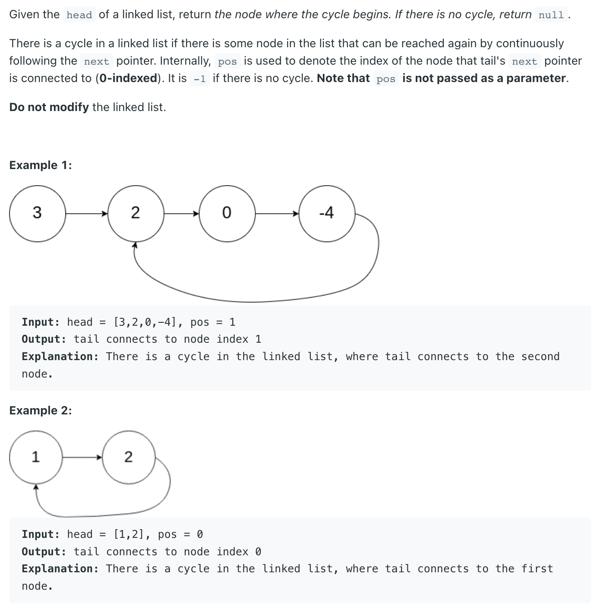
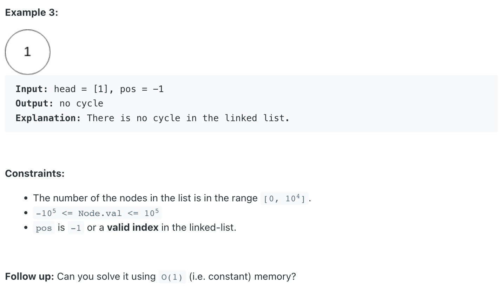

## 142. Linked List Cycle II


---

- [leetcode disscusion](https://leetcode.com/problems/linked-list-cycle-ii/discuss/1701128/C%2B%2BJavaPython-Slow-and-Fast-oror-Image-Explanation-oror-Beginner-Friendly)

```ruby
    s f
    [3] -> [2]  -> [0] -> [4] ———
            ↑                   |
            |                   |
            |                   |
            —————————————————————


            s       f
    [3] -> [2]  -> [0] -> [4] ———
            ↑                   |
            |                   |
            |                   |
            —————————————————————


            f       s       
    [3] -> [2]  -> [0] -> [4] ———
            ↑                   |
            |                   |
            |                   |
            —————————————————————


                          f s       
    [3] -> [2]  -> [0] -> [4] ———
            ↑                   |
            |                   |
            |                   |
            —————————————————————


    [3] -> [2]  ->  [0]  ->  [4] 
    <————X———><————————y—————————>

    x = 1
    y = 2

    2 * (x + y) - (x + y) = NC
    x + y = NC
    x = NC - y

    head                  f s               
    [3] -> [2]  -> [0] -> [4] ———
            ↑                   |
            |                   |
            |                   |
            —————————————————————


           head
            s               
    [3] -> [2]  -> [0] -> [4] ———
            ↑                   |
            |                   |
            |                   |
            —————————————————————
```

- `slow` moves `1` step at a time, `fast` moves `2` steps at a time.
- when `slow` and `fast` meet each other, they must be on the cycle
  - `x` denotes the length of the linked list before starting the circle
  - `y` denotes the distance from the start of the cycle to where `slow` and `fast` **met**
  - `C denotes the length of the cycle
  - when they **meet**, `slow` traveled `(x + y)` steps while `fast` traveled `2 * (x + y)` steps, 
    and the extra distance `(x + y)` must be a multiple of the circle length `C`
    - note that `x`, `y`, `C` are all lengths or the number of steps need to move.
    - `head`, `slow`, `fast` are pointers.
    - `head` moves `x` steps and arrives at the **start** of the cycle.
- so we have `x + y = N * C` => `x = NC - y`, let slow continue to travel from `y` and after `x` more steps, 
  slow will return to the start of the cycle.
---

```java
class _142_LinkedListCycle_II {
    public ListNode detectCycle(ListNode head) {
        ListNode slow = head;
        ListNode fast = head;
        while (fast != null && fast.next != null) {
            slow = slow.next;
            fast = fast.next.next;

            if (slow == fast) {
                break;
            }
        }
        if (fast == null || fast.next == null) {
            return null;
        }
        while (head != slow) {
            head = head.next;
            slow = slow.next;
        }
        return head;
    }
}
```