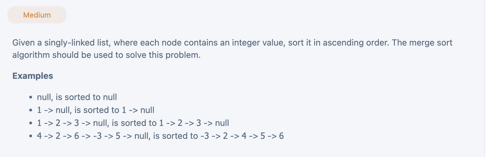

## Merge Sort Linked List


---

```py
class Solution(object):
    def mergeSort(self, head: ListNode) -> ListNode:
        if not head or not head.next:
            return head
        one, two = self.splitInHalf(head)
        one = self.mergeSort(one)
        two = self.mergeSort(two)
        return self.merge(one, two)

    def splitInHalf(self, head):
        slow, fast = head, head.next
        while fast and fast.next:
            slow = slow.next
            fast = fast.next.next
        next = slow.next
        slow.next = None
        return head, next

    def merge(self, one, two):
        dummy = ListNode(-1)
        cur = dummy
        while one and two:
            if one.val < two.val:
                cur.next = one
                one = one.next
            else:
                cur.next = two
                two = two.next
            cur = cur.next
        if one:
            cur.next = one
        else:
            cur.next = two
        return dummy.next
```