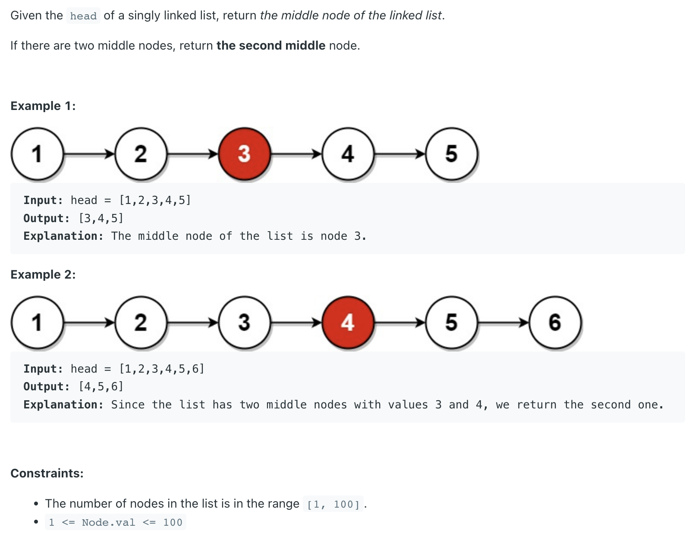

## 876. Middle of the Linked List

---
### Analysis:

- 这里注意跳出循环条件： `while(fast != null && fast.next != null)`, 

```ruby
    [1] -> [2] -> [3] -> [4] -> [5] ->
                                fast       # fast.next != null

```
---
- 这里注意跳出循环条件： `while(fast.next != null && fast.next.next != null)`, 

```ruby
    [1] -> [2] -> [3] -> [4] -> [5] ->
                                fast       # fast.next != null


    [1] -> [2] -> [3] -> [4] -> [5] ->
                        fast          # fast.next.next != null
```
---
- 如果和判断是否有环那题一样的跳出循环条件 => 那么将无法判断 `odd | even`  cases
- note there are two example, one is odd numbers of Nodes
  - second is even numbers of Nodes, which it requires return `Node 4`
    - so first, count the length of LinkedList
    - then, count either odd or even
---

### Brute Force

```java
class MiddleOfLinkedList_BruteForce {
    public ListNode middleNode(ListNode head) {
        if (head == null) {
            return head;
        }
        int len = 0;
        ListNode count = head;
        while (count != null) {
            len++;
            count = count.next;
        }

        ListNode slow = head;
        ListNode fast = head;
        while(fast.next != null && fast.next.next != null){
            slow = slow.next;
            fast = fast.next.next;
        }

        if (len % 2 == 0) {
            return slow.next;
        } else {
            return slow;
        }
        // return (len % 2 == 0) ? slow.next : slow;
    }
}
```

---

```java
class MiddleOfLinkedList {
    public ListNode middleNode(ListNode head) {
        ListNode slow = head;
        ListNode fast = head;
        while (fast != null && fast.next != null) {
            slow = slow.next;
            fast = fast.next.next;
        }
        return slow;
    }
}
```