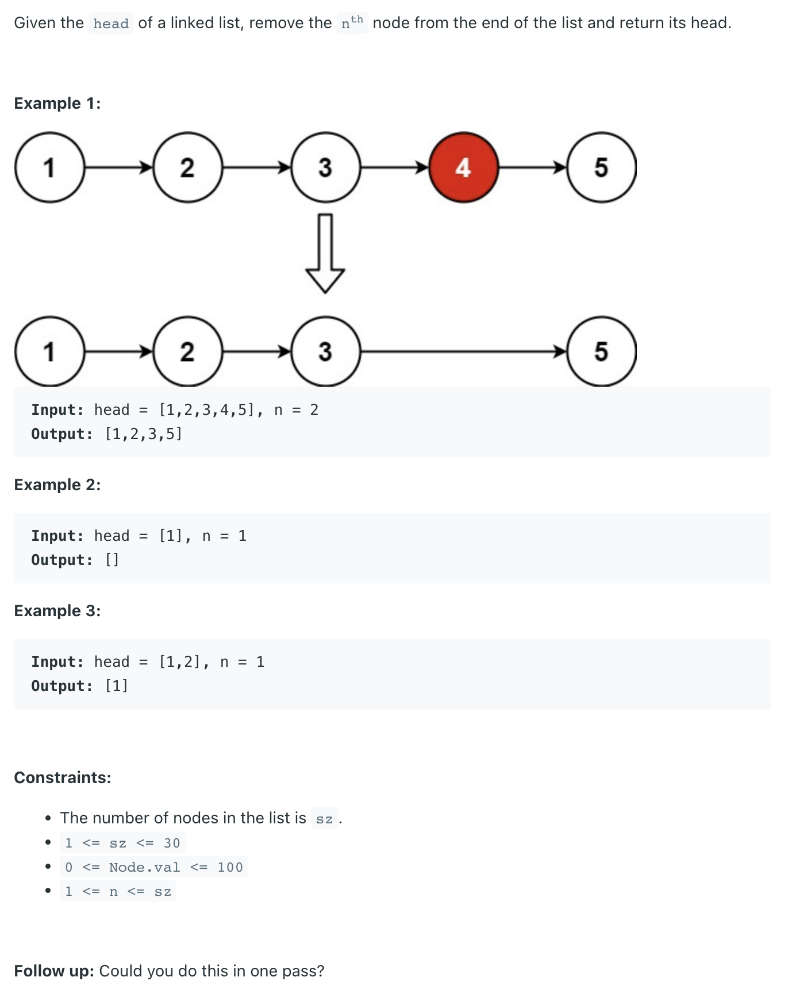
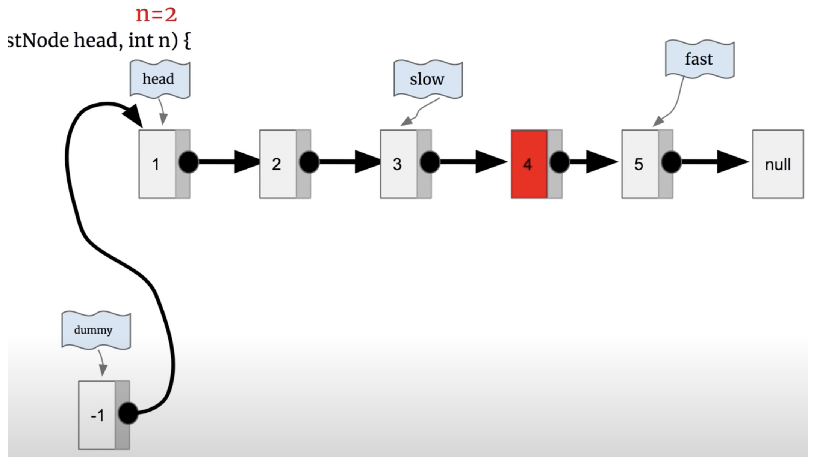

## 19. Remove Nth Node From End of List

---
### two pointer

```ruby
n = 2
 slow->   
 fast-> [1] -> [2] -> [3] -> [4] -> [5] -> null
        

 i = 0 < 2       
        [1] -> [2] -> [3] -> [4] -> [5] -> null 
         f
      s   


 i = 1 < 2       
        [1] -> [2] -> [3] -> [4] -> [5] -> null 
                f
      s
      
      
        [1] -> [2] -> [3] -> [4] -> [5] -> null 
                       f
         s 


        [1] -> [2] -> [3] -> [4] -> [5] -> null 
                              f
                s 


        [1] -> [2] -> [3] -> [4] -> [5] -> null 
                                     f
                       s 
```



```java
/**
 * Definition for singly-linked list.
 * public class ListNode {
 *     int val;
 *     ListNode next;
 *     ListNode() {}
 *     ListNode(int val) { this.val = val; }
 *     ListNode(int val, ListNode next) { this.val = val; this.next = next; }
 * }
 */
class Solution {
    public ListNode removeNthFromEnd(ListNode head, int n) {
        ListNode dummy = new ListNode(0);
        dummy.next = head;
        ListNode slow = dummy;
        ListNode fast = dummy;
        for (int i = 0; i < n; i++) {
            fast = fast.next;
        }
        while (fast.next != null) {
            slow = slow.next;
            fast = fast.next;
        }
        slow.next = slow.next.next;
        return dummy.next;
    }
}
```
---

### One Pass

```java
public class Solution {
    public ListNode removeNthFromEnd(ListNode head, int n) {
        ListNode dummy = new ListNode(9527);
        dummy.next = head;
        ListNode fastNode = dummy;
        ListNode slowNode = dummy;
        while(fastNode.next != null){
        	if(n <= 0){
        	    slowNode = slowNode.next;
        	} else {
        	    n--;
        	}
        	fastNode = fastNode.next;
        }
        if(slowNode.next != null)
        	slowNode.next = slowNode.next.next;
        return dummy.next;
    }
}
```