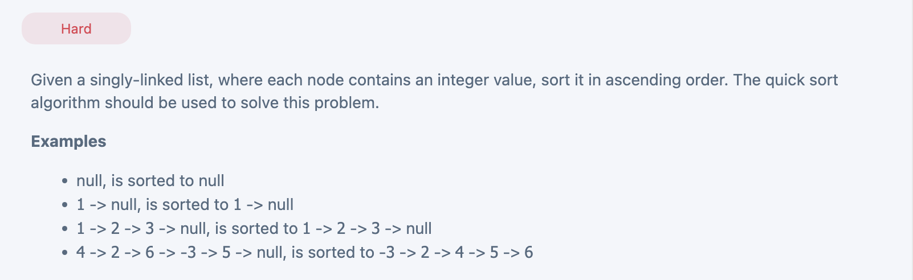

## Quick Sort On LinkedList


---

```py
# Definition for singly-linked list.
class ListNode(object):
    def __init__(self, x):
        self.val = x
        self.next = None


class Solution:
    def quickSort(self, head: ListNode) -> ListNode:
        """Sorts the linked list using QuickSort and returns the new head."""
        if not head:
            return None

        tail = self.get_tail(head)  # Get the last node
        head, tail = self.quick_sort(head, tail)
        tail.next = None  # Ensure the last node points to None
        return head

    def quick_sort(self, head, tail):
        """Recursively sorts the linked list using QuickSort."""
        if head == tail:
            return head, tail  # Base case: single node

        # Partition the list around a pivot
        left_head, left_tail, pivot_head, pivot_tail, right_head, right_tail = self.partition(head, tail)

        # Sort the left part
        if left_head:
            left_head, left_tail = self.quick_sort(left_head, left_tail)
            left_tail.next = pivot_head  # Link left part with pivot
            head = left_head
        else:
            head = pivot_head  # No left part, pivot becomes new head

        # Sort the right part
        if right_head:
            right_head, right_tail = self.quick_sort(right_head, right_tail)
            pivot_tail.next = right_head  # Link pivot with right part
            tail = right_tail
        else:
            tail = pivot_tail  # No right part, pivot becomes new tail

        return head, tail

    def partition(self, head, tail):
        """Partitions the list around the pivot (last node)."""
        pivot = tail
        pivot_head, pivot_tail = pivot, pivot  # Nodes equal to pivot
        left_head, left_tail = None, None  # Nodes smaller than pivot
        right_head, right_tail = None, None  # Nodes greater than pivot

        dummy = ListNode(-1)  # Dummy node to help traverse
        dummy.next = head
        curr = dummy  # Start iterating from the dummy node

        while curr.next and curr.next != tail:  # Iterate until we reach the last node before 'tail'
            node = curr.next  # Move to the next node in the list
            curr = curr.next  # Update 'curr' to point to the current node
            
            if node.val < pivot.val:  # If current node's value is smaller than the pivot
                if left_tail:  # If the left partition already has nodes
                    left_tail.next = node  # Link the last node of the left partition to the current node
                    left_tail = node  # Update 'left_tail' to point to the current node (new tail of the left partition)
                else:  # If the left partition is empty (this is the first node being added to the left partition)
                    left_head = node  # Set this node as the first node in the left partition
                    left_tail = node  # Set this node as both the head and tail of the left partition
            
            elif node.val > pivot.val:  # If current node's value is greater than the pivot
                if right_tail:  # If the right partition already has nodes
                    right_tail.next = node  # Link the last node of the right partition to the current node
                    right_tail = node  # Update 'right_tail' to point to the current node (new tail of the right partition)
                else:  # If the right partition is empty (this is the first node being added to the right partition)
                    right_head = node  # Set this node as the first node in the right partition
                    right_tail = node  # Set this node as both the head and tail of the right partition
            
            else:  # If current node's value is equal to the pivot value
                pivot_tail.next = node  # Link the last node of the pivot partition to the current node
                pivot_tail = node  # Update 'pivot_tail' to point to the current node (new tail of the pivot partition)


        return left_head, left_tail, pivot_head, pivot_tail, right_head, right_tail

    def get_tail(self, node):
        """Finds the last node in the linked list."""
        while node.next:
            node = node.next
        return node
```