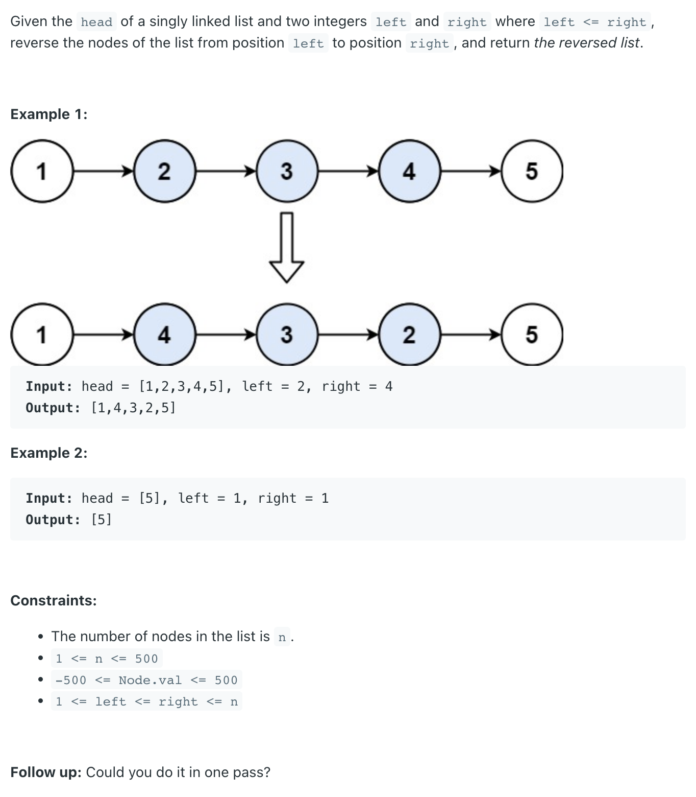

## 92. Reverse Linked List II

---

```ruby

               L=2           R=4
         1      2      3      4      5   
        [1] -> [2] -> [3] -> [4] -> [5]
 

                L             R
               [2] -> [3] -> [4]          

               R - L = 4 - 2 = 2
            # for 2 to 4, the length should be
            # R - L + 1


                    L             R
    [lp] -> [1] -> [2] -> [3] -> [4] -> [5]
            cur


                    L             R
            [1] -> [2] -> [3] -> [4] -> [5]
             lp    cur                # reverse from left to right


                    L             R
            [1] -> [2] <- [3] <- [4]    [5]
             lp                  prev   cur                
                                        next


                    L             R
            [1]    [2] <- [3] <- [4]    [5]
             lp                  prev   cur                
                    |                   next
                    |                     ↑
                     ——————————————————————   
                # lp.next.next = cur


              ————————————————————     # lp.next = prev
             |                    ↓
             |      L             R
            [1]    [2] <- [3] <- [4]    [5]
             lp                  prev   cur                
                    |                   next
                    |                     ↑
                     ——————————————————————   
                # lp.next.next = cur

```
---

```java
public class _92_ReverseLinkedList_II {
    public ListNode reverseBetween(ListNode head, int left, int right) {
        if (head == null || head.next == null) {
            return head;
        }
        ListNode dummy = new ListNode(9527);
        dummy.next = head;

        // 1) reach node at position "left"
        ListNode leftPrev = dummy;
        ListNode cur = head;
        for (int i = 0; i < left - 1; i++) {
            leftPrev = cur;
            cur = cur.next;
        }

        // Now cur = "left", leftPrev = "node before left"
        // 2) reverse from left to right
        ListNode prev = null;
        ListNode next = null;
        for (int j = 0; j < right - left + 1; j++) {
            next = cur.next;
            cur.next = prev;
            prev = cur;
            cur = next;
        }

        leftPrev.next.next = cur;
        leftPrev.next = prev;

        return dummy.next;
    }
}
```
