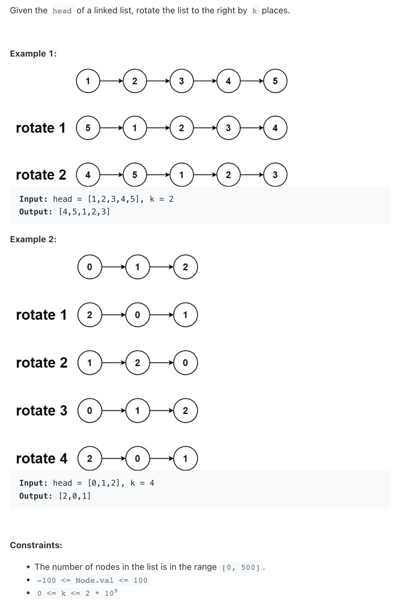

## 61. Rotate List


- if `K` is bigger than `length`
- if `K` is exactly the size of the input

```ruby
k = 2
len = 5
     
                   len - k - 1 = 2
    [1] -> [2] -> [3] -> [4] -> [5] -> null
                   ⇧


    [1] -> [2] -> [3]      [4]  ->  [5]  ->  null
                            ⇧
                         newHead


```

- [YoutTuBe Video](https://youtu.be/UcGtPs2LE_c?t=338)


```java
class _61_RotateList {
    public ListNode rotateRight(ListNode head, int k) {
        if (head == null || head.next == null) {
            return head;
        }
        // Get Length
        int len = 1;
        ListNode tail = head;
        while (tail.next != null) {
            tail = tail.next;
            len++;
        }// Note: this tail need to connect to original Head

        k = k % len;
        if (k == 0) {
            return head;
        }

        // Move to the pivot and rotate
        ListNode cur = head;
        for (int i = 0; i < len - k - 1; i++) {
            cur = cur.next;
        }
        ListNode newHead = cur.next;
        cur.next = null;
        tail.next = head;
        return newHead;
    }

    public static void main(String[] args) {
        ListNode head = new ListNode(1);
        head.next = new ListNode(2);
        head.next.next = new ListNode(3);
        head.next.next.next = new ListNode(4);
        head.next.next.next.next = new ListNode(5);

        _61_RotateList rotateList = new _61_RotateList();
        ListNode res = rotateList.rotateRight(head, 2);
        while (res != null) {
            System.out.print(res.val + " ");
            res = res.next;
        } // 1->2->3->4->5  =>  4->5->1->2->3 
    }
}
```