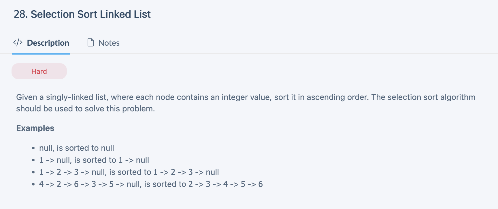
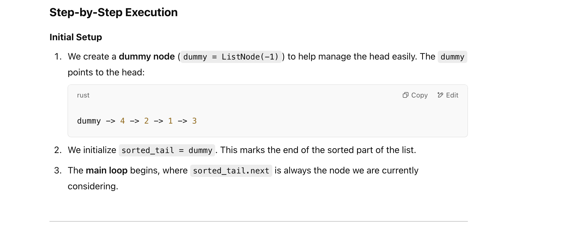
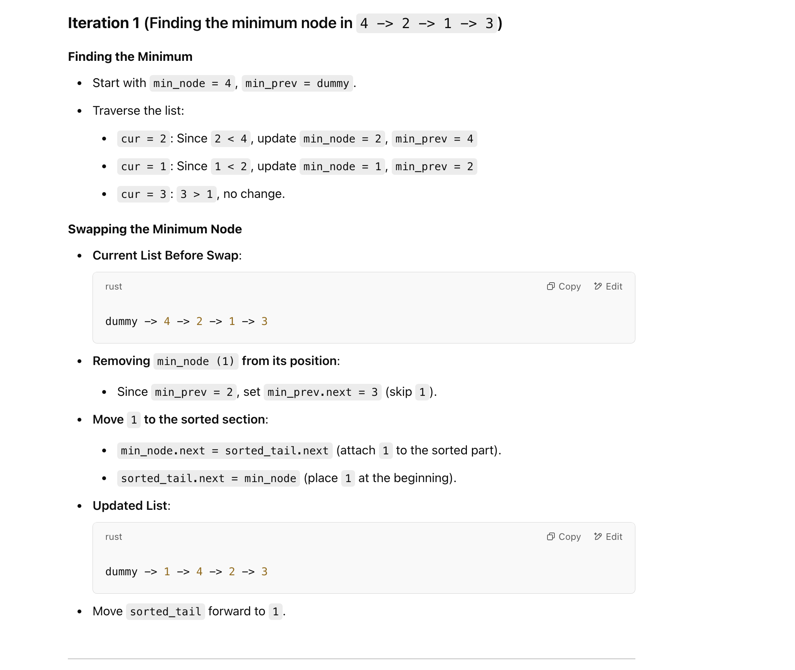
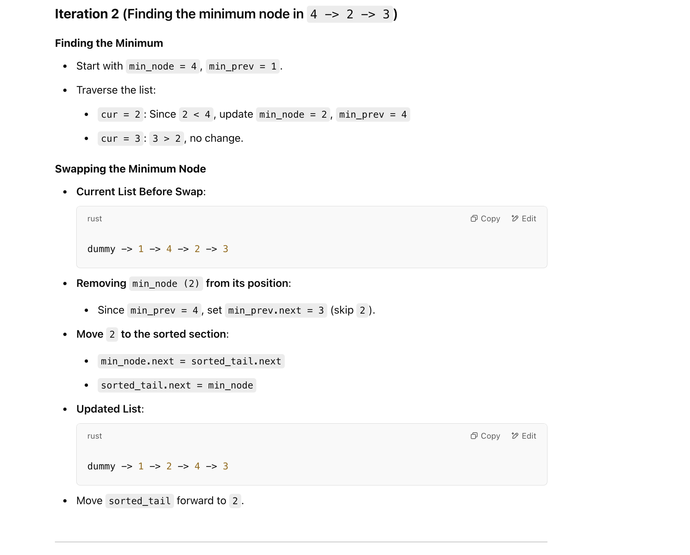
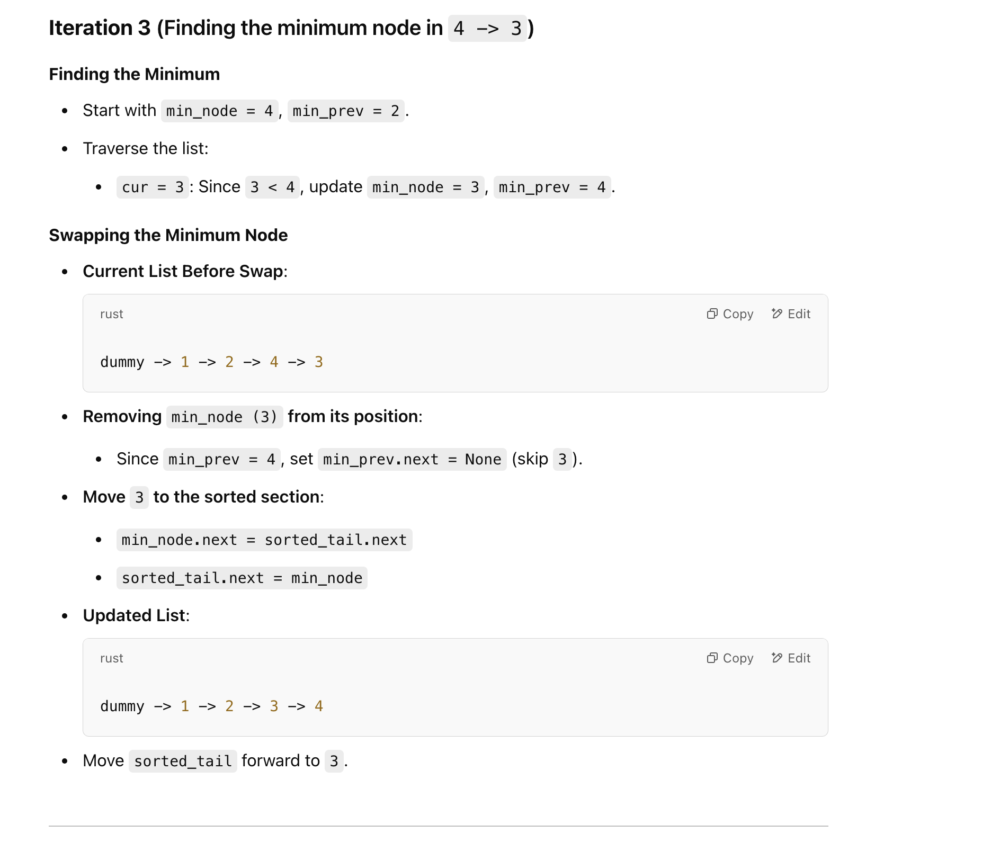
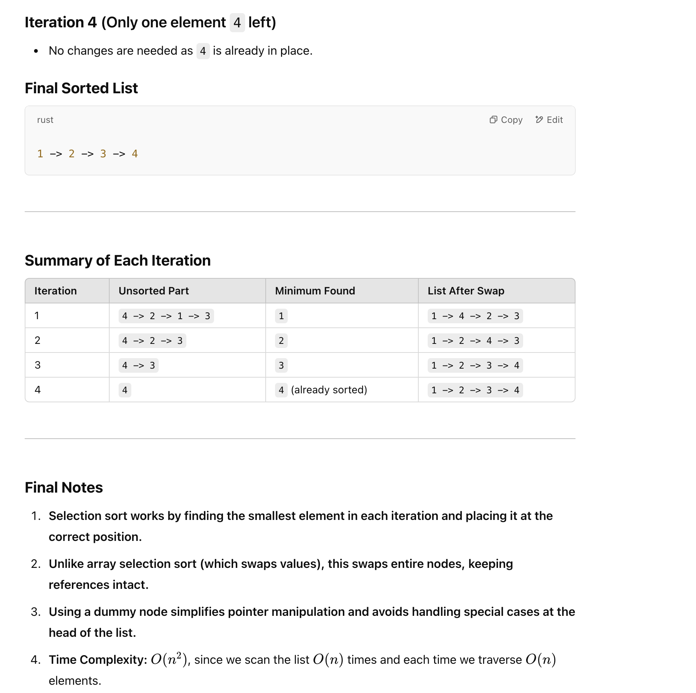

## Selection Sort Linked List


---


- [python tutor](https://pythontutor.com/render.html#mode=display)


#### sample codes

```py
class ListNode(object):
    def __init__(self, x):
        self.val = x
        self.next = None

class Solution(object):
    def selectionSort(self, head):
        """
        input: ListNode head
        return: ListNode
        """
        # write your solution here
        if not head or not head.next:
            return head  # No sorting needed for empty or single-node lists
        dummy = ListNode(-1)
        dummy.next = head
        sorted_tail = dummy
        
        while sorted_tail.next:
            min_node = sorted_tail.next
            min_prev = sorted_tail
            cur = min_node
            prev = min_prev
            
            while cur:
                if cur.val < min_node.val:
                    min_node = cur
                    min_prev = prev
                prev = cur
                cur = cur.next
            # swap nodes by adjusting pointes:
            min_prev.next = min_node.next
            min_node.next = sorted_tail.next
            sorted_tail.next = min_node
            
            sorted_tail = sorted_tail.next
        return dummy.next


head = ListNode(4)
head.next = ListNode(2)
head.next.next = ListNode(1)
head.next.next.next = ListNode(3)
selectionSort(head)
```


#### Test it step by step with an example:










