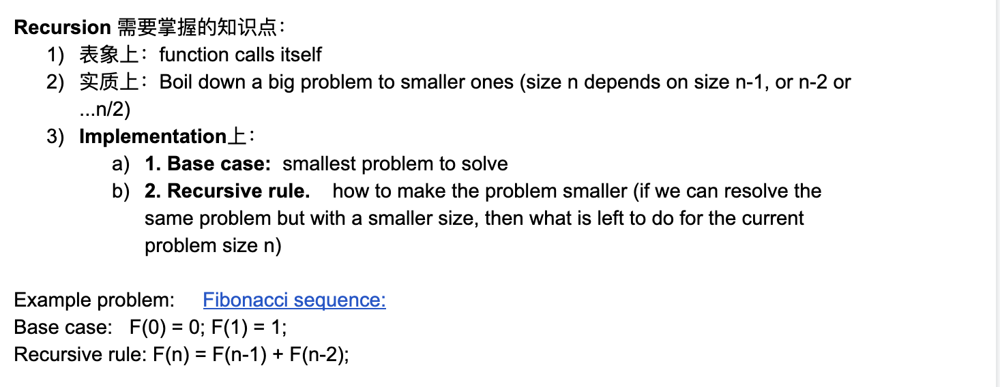
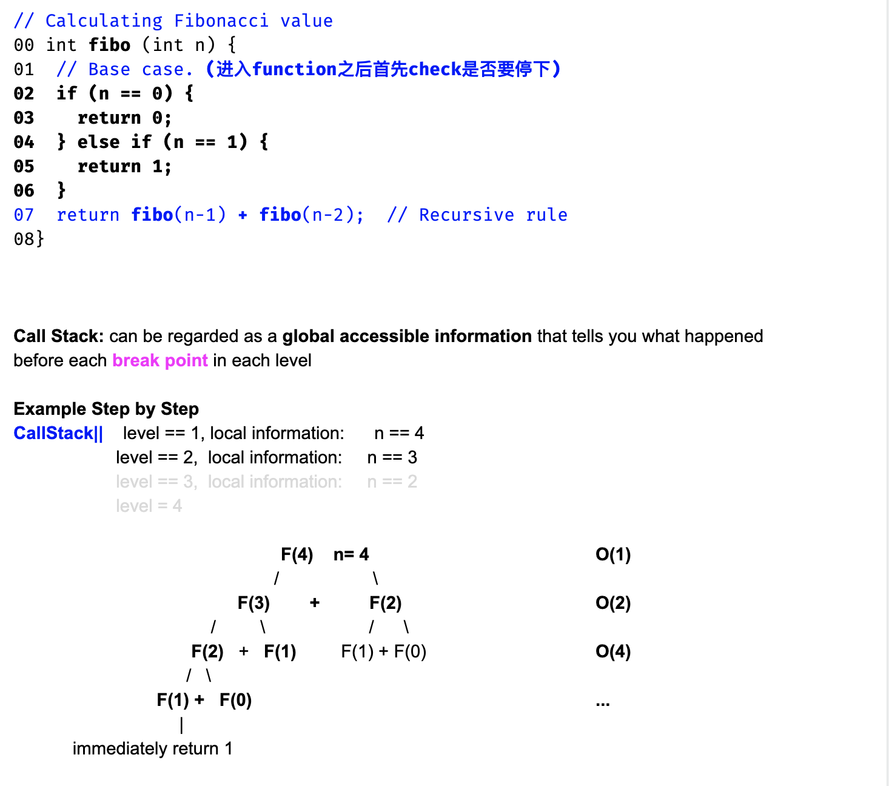
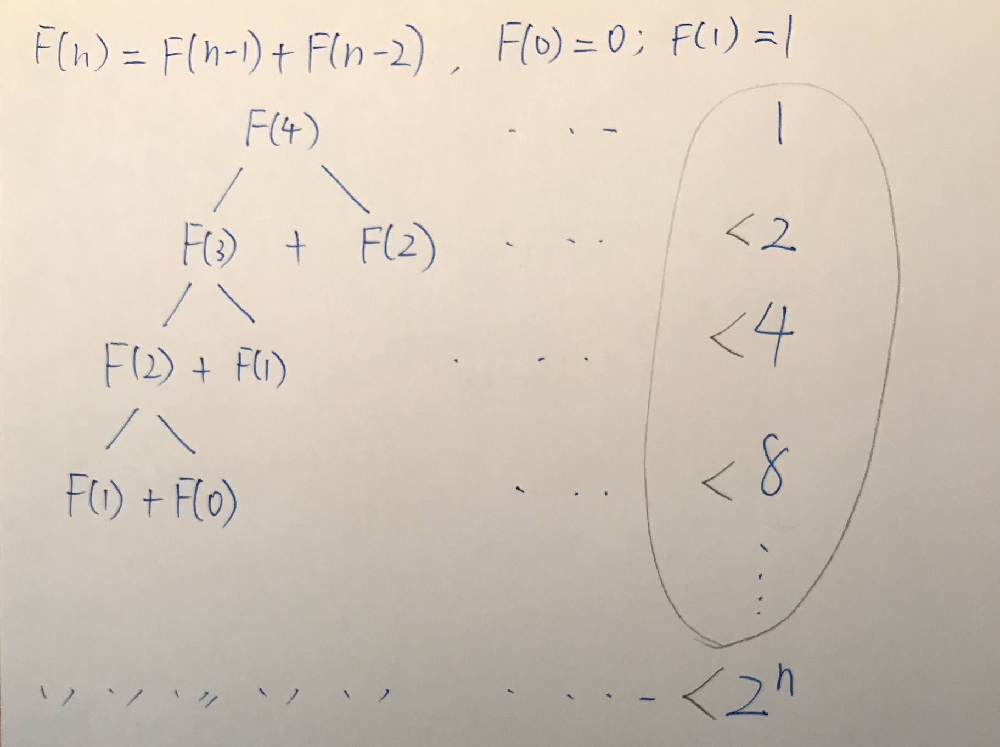
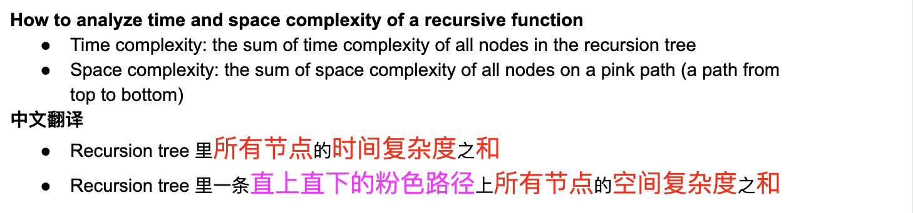
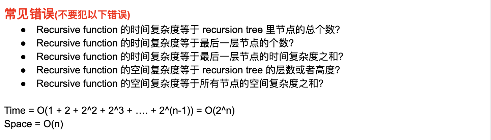
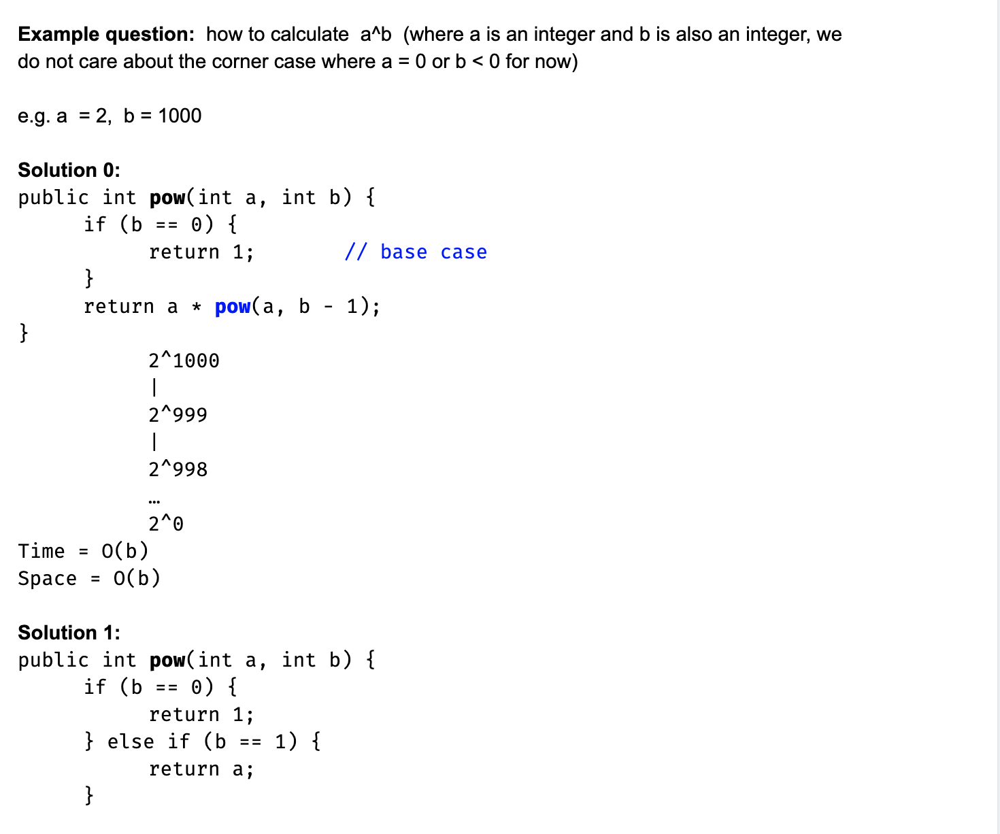
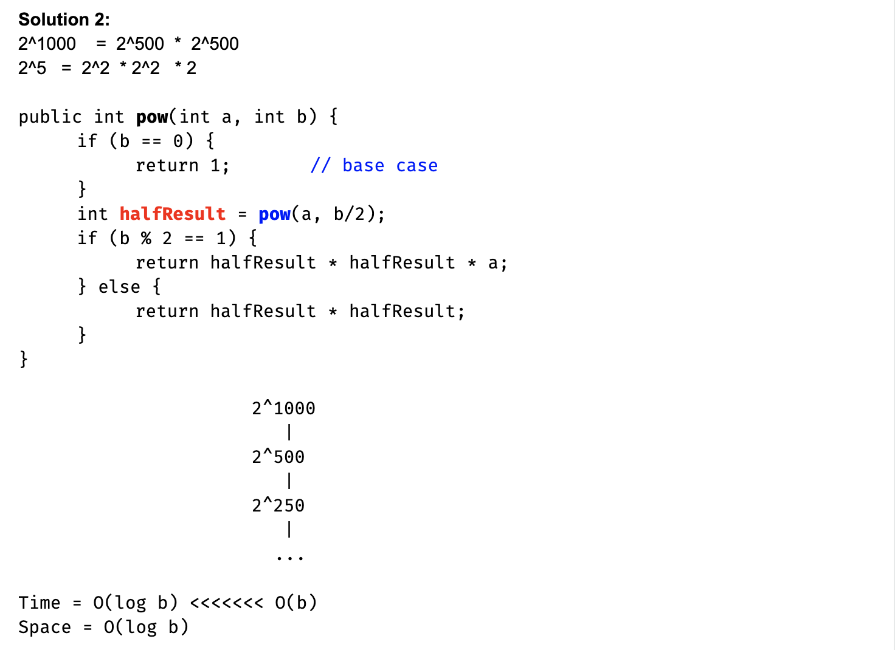

# Recursion




- 由于冯诺伊曼体系，可以看成 `fibo(n - 1) (break point)`, 旁边有一个断点，那么  recursive tree 先走左边子树，
  `fibo(n - 1)` and `fibo(n - 2)`, 这两个recursion 不会同时并行，由于冯诺伊曼体系。
- 他们按照触底反弹规律，`f(3)` call `f(2)` call `f(1)`
  他们一定是按照触底反弹的顺序call



- 如图所示，前面所有的sum < 2^n
- 那么 Time（）, 不考虑常数项，所以 Tme = O(2^n)








```java
public int pow(int a, int b){
    if(b == 0){
        return 1;
    }
    int half = pow(a, b / 2);
    return (b % 2 == 0) ? half * half : a * half * half;
}
```


1. Recursion = base + rule
2. 一个递归调用需要存储： 内存地址，parameter.
3. Recursion Time Complexity, Space complexity 只有是常数 O(1)时，才和总node数，总层数有关
4. 如果一层适用的空间，和别的层使用的空间重合了，那么这个 space就不能相加了，取最大的空间


## Recursion further explanation:

- [Fibonacci Recursion Tree](https://novemberfall.github.io/Algorithm-FullStack/csBasic/recursion.html)


## Merge Sort

