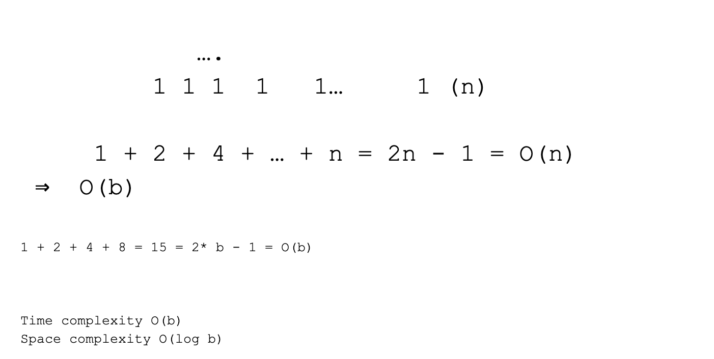
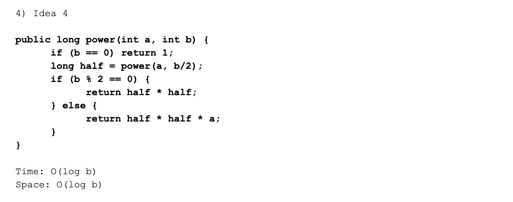

# Recursion Tree

### 需要掌握的知识点

1) 表象上： function calls itself

2) 实质上: Boil down a big problem to smaller ones (size n depends on size n - 1,
   or n-2 or ... n/2)

3) Implementation:

        1. Base case: smalleset problem to solve

        2. Recursive/Induction rule. How to make the problem smaller (if we can resolve 
           the same problem but with a smaller size, 
           then what is left to do for the current problem size n)
        

# 三步思考法：
        1. define subproblem
        2. find recursion rule
        3. define base case


### Ex 1: Fibonacci sequence: 

- https://en.wikipedia.org/wiki/Fibonacci_number


---

### don't use recursion, using o(n)


```java
1 + 2 + 4 + 8 + ... + 2^(n - 1) = (2 ^ n) - 1
```


- for Space: 
  1. stack 上， only two local variable O(1)
  2. heap 上， 并没有创造 new 对象， 所以 为 0

---


### Ex 2: Power







### Note some key points:


### Recursion codes:


### attachment


